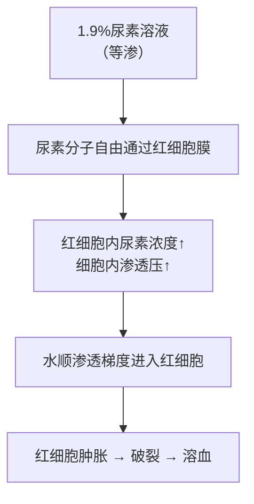

# 等渗与等张溶液（Isosmotic vs Isotonic Solutions）

## 📌 定义

| 概念 | 定义 | 关键特征 |
|:----|:-----|:---------|
| **等渗溶液（isosmotic）** | 渗透压 = 血浆渗透压（~300 mOsm/L） | 仅考虑渗透压数值相等 |
| **等张溶液（isotonic）** | 能使红细胞保持正常形态和大小 | 由**不能自由通过细胞膜**的溶质形成 |

## 🔬 核心区别

**等渗 ≠ 等张**。

等张溶液一定是等渗溶液，但等渗溶液不一定是等张溶液。

### 经典对比

| 溶液 | 渗透压 | 对红细胞的影响 | 机制 |
|:----|:------|:--------------|:-----|
| **0.9% NaCl** | 等渗 ✓ | 等张 ✓ → 形态正常 | Na⁺ 和 Cl⁻ 不易通过红细胞膜 |
| **5% 葡萄糖** | 等渗 ✓ | 等张 ✓（进入体内后） | 葡萄糖被摄取后实际等效 |
| **1.9% 尿素** | 等渗 ✓ | **不等张 ✗ → 溶血** | 尿素可自由通过红细胞膜 → 进入细胞 → 细胞内渗透压↑ → 水进入 → **细胞肿胀破裂** |

### 机制图解

**关键概念**：等渗 ≠ 等张 → 尿素可自由通过细胞膜 → [[溶血]](溶血)

## 🩸 临床意义

- **临床输液必须使用等张溶液**（如 0.9% NaCl、5% 葡萄糖）
- 误输等渗但不等张的溶液（如 1.9% 尿素）会导致**急性溶血**，危及生命
- 5% 葡萄糖虽是等渗且进入体内后葡萄糖被代谢，水保留 → 实际效果为等张

## ❗ 易混点

- 🚨 等张溶液 = **不能自由通过细胞膜的溶质**所形成的等渗溶液
- 🚨 看一种溶液是否等张 → 看溶质能否自由通过**红细胞膜**（不是毛细血管壁）
- 🚨 0.9% NaCl 既是等渗又是等张 → **临床最常用**
- 🚨 1.9% 尿素=等渗但不等张 → 记忆点："尿素自由过膜→溶血"

---
## 📎 相关笔记
- 基础：[[血浆渗透压]]（等渗的基准）
- 上级：[[血液生理]]
- 临床：[[输液原则]]、[[溶血]]
