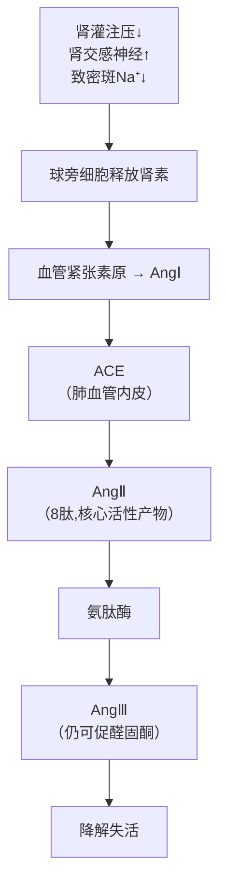
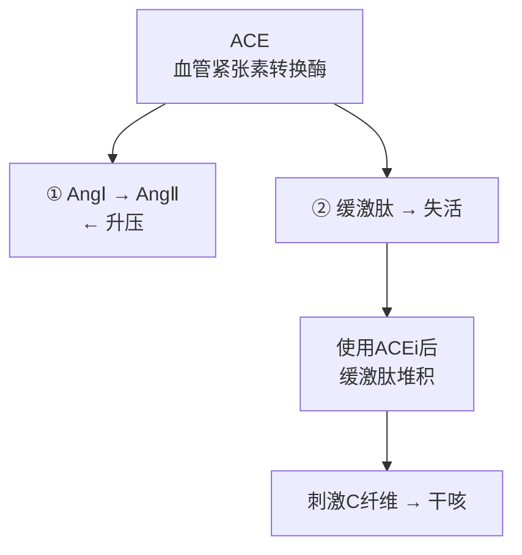
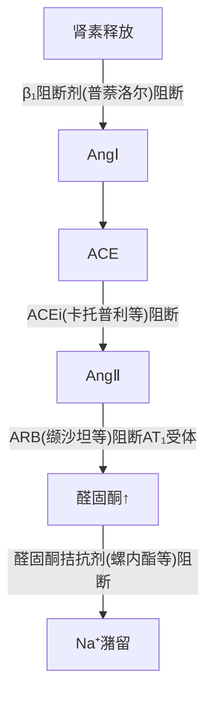
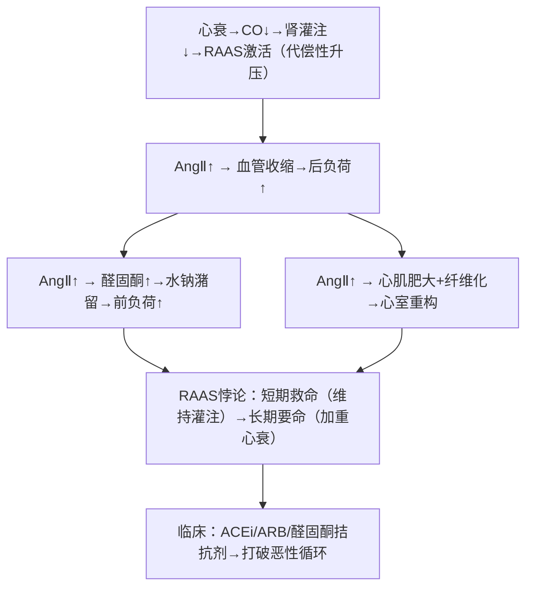

# RAAS（肾素-血管紧张素-醛固酮系统）

## 📌 定义

RAAS 是调节**血压、血容量和水电解质平衡**的核心体液系统。从肾素释放开始，经一系列酶切反应生成血管紧张素Ⅱ（AngⅡ），最终通过**缩血管+保钠保水**双重机制升高血压。

> 🔑 RAAS 是血压**长期调节**的最重要系统（短期靠压力反射，长期靠 RAAS+肾脏）。

---

## 🔬 一、级联反应——从肾素到 AngⅡ

### 完整级联



**关键概念**：[[RAAS]]、[[ACE]](血管紧张素转换酶)、AngⅠ→AngⅡ→AngⅢ

### 肾素释放的三条调控通路

| 通路 | 刺激 | 机制 | 受体 |
|:-----|:-----|:-----|:----:|
| **肾内机制** | 肾灌注压↓ | 入球小动脉牵张↓ → 球旁细胞释放肾素 | 压力感受(机械) |
| **肾交感神经** | 交感兴奋 | NE → 球旁细胞 | **β₁受体** |
| **致密斑机制** | 远曲小管Na⁺↓ | 致密斑感受 → 信号→球旁细胞 | Na⁺-K⁺-2Cl⁻共转运体 |

> 🔑 **β₁阻断剂（普萘洛尔等）降压的机制之一**：阻断球旁细胞的β₁受体 → 肾素释放↓ → RAAS活性↓ → BP↓

---

## 🔬 二、AngⅡ——核心效应分子

### AngⅡ的六大效应

| 效应 | 机制 | 受体 | 生理意义 |
|:-----|:-----|:----:|:---------|
| **① 缩血管** | 血管平滑肌收缩 | AT₁ | TPR↑ → BP↑（**比NE强~40倍**） |
| **② 醛固酮↑** | 肾上腺皮质球状带 | AT₁ | Na⁺潴留 + K⁺排泄↑ → 容量↑ → BP↑ |
| **③ ADH释放↑** | 垂体后叶 | AT₁ | 水潴留 → 容量↑ |
| **④ 交感↑** | 促进NE释放 + 抑制NE再摄取 | AT₁ | HR↑ + 收缩力↑ + 血管收缩↑ |
| **⑤ 渴感↑** | 下丘脑室周器 | AT₁ | 饮水↑ → 容量↑ |
| **⑥ 促生长** | 心肌肥大、血管平滑肌增生 | AT₁ | 长期 → 心血管重构 |

### AngⅡ效应的统一逻辑

```
短期（秒-分）：血管收缩 → TPR↑ → BP立即↑
中期（分-天）：醛固酮↑ + ADH↑ → Na⁺/水潴留 → 容量↑ → BP↑
长期（天-月）：心肌肥大+血管重构 → 慢性高血压→心衰恶性循环
```

---

## 🔬 三、ACE 的两个面孔——AngⅡ生成 + 缓激肽降解



**关键概念**：[[ACE]](ACE)、缓激肽、ACEi（干咳副作用）

> 🔑 **ACEi 的干咳**：ACE也是缓激肽的降解酶。ACEi阻断ACE → 缓激肽堆积 → 刺激呼吸道C纤维 → 干咳（发生率5-20%，华人更高）。**ARB 不阻断缓激肽降解** → 无干咳副作用。

---

## 🔬 四、局部（组织）RAAS

除了循环 RAAS，各组织自身也可合成 RAAS 组分：

| 组织 | 局部 AngⅡ 的作用 |
|:-----|:-----------------|
| **心脏** | 心肌肥大、纤维化（心衰恶化） |
| **血管** | VSMC增生、内皮功能障碍 |
| **肾脏** | 系膜增生、肾小球硬化 |
| **脑** | 交感兴奋、渴感、ADH释放 |
| **脂肪** | 与肥胖相关高血压有关 |

> 🔑 局部 RAAS 解释了为什么 ACEi/ARB 的靶器官保护作用**超出了单纯降压所能解释的范围**——它们在组织中直接阻断 AngⅡ 的致纤维化和致炎效应。

---

## 💊 五、RAAS 药物靶点——三大类药物



**关键概念**：[[RAAS]](RAAS药物靶点)、β₁阻断剂、ACEi、ARB、醛固酮拮抗剂

| 药物类别 | 代表药 | 靶点 | 特点 |
|:---------|:------|:-----|:-----|
| **ACEi** | 卡托普利、依那普利 | ACE | 阻止 AngⅠ→AngⅡ + 缓激肽堆积→干咳 |
| **ARB** | 缬沙坦、氯沙坦 | **AT₁受体** | 直接阻断 AngⅡ 效应，无干咳 |
| **醛固酮拮抗剂** | 螺内酯、依普利酮 | MR 受体 | 抑制 Na⁺潴留，治疗心衰 |
| **直接肾素抑制剂** | 阿利吉仑 | 肾素 | 从源头阻断 RAAS |

---

## 🧠 临床推导



> 慢性心衰金三角：ACEi/ARB + β阻断剂 + 醛固酮拮抗剂

> 🔑 慢性心衰的"金三角"治疗：ACEi/ARB + β阻断剂 + 醛固酮拮抗剂 → 三种药都直接或间接抑制 RAAS。

---

## ❗ 易混点

- 🚨 **AngⅡ是已知最强生理性缩血管物质**（比 NE 强约 40 倍）——不是 NE 最强
- 🚨 **ACEi → 干咳**（缓激肽堆积）；**ARB → 无干咳**（不阻断缓激肽降解）
- 🚨 RAAS 的短期作用是**血管收缩**（秒-分），长期作用是**心血管重构**（月-年）
- 🚨 **双侧肾动脉狭窄禁用 ACEi/ARB**：出球小动脉扩张 → GFR↓ → 急性肾衰

---

## 📎 相关笔记

- 上级：[[血液循环生理]]、[[心血管的体液调节]]
- 关联：[[动脉血压]]（RAAS 升压的靶器官）、[[心血管的神经调节]]（交感→肾素释放的桥梁）
- 病理：[[高血压]]、[[心力衰竭]]
- 药理：ACEi/ARB/醛固酮拮抗剂（待整理）
