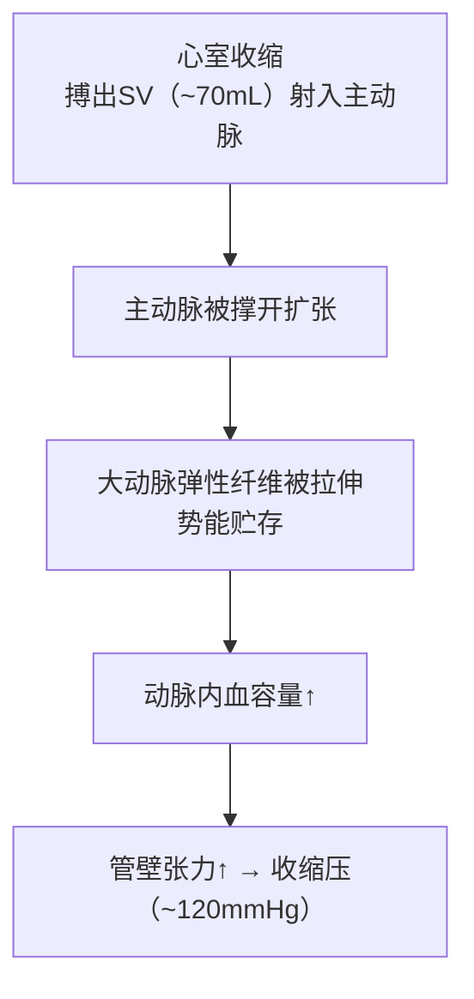
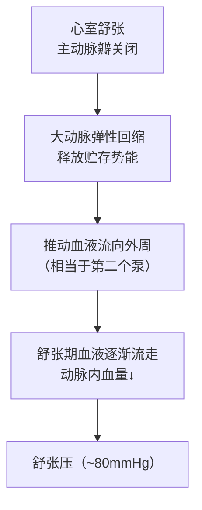
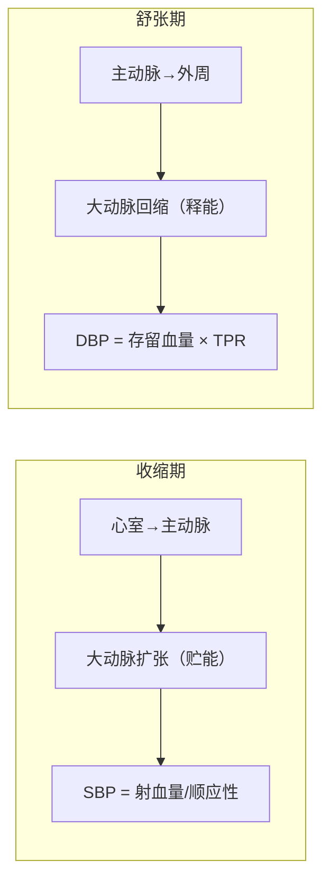
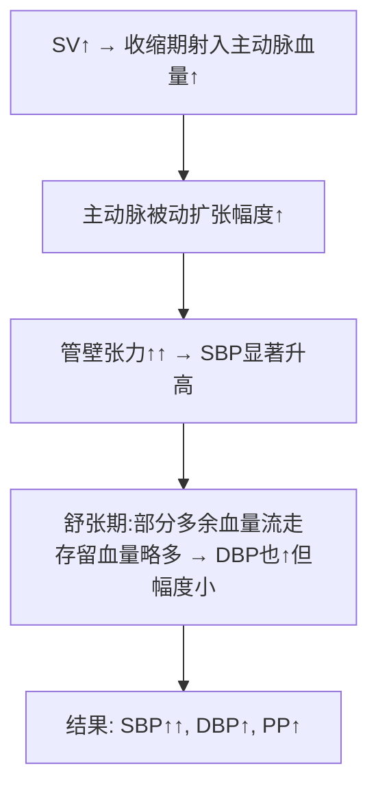
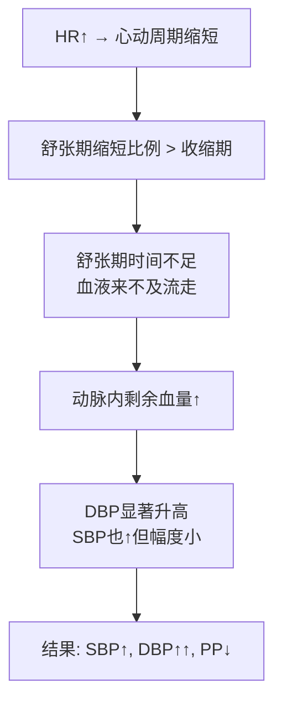
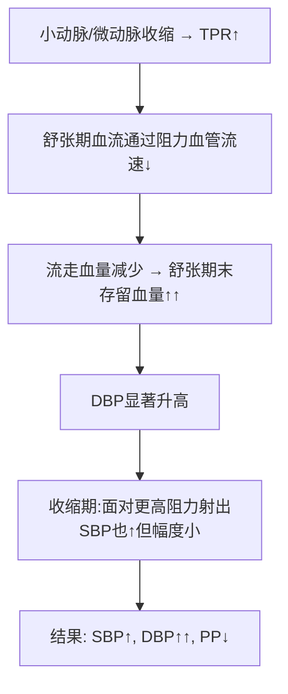
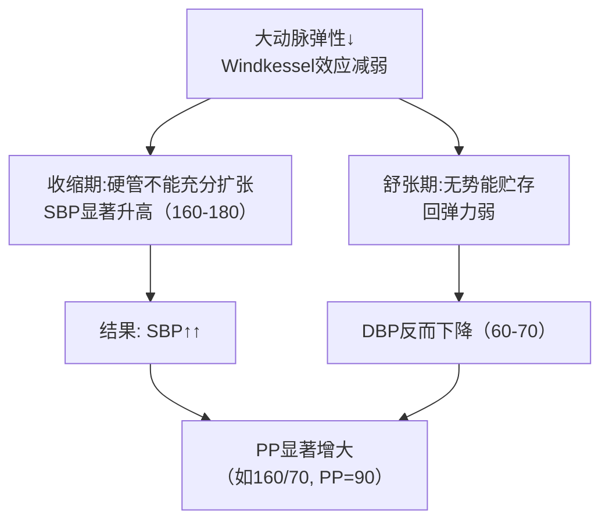
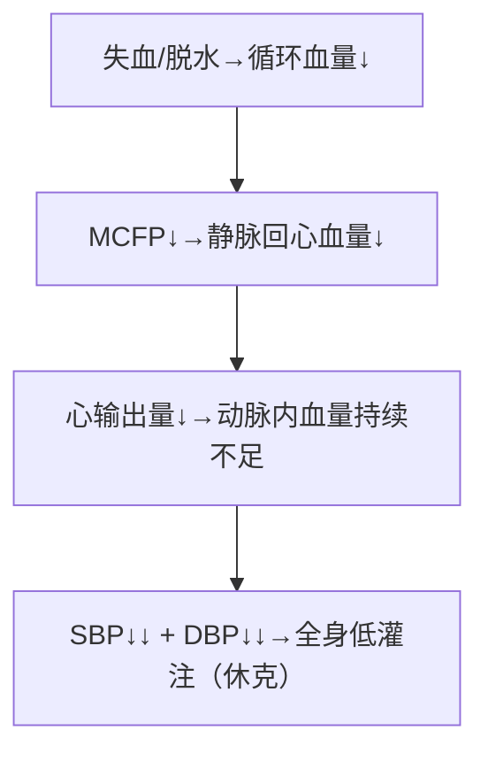

# 动脉血压（Arterial Blood Pressure）

## 📌 定义

| 指标 | 缩写 | 定义 | 正常值(mmHg) |
|:-----|:----:|:-----|:-----------:|
| **收缩压** | SBP | 心室收缩时动脉压最高值 | 100~120 |
| **舒张压** | DBP | 心室舒张时动脉压最低值 | 60~80 |
| **脉压** | PP | SBP - DBP | 30~40 |
| **平均动脉压** | MAP | DBP + PP/3 | ~93 |

> 🔑 MAP ≠ (SBP+DBP)/2。因为舒张期占心动周期约2/3，DBP权重更大 → MAP = DBP + PP/3。

---

## 🔬 一、动脉血压的形成 —— Windkessel 效应

动脉血压的形成不是"心脏直接泵出的压力"，而是**心脏射血 + 外周阻力 + 大动脉弹性**三者配合的结果。核心机制是**Windkessel（弹性贮器）效应**：

### 收缩期（SBP的形成）

**关键概念**：SV(每搏输出量)、[[大动脉弹性]](Windkessel效应)

> 🔑 **SBP 的高低取决于两点：①射入了多少（SV）②大动脉能撑多大（顺应性）。顺应性越差（硬化），同样的 SV 带来更高的 SBP。**

### 舒张期（DBP的形成）

**关键概念**：[[大动脉弹性]](Windkessel效应)、[[TPR]](总外周阻力)

> 🔑 **DBP的高低取决于两点：①血液流走的速度（TPR——阻力越大流越慢→DBP越高）②大动脉回弹的力度（硬化→弹不回来→DBP越低）**

### 图解：Windkessel 效应

**关键概念**：大动脉 = 弹性缓冲器 + 二次泵

---

## 🔬 二、动脉血压的四个形成条件

| 条件 | 作用 | 少了会怎样 |
|:-----|:-----|:----------|
| **循环系统充盈** | 提供基础血量（MCFP~7mmHg） | 血管瘪→血压为零（大失血） |
| **心脏射血** | 提供血流动力+周期性能量输入 | 没动力→无血压 |
| **外周阻力** | 阻碍血液顺畅流走 | SV全流走→舒张期无血→DBP=0（脉压极大） |
| **大动脉弹性** | 缓冲SBP（不飙太高）+ 维持DBP（不回零） | SBP飙升+DBP骤降→脉压极大 |

---

## 🔬 三、影响动脉血压的五大因素（逐条推导）

### 1. 每搏输出量(SV)↑ → SBP↑↑, DBP↑

**推导过程**：

> 🔑 **SV主要影响SBP**——因为搏出量直接决定收缩期动脉"被撑多满"。临床上**SBP的高低大致反映SV的大小**。

### 2. 心率(HR)↑ → DBP↑↑, SBP↑

**推导过程**：

> 🔑 **心率主要影响DBP**——心率越快，两次射血之间的"排泄时间"越短。这也是为什么**心动过速时冠脉供血减少**（冠脉靠舒张期供血，舒张期被压缩了）。

### 3. 外周阻力(TPR)↑ → DBP↑↑, SBP↑

**推导过程**：

> 🔑 **TPR是DBP的主要决定因素**——高血压患者DBP升高最直接的原因就是小动脉痉挛/硬化→阻力增大。降压药扩张小动脉→TPR↓→DBP↓。

### 4. 大动脉硬化 → SBP↑↑, DBP↓, PP↑↑

**推导过程**：

> 🔑 **老年单纯收缩期高血压**的核心机制就是大动脉硬化。SBP>140但DBP<90 → 这是最危险的类型之一（SBP每降10mmHg，卒中风险↓30%）。

### 5. 循环血量↓ → SBP↓↓, DBP↓↓

**推导过程**：

---

## 📊 五大因素总结表（含推导方向）

| 因素 | SBP | DBP | PP | **核心机制（一句话推导）** |
|:-----|:---:|:---:|:--:|:--------------------------|
| SV↑ | ↑↑ | ↑ | ↑ | 收缩期射入多→撑得更满→收缩压高 |
| HR↑ | ↑ | ↑↑ | ↓ | 舒张期不够流走→剩得多→DBP高 |
| TPR↑ | ↑ | ↑↑ | ↓ | 血液流不动→积在动脉→DBP高 |
| 大动脉硬化 | ↑↑ | ↓ | ↑↑ | 收缩期存不住→SBP飙；舒张期弹不回来→DBP跌 |
| 血量↓ | ↓↓ | ↓↓ | ↓ | 整个系统"缺水"→充盈不足→SBP+DBP双降 |

---

## 🩺 高血压分类（≥18岁）

| 类别 | SBP(mmHg) | DBP(mmHg) |
|:-----|:---------:|:---------:|
| 理想 | <120 | <80 |
| 正常高值 | 120~139 | 80~89 |
| **1级高血压** | 140~159 | 90~99 |
| **2级高血压** | 160~179 | 100~109 |
| **3级高血压** | ≥180 | ≥110 |
| 单纯收缩期高血压 | ≥140 | <90 |

---

## ❗ 易混点

- 🚨 **SV↑→SBP↑为主**（搏出多→收缩压高）；**TPR↑→DBP↑为主**（流不走→舒张末血压高）
- 🚨 大动脉硬化→SBP↑↑, DBP↓→**脉压显著增大**（收缩期存不住+舒张期弹不回来）
- 🚨 Windkessel效应=大动脉弹性缓冲SBP + 弹性回缩维持DBP。硬化时这两项都失效
- 🚨 MAP ≠ (SBP+DBP)/2，而是 = **DBP + PP/3**（舒张期时间更长，权重更大）

---

## 📎 相关笔记

- 上级：[[血液循环生理]]
- 关联：[[血流动力学基础]]、[[心输出量及其影响因素]]（SV→SBP的主要决定因素）
- 临床：[[高血压]]
