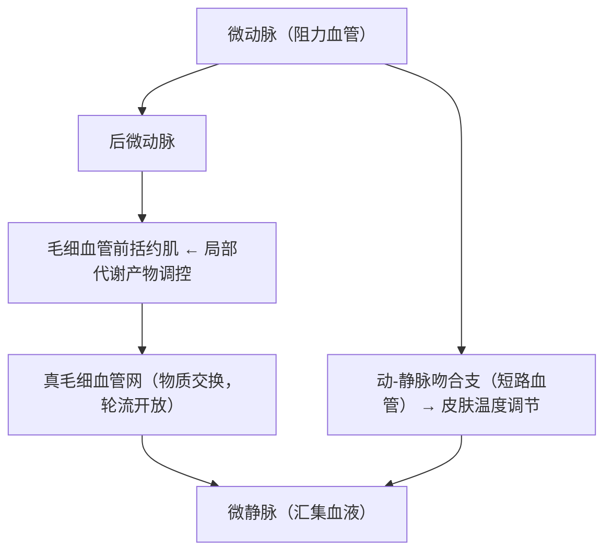
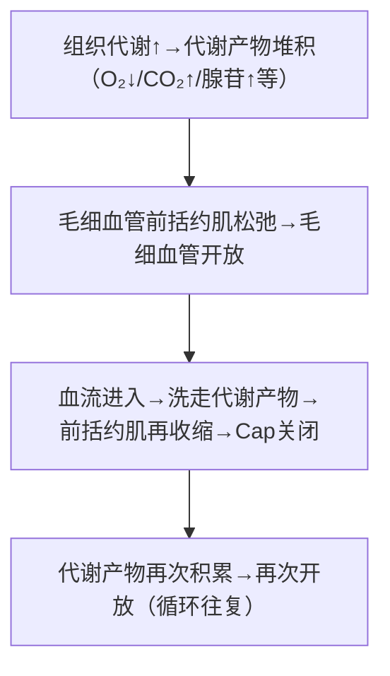

# 微循环（Microcirculation）

## 📌 定义

微循环是**微动脉与微静脉之间**的血液循环，是血液和组织液之间进行**物质交换**的场所。由微动脉→后微动脉→毛细血管前括约肌→真毛细血管→微静脉及动-静脉吻合支组成。

---

## 🔬 一、微循环的组成

---

## 🔬 二、三条通路对比

| 通路 | 路径 | 血流特点 | 物质交换 | 主要功能 | 开放调控 |
|:-----|:-----|:--------|:--------:|:---------|:---------|
| **迂回通路** | 微动脉→后微动脉→Cap前括约肌→真Cap网→微静脉 | 慢、迂回 | **最多** | **营养+物质交换** | 局部代谢调控（交替开放） |
| **直捷通路** | 微动脉→后微动脉→通血Cap→微静脉 | 较快 | 少 | 让血液快速通过（骨骼肌多见） | 通常开放 |
| **动-静脉短路** | 微动脉→A-V吻合支→微静脉 | 最快 | **无交换** | **体温调节**（皮肤） | 交感神经→缩/舒 |

> 🔑 **迂回通路 = 营养通路**（真正干活）；**动-静脉短路 = 散热通路**（皮肤特有）

---

## 🔬 三、微循环的局部代谢调控

### 毛细血管的交替开放

安静时约**20~30%**毛细血管开放（轮流开放，不是全部常开）。局部代谢产物积累是调控开关。

### 局部代谢产物调控机制

> 局部代谢调控=血流量自动匹配代谢需求

> 🔑 此机制确保血流量与组织代谢需求**自动匹配**——代谢活跃区域血管自动扩张（功能性充血）

---

## 🔬 四、物质交换方式

| 方式 | 机制 | 物质类型 | 占比 |
|:-----|:-----|:---------|:---:|
| **扩散** | 浓度梯度→跨Cap壁 | O₂/CO₂、脂溶性物质 | **主要方式** |
| **滤过与重吸收** | Starling力 | 水+电解质 | 次要 |
| **胞饮/胞吐** | 内皮细胞囊泡 | 大分子（血浆蛋白） | 少量 |

---

## ❗ 易混点

- 🚨 微循环三条通路中**迂回通路才是营养通路**（交换最多），不是所有毛细血管都一直开放
- 🚨 动-静脉短路**不存在物质交换**——只用来散热
- 🚨 毛细血管是**轮流开放**（不是同时全开），安静时仅开放20~30%

---

## 📎 相关笔记

- 上级：[[血液循环生理]]
- 关联：[[组织液的生成与回流]]（在毛细血管端完成的交换）、[[器官循环的特点]]（各器官微循环特点）
