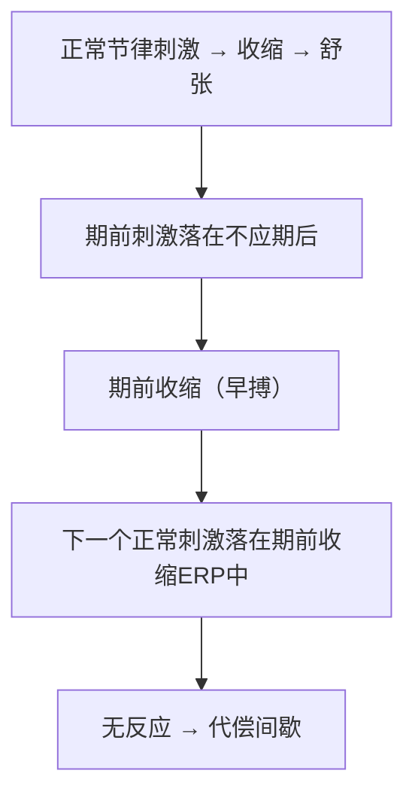
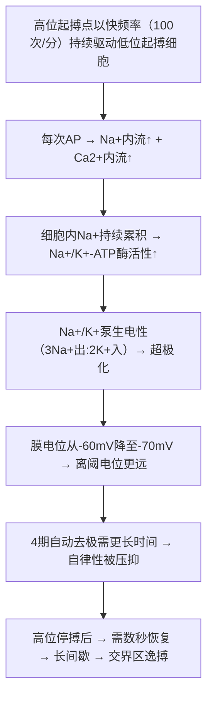
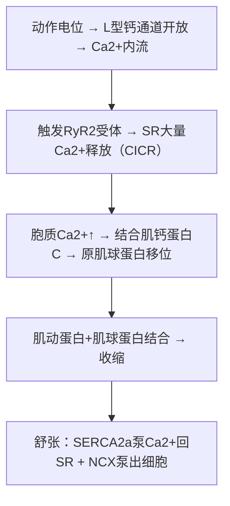

# 心肌的生理特性

## 📌 四大生理特性

| 特性 | 定义 | 关键参数 |
|:-----|:-----|:---------|
| **兴奋性** | 对刺激产生AP的能力 | 有效不应期~250ms |
| **自律性** | 自动产生节律性兴奋 | 窦房节~100次/分（首位） |
| **传导性** | 传导兴奋的能力 | 房室延搁0.1s |
| **收缩性** | 兴奋-收缩耦联→收缩 | 全或无收缩 |

---

## 🔬 一、兴奋性

### 兴奋性的周期性变化

| 周期 | 膜电位范围 | 刺激能否产生AP | 对应时相 |
|:-----|:----------|:-------------|:---------|
| **有效不应期（ERP）** | -90→-60mV | ❌ 任何刺激都不产生 | 0期~3期前半 |
| **相对不应期（RRP）** | -60→-80mV | ✅ 强刺激可产生 | 3期后半 |
| **超常期（SNP）** | -80→-90mV | ✅ 弱刺激可产生 | 3期末~4期初 |

### 心肌不应期长的意义

> 🔑 心肌有效不应期~250ms，骨骼肌仅~2ms。这使得**心肌不会产生强直收缩**——即使高频刺激也只能逐个收缩，保证泵血节律。

### 期前收缩与代偿间歇



> 🔑 **期前收缩**（早搏）：在正常节律之前出现一次"额外"兴奋  
> **代偿间歇**：期前收缩后有一个**延长的间歇**——因为下一个正常窦性冲动正好落在期前收缩的有效不应期内

---

## 🔬 二、自律性——自动节律性

### 各级起搏点固有频率

| 起搏点 | 固有频率 | 地位 |
|:-------|:--------:|:----:|
| **窦房结** | **~100次/分** | **正常起搏点（首位）** |
| 房室结 | ~50次/分 | 潜在起搏点 |
| 浦肯野纤维 | ~25次/分 | 潜在起搏点 |

### 窦房结为何是第一位

> **抢先占领（Preemptive占领）** —— 窦房结自律性最高（100次/分），在潜在起搏点4期自动去极到阈值之前，窦房结传来的兴奋已经将其"抢先"兴奋了。

### 超速驱动压抑（Overdrive Suppression）

**现象**：当一快频率的起搏点持续驱动心脏时，潜在起搏点的自律性被**抑制**。一旦高位起搏点停搏，低位起搏点需要一段"热身时间"才恢复起搏。



> 🔑 临床：**窦性停搏→长间歇→交界区逸搏**是超速驱动压抑的典型表现。植入起搏器更换电池时也需要逐渐降低起搏频率，不能突然停机——否则可能长间歇→阿斯综合征。

---

## 🔬 三、传导性

### 传导系统路径

```
窦房结→结间束（优势传导通路）→房室结（延搁0.1s）→希氏束
    →左右束支→浦肯野纤维网→心室肌
```

### 传导速度差异

| 部位 | 传导速度(m/s) | 意义 |
|:-----|:------------:|:-----|
| 窦房结 | 慢 | 起搏 |
| **房室结** | **0.02~0.05** | **延搁0.1s**——保证心房收缩在前、心室在后 |
| 浦肯野纤维 | **2~4**（最快） | 快速传导→心室同步收缩 |

> 🔑 **房室延搁**：唯一正常的房室传导减速点——保护心室不跟随心房高频兴奋（如房颤时）。

---

## 🔬 四、收缩性

### 心肌收缩的特点

| 特点 | 机制 | 意义 |
|:-----|:-----|:-----|
| **全或无收缩** | 闰盘→功能合胞体 | 全心同步收缩（像一个大细胞） |
| **不发生强直收缩** | ERP长（~250ms） | 保证泵血节律 |
| **依赖细胞外Ca²⁺** | CICR机制 | 细胞外Ca²⁺↓→收缩力↓ |
| **Bowditch效应** | HR↑→Ca²⁺内流↑→收缩力↑ | 心率越快，收缩越强（阶梯现象） |

### 兴奋-收缩耦联（EC Coupling）



> 🔑 **CICR**（钙诱导钙释放）：L型钙通道进来的少量Ca²⁺ → 触发RyR2 → SR暴发性释放大量Ca²⁺

---

## 📊 四大特性总结表

| 特性 | 决定因素 | 关键离子/结构 | 临床关联 |
|:-----|:---------|:------------|:---------|
| 兴奋性 | 钠通道状态 | INa | 抗心律失常药（I类阻断INa） |
| 自律性 | 4期去极速度 | If + ICa-T | 窦房结功能障碍→起搏器 |
| 传导性 | 0期去极速度+细胞间连接 | INa + 缝隙连接 | 房室传导阻滞 |
| 收缩性 | 胞质Ca²⁺浓度 | ICa-L + RyR2 | 正性肌力药 |

---

## ❗ 易混点

- 🚨 **ERP中心肌不会产生动作电位**（Na⁺通道处于失活状态），不是"难以产生"
- 🚨 **期前收缩后的代偿间歇**来自窦性冲动落入ERP
- 🚨 **房室延搁 = 保护心室**——不跟随心房过快频率
- 🚨 心肌收缩**严格依赖细胞外Ca²⁺**（骨骼肌不依赖）——低钙血症→心肌收缩力↓

---

## 📎 相关笔记

- 上级：[[血液循环生理]]
- 电生理基础：[[心肌细胞的分类与动作电位]]
- 关联：[[心电图]]（体表反映的电活动总和）
- 临床：[[心律失常]]、[[心力衰竭]]
