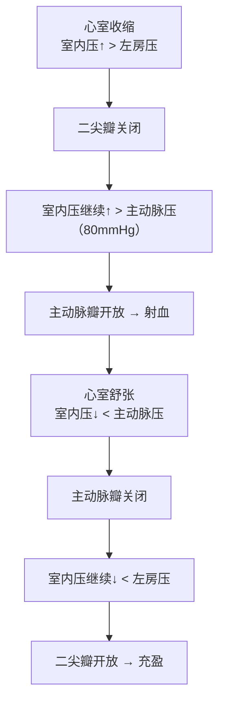

# 心脏泵血过程与机制

## 📌 概述

心脏泵血的根本动力来自**心室肌的节律性收缩和舒张**，引起心脏内**压力和容积**的周期性变化。**压力梯度**驱动血液流动，**瓣膜**保证血液单向流动。

> 🔑 心脏泵血的实质 = 心室收缩产生压力 → 压力差推动血流 → 瓣膜开闭保证方向

---

## 🔬 一、泵血的基本动力——压力梯度

### 左心泵血的压力驱动



**关键概念**：压力梯度驱动 → 瓣膜被动作出反应 → [[心动周期]] → [[心脏泵血过程与机制]]

### 右心泵血的压力驱动（低压系统）

| 对比 | 左心室 | 右心室 |
|:-----|:------|:------|
| **关闭房室瓣压差** | 室内压 > 左房压(~5) | 室内压 > 右房压(~2) |
| **开放半月瓣压差** | 室内压 > 主动脉压(~80) | 室内压 > 肺动脉压(~8) |
| **收缩压峰值** | ~120 mmHg | ~25 mmHg |
| **泵血特点** | 高压低容量 | 低压同量 |

> 🔑 肺动脉压低(25/8 mmHg)，仅主动脉压的1/5，所以右心室壁远薄于左心室。

---

## 🔬 二、瓣膜的作用——保证单向流动

| 瓣膜 | 位置 | 开放条件 | 关闭条件 | 关闭音 |
|:-----|:-----|:---------|:---------|:------:|
| **二尖瓣** | 左房→左室 | 房内压 > 室内压 | 室内压 > 房内压 | S₁成分 |
| **三尖瓣** | 右房→右室 | 同上 | 同上 | S₁成分 |
| **主动脉瓣** | 左室→主动脉 | 室内压 > 主动脉压 | 主动脉压 > 室内压 | S₂成分 |
| **肺动脉瓣** | 右室→肺动脉 | 室内压 > 肺动脉压 | 肺动脉压 > 室内压 | S₂成分 |

> 🔑 **瓣膜是纯粹被动的结构**——没有主动的"打开"指令，完全由两侧压力差决定开还是关。这就是为什么压力梯度是泵血的根本。

---

## 🔬 三、被动充盈与主动充盈

| 阶段 | 机制 | 贡献比例 | 驱动力 |
|:-----|:-----|:--------:|:-------|
| **快速充盈期** | 心室舒张"抽吸" | **~70%** | 心室舒张→容积↑→室内压↓ |
| **减慢充盈期** | 回流逐渐减少 | ~5% | 静脉回流惯性 |
| **心房收缩期** | 心房主动收缩 | **~25%** | 心房肌收缩→房内压↑ |

> 🔑 安静时心房收缩不是充盈的主力（主力是心室的舒张抽吸），但**运动/心率快时**心房贡献显著增加（可达40%）。

---

## 🔬 四、心室压力-容积环（PV Loop）——逐步走读

### 环路全貌

```
压力(mmHg)
 120 ─                   ③→④（射血）
     │              ┌──────┐
  80 ─              │      │ ← 主动脉瓣开放（③点）
     │       ②（等容收缩）  │
     │      ┌┘            └┐
  5  ─      │              │ ← 主动脉瓣关闭（④点）
     │  ①（充盈）      ⑤（等容舒张）
     │  ┌┘               ┌┘
  0  ─  │                │
     └──┴──────┬─────────┴──→ 容积(mL)
        55     125
       (ESV)  (EDV)

①→② 充盈期    ②→③ 等容收缩期
③→④ 射血期    ④→① 等容舒张期（实际先等容再充盈）
```

### 逐步走读 PV Loop

#### 起点：舒张末期（右下角，EDV~125mL, P~5mmHg）

此时状态：心室已充盈完毕，二尖瓣还开着，主动脉瓣关着。心室即将收缩。

#### 第1段 ②→③ 等容收缩期（直线向上）

```
心室开始收缩 → 室内压从5mmHg急剧上升
    ↓
室内压 > 左房压(~5mmHg) → **二尖瓣关闭**（产生S₁）
    ↓
但室内压尚 < 主动脉压(80mmHg) → 主动脉瓣仍关闭
    ↓
两套瓣膜都关着 → 血液出不去 → **容积不变(125mL)**
    ↓
但心室持续收缩 → 室内压从5飙到80mmHg（仅用0.05s）
```

> 🔑 **"等容"≠"无压力变化"**。等容指**容积不变**，但压力在飙升。这个阶段心室肌在"憋着劲"——相当于你推一扇锁着的门，肌肉在发力但门没动。

#### 第2段 ③→④ 射血期（向左上方走）

```
室内压 > 主动脉压(80mmHg) → **主动脉瓣开放**（③点）
    ↓
血液从心室快速射入主动脉 → 容积从125→55mL
    ↓
室内压先继续升高至峰值(~120mmHg) → 快速射血期
    ↓
随后心室肌收缩减弱 + 血量减少 → 室内压略降至~100mmHg → 减慢射血期
    ↓
注意：减慢射血期末室内压**略低于主动脉压**
    → 但血液靠**惯性**仍可继续射出（不逆行）
    ↓
射血结束：心室剩余血量~55mL = 收缩末期容积（ESV）
```

> 🔑 ③点是"主动脉瓣开放点"——室内压必须跨过80mmHg这个坎。**高血压患者这个坎更高** → 等容收缩期延长 → 射血时间缩短 → SV减少。

#### 第3段 ④→① 等容舒张期（直线向下）

```
心室开始舒张 → 心肌松弛 → 室内压急剧下降
    ↓
室内压 < 主动脉压 → **主动脉瓣关闭**（产生S₂，④点）
    ↓
但室内压仍 > 左房压 → 二尖瓣仍关闭
    ↓
两套瓣膜又都关了 → **容积不变(55mL)**
    ↓
室内压继续骤降：100→5mmHg（仅用0.07s）
```

#### 第4段 ①→② 充盈期（向右走）

```
室内压 < 左房压(~5mmHg) → **二尖瓣开放**（①点）
    ↓
心房血被"吸入"心室（心室舒张的抽吸作用）
    ↓
快速充盈期(0.11s)：容积从55升到~115mL（占70%充盈量）
减慢充盈期(0.22s)：继续缓慢充盈至125mL
心房收缩(0.1s)：最后挤入~25%充盈量 → 回到起点(②点)
```

> 🔑 ①点是"二尖瓣开放点"。**二尖瓣狭窄时**这个点需要更高的房室压差才能开放 → 左房压力↑ → 肺静脉淤血 → 呼吸困难。

### PV Loop 的核心信息

| 量 | PV Loop 上的含义 |
|:---|:----------------|
| **SV** | = EDV - ESV = 环路宽度（125-55=70mL） |
| **每搏功** | = 环路面积（压力×容积变化的积分） |
| **EDV** | 环路最右点 |
| **ESV** | 环路最左点 |
| **收缩力↑** | ESV↓ → 环路变宽（同一EDV输出更多） |
| **后负荷↑** | 等容收缩期延长 → 环路上半变窄变高 |

---

## 🔬 五、心脏做功与心肌耗氧量——Laplace定律的临床含义

### 每搏功

- = SV × 平均射血压（压力-容积功）
- **压力功占主导**（~95%），动能仅~5%

### 心肌耗氧的决定因素——Laplace定律

$$T = \frac{P \times r}{2h}$$

| 参数 | 含义 | ↑时对耗氧的影响 | 临床对应 |
|:-----|:-----|:--------------|:---------|
| **P**（室内压） | 心室需要产生的压力 | ↑↑ | **高血压→后负荷↑→P↑→T↑→耗氧↑** |
| **r**（心室半径） | 心室腔的大小 | ↑↑ | **扩张型心肌病→r↑→T↑→耗氧↑** |
| **h**（室壁厚度） | 心肌厚度 | ↓↑ | 肥厚→h↑→T↓（代偿性降低张力） |

### 为什么压力功比容量功更耗氧？

```
容量功（SV↑）：主要是肌节缩短 → 相对省氧
压力功（后负荷↑）：心室需产生更高压力 → 等容收缩期延长
    → 心肌在"憋劲"状态持续更久（高张力+短缩短）
    → 室壁张力(T)是耗氧的主要决定因素
    → P(压力)↑ 直接推高T → 耗氧剧增
```

> 🔑 **同样的CO，高血压患者的心肌耗氧 > 主动脉瓣关闭不全患者。** 前者压力功大（P↑→T↑→耗氧↑），后者容量功大但压力正常。

### 临床推导：三种心脏病的耗氧差异

| 病变 | 主要异常 | 耗氧机制 | 易缺血程度 |
|:-----|:---------|:---------|:----------:|
| **高血压** | P↑（后负荷↑） | T↑（P↑→室壁张力↑↑） | ⭐⭐⭐ |
| **主动脉瓣狭窄** | P↑↑（严重后负荷） | T↑↑ + 射血期阻力↑ | ⭐⭐⭐ |
| **主动脉瓣关闭不全** | r↑（容量↑→心室扩张） | T↑（r↑→室壁张力↑） | ⭐⭐ |
| **扩张型心肌病** | r↑↑（心室显著扩大） | T↑↑（r↑→室壁张力剧增） | ⭐⭐⭐ |

---

## 🧠 左右心室泵血的协同

- **串联关系**：左心和右心必须以**相同的平均输出量**泵血
- **Starling 机制确保平衡**：
  ```
  右心输出量短暂↑ → 肺循环血量↑ → 左心充盈↑
      → 左室EDV↑ → Starling机制 → 左室SV↑ → 左心输出量↑
      → 追上右心，恢复平衡
  ```
- **失衡的后果**：
  - 左心衰 → 血积在肺 → **肺淤血**（呼吸困难、粉红色泡沫痰）
  - 右心衰 → 血积在体循环 → **体循环淤血**（下肢水肿、肝大、颈静脉怒张）

> 🔑 为什么心衰先出现左心衰？因为左心是"高压泵"，工作负荷最大，冠状动脉粥样硬化也首先影响左室供血。

---

## ❗ 易混点

- 🚨 心脏泵血的**直接动力**是压力梯度，不是心肌收缩本身
- 🚨 左心是"高压泵"，右心是"低压泵"——但输出量必须相同
- 🚨 **等容收缩期**：容积不变，但压力在飙，"憋着劲推不开门"
- 🚨 **压力功耗氧 >> 容量功耗氧**（高血压比主动脉瓣反流更容易心肌缺血）
- 🚨 Laplace 效应：心室**越大越耗氧、压力越高越耗氧**、室壁厚可代偿
- 🚨 减慢射血期末室内压**低于主动脉压**，但血液靠惯性仍射出

---

## 📎 相关笔记

- 上级：[[血液循环生理]]
- 前序：[[心动周期]]（七个时相的划分）
- 关联：[[心音]]（瓣膜关闭是心音的直接来源）、[[心输出量及其影响因素]]（SV由PV Loop的宽度决定）
- 病理：[[心力衰竭]]（泵功能障碍的病理基础）
