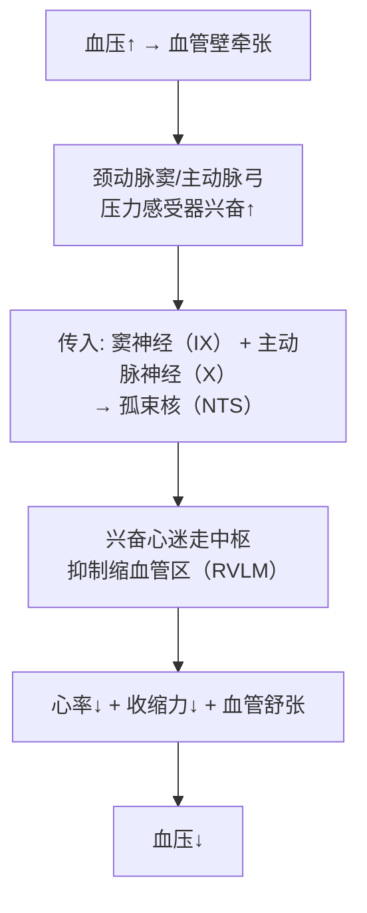
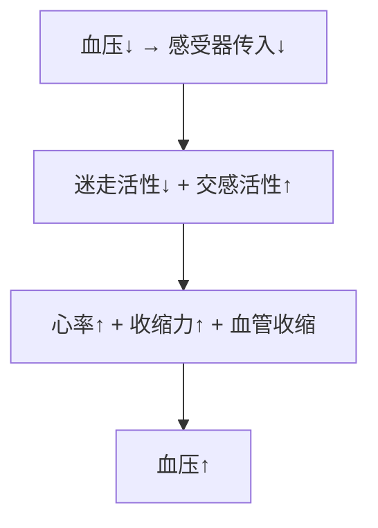
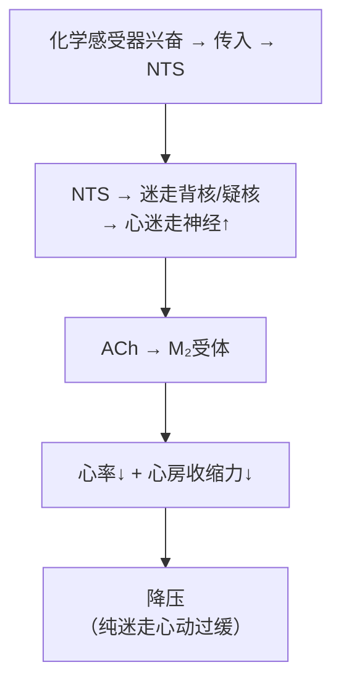
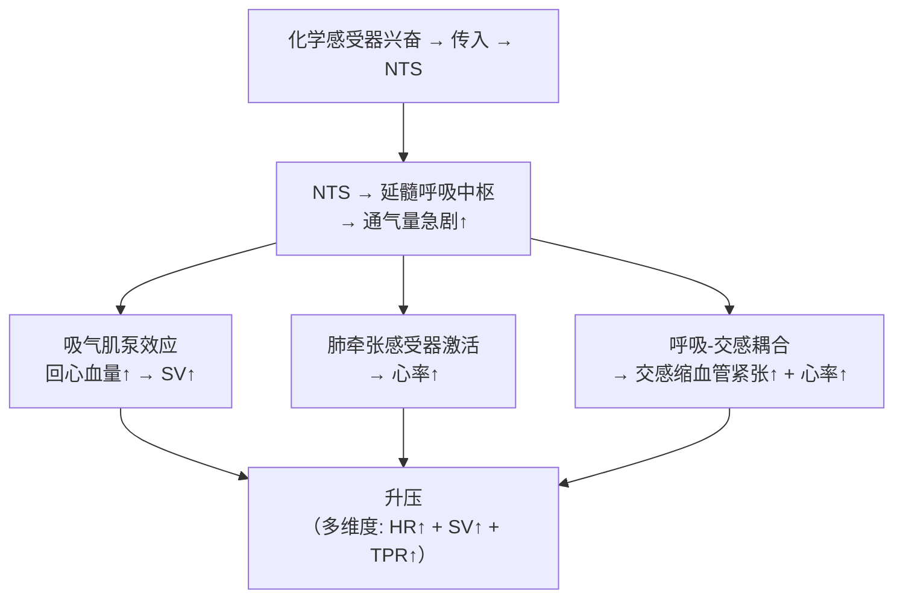
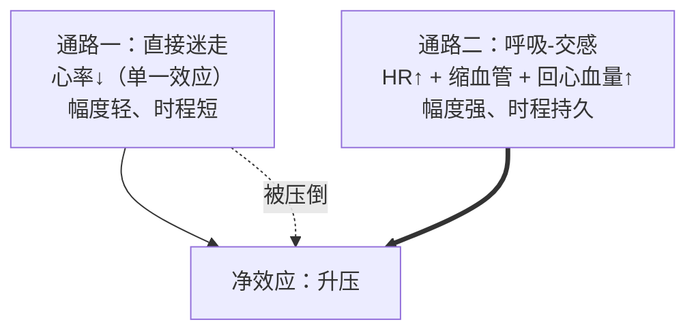
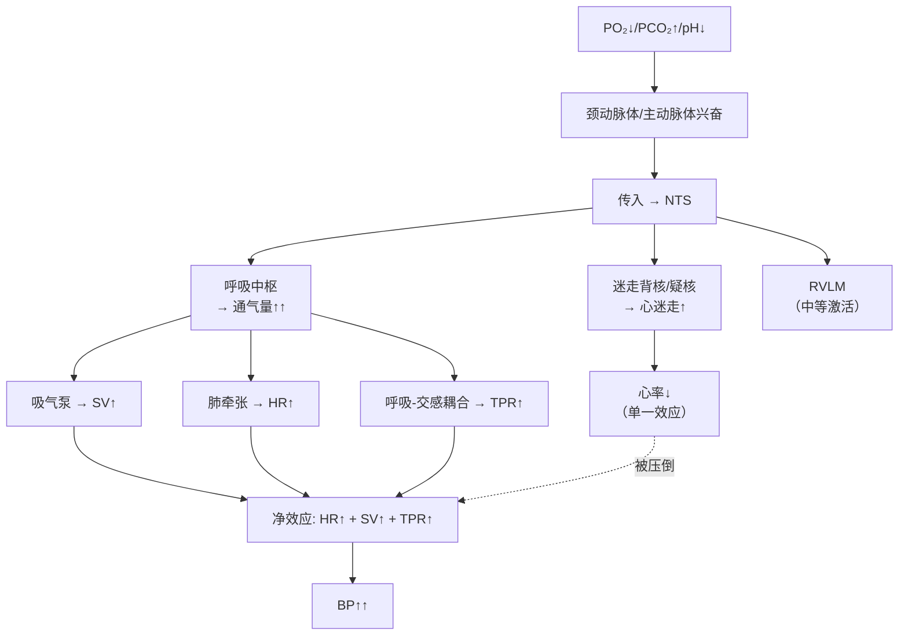
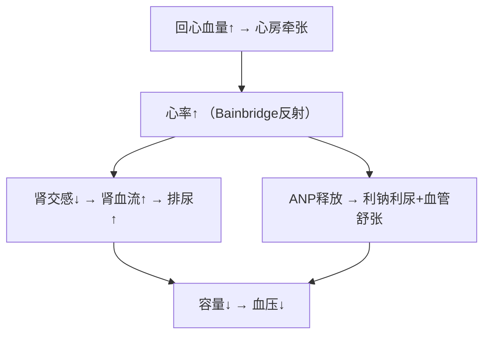

# 心血管反射

## 📌 概述

心血管反射是**快速、短时程**的血压调节机制。最重要的两类：**压力感受器反射**（降压）和**化学感受性反射**（升压）。

---

## 🔬 一、压力感受器反射（Baroreflex）

### 感受器——颈动脉窦和主动脉弓

| | 颈动脉窦 | 主动脉弓 |
|:--|:--------|:--------|
| 神经 | **窦神经→舌咽神经** | **主动脉神经→迷走神经** |
| 敏感范围 | 60~180 mmHg | 同 |
| 最敏感点 | **~100 mmHg**（正常MAP附近） | 同 |
| 对搏动敏感 | **是**（脉压越大→反应越强） | 是 |

> 🔑 压力感受器**对"变化"敏感**（动态反应 > 静态压力）——持续高血压时感受器会**重调**到高水平

### 反射弧（血压↑时）

**关键概念**：[[Baroreflex]](压力感受器反射)、负反馈、[[NTS]](孤束核)

### 血压↓时——反射相反

> 🔑 此反射是**负反馈**，每时每刻都在工作以**稳定动脉血压**。

---

## 🔬 二、化学感受性反射——一个"竞争机制"的经典案例

### 核心矛盾

化学感受器（颈动脉体/主动脉体）受 PO₂↓/PCO₂↑/pH↓ 刺激后，**传入信号同时走两条路**，且两条路对心血管的效应**恰好相反**：

### 通路一：直接迷走效应（降压）

> 这条通路与压力反射共用下游回路。在**人工固定通气**的动物实验中，化学感受器刺激会露出这条通路 → 心率减慢。

### 通路二：呼吸驱动的交感效应（升压）—— 压倒性优势

**关键概念**：化学感受器反射（双通路竞争）、呼吸中枢→交感耦合、通路一（降压）vs 通路二（升压）

### 为什么升压赢了？

### 实验验证——为什么文献有"矛盾"

| 实验条件 | 化学感受器刺激结果 | 为什么 |
|:---------|:-----------------|:-------|
| **人工固定通气** | 心率↓ + 轻度血管收缩 | 通路二被阻断（呼吸机接管→无自主呼吸增强→交感不激活），只剩通路一 |
| **自主呼吸** | 心率↑ + 血管收缩↑ + **BP↑↑** | 两条通路都工作，通路二压倒通路一 |

> 🔑 有些老教材说化学反射"降压"、更多说"升压"——取决于实验是否保留自主呼吸。**人体的生理状态是自主呼吸存在 → 净效应 = 升压。**

### 统一流程图

**关键概念**：[[化学感受器反射]]、[[PO₂]](氧分压)、[[PCO₂]](二氧化碳分压)、双通路竞争

### 对比表

| | 压力感受器反射 | 化学感受器反射 |
|:--|:-------------|:-------------|
| **感受器** | 颈动脉窦/主动脉弓 | **颈动脉体/主动脉体** |
| **刺激** | 血压变化（牵张） | **PO₂↓/PCO₂↑/pH↓** |
| **首要功能** | 调节血压 | **调节呼吸**（通气量↑） |
| **心血管通路** | 单纯的压力→迷走/交感变 | **双通路竞争**（迷走降压 vs 呼吸交感升压） |
| **净心血管效应** | 心率↓+血管舒张 → **降压** | 呼吸交感胜出 → **升压** |
| **临床触发** | 每时每刻 | O₂<60mmHg时明显（严重缺氧/窒息） |

> 🔑 化学感受器的主要功能是**调节呼吸**，心血管效应是**次要的**——仅在严重缺氧时才表现为升压。升压的"代价"是**呼吸做功大幅增加**。

---

## 🔬 三、心肺感受器反射（容量反射）

| 特征 | 内容 |
|:-----|:-----|
| **位置** | 心房、心室、肺血管 |
| **刺激** | 容量↑（牵张）或化学物质 |
| **效应** | 交感↓ + 迷走↑ → 心率↑(Bainbridge反射) + ANP释放 + 肾交感↓(排尿↑) |
| **意义** | **调节血容量**（而不仅是压力） |

### 心房牵张→Bainbridge反射

**关键概念**：[[Bainbridge反射]](心房牵张→心率↑)、[[ANP]](心房钠尿肽)

> 🔑 Bainbridge反射：容量↑→心率↑（与压力反射→心率↓相反）。因为它走的是心肺感受器→直接兴奋交感，不经过压力反射弧。

---

## 📊 三类反射对比

| | 压力感受器反射 | 化学感受器反射 | 心肺反射 |
|:--|:------------|:------------|:--------|
| 感受器 | 颈动脉窦/主动脉弓 | 颈动脉体/主动脉体 | 心房/心室/肺血管 |
| 刺激 | 血压(牵张) | O₂↓/CO₂↑/pH↓ | 容量↑/化学 |
| 心率 | ↓(升压时) | ↑ | ↑(Bainbridge) |
| 交感 | ↓ | ↑ | ↓ |
| 主要作用 | **稳压** | **调呼吸为主** | **调容量** |

---

## ❗ 易混点

- 🚨 压力反射=降压反射（血压↑→反射使血压↓）；化学反射=升压反射（O₂↓→反射使血压↑）
- 🚨 Bainbridge反射使心率↑（与压力反射的"血压↑→心率↓"**恰恰相反**）
- 🚨 压力感受器可"**重调**"——长期高血压→调定点抬高→身体认为高BP是"正常"

---

## 📎 相关笔记

- 上级：[[血液循环生理]]
- 关联：[[心血管的神经调节]]（反射的执行路径）、[[心血管的体液调节]]（反射+体液共同调控）
