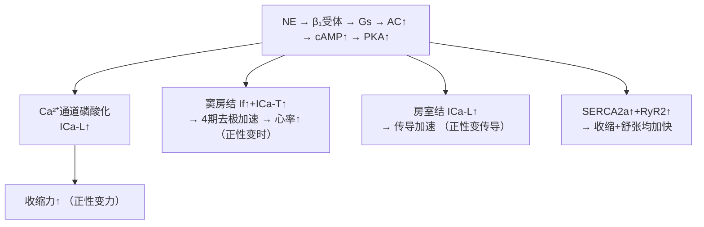
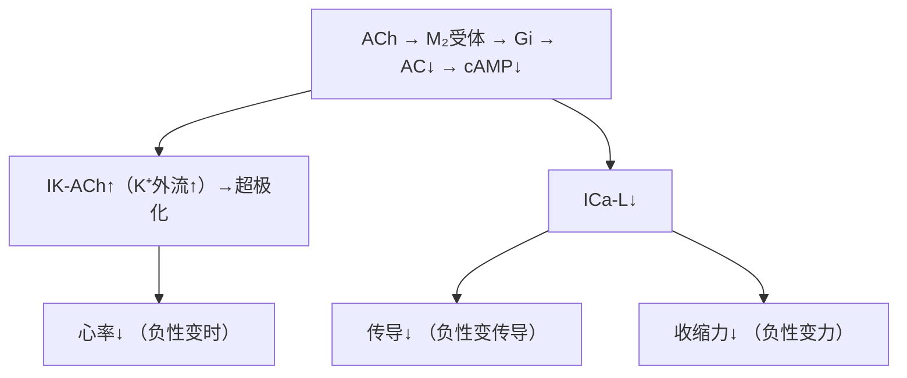

# 心血管的神经调节

## 📌 概述

心血管受**自主神经系统**的双重支配——**交感神经**和**副交感（迷走）神经**——持续发放**紧张性冲动**，时刻调节心脏和血管活动。

---

## 🔬 一、心交感神经（Cardiac Sympathetic）

| 项目 | 内容 |
|:-----|:-----|
| **起源** | 脊髓胸段T₁~T₅侧角 |
| **节后纤维** | 去甲肾上腺素（NE） |
| **支配** | **全心**：窦房结、房室结、心房肌、心室肌 |
| **受体** | **β₁肾上腺素能受体**（心室为主） |
| **效应** | **正性变时/变力/变传导** |

### 作用机制

---

## 🔬 二、心迷走神经（Cardiac Vagal）

| 项目 | 内容 |
|:-----|:-----|
| **起源** | 延髓迷走神经背核/疑核 |
| **节后纤维** | 乙酰胆碱（ACh） |
| **支配** | 窦房结、房室结、心房肌（**心室肌少**） |
| **受体** | **M₂毒蕈碱受体** |
| **效应** | **负性变时/变力/变传导** |

### 作用机制

---

## 🔬 三、交感缩血管神经

| 项目 | 内容 |
|:-----|:-----|
| **起源** | 脊髓胸腰段侧角 |
| **递质** | **NE**（去甲肾上腺素） |
| **分布** | 几乎所有血管（全身性） |
| **受体** | **α₁受体** → 血管收缩 |
| **紧张性** | **持续发放**（交感缩血管紧张） |

### 不同器官血管的受体差异

| 器官 | 主要受体 | 交感兴奋效应 |
|:-----|:--------|:-----------|
| 皮肤 | **α₁** | 强烈收缩（散热↓） |
| 内脏（肾/胃肠） | **α₁** | 强烈收缩（血量调配） |
| 骨骼肌 | **α₁**(收缩) + **β₂**(舒张) | 两种可切换 |
| 脑 | α₁弱 | 自身调节为主 |
| **冠脉** | α₁(缩) + β₂(舒) | 代谢调控为主（腺苷）→继发性舒张 |

---

## 📊 交感 vs 迷走对比

| | 心交感 | 心迷走 | 交感缩血管 |
|:--|:------|:------|:---------|
| 递质 | NE | ACh | NE |
| 受体 | β₁ | M₂ | α₁(收缩) / β₂(舒张) |
| 心率 | ↑↑ | ↓↓ | — |
| 收缩力 | ↑↑ | ↓(仅心房) | — |
| 传导 | ↑ | ↓(房室结) | — |
| 血管 | — | — | 收缩(为主)/舒张 |
| 基础紧张性 | 有 | **有**（占优势） | **有**（维持血压） |

> 🔑 安静时**迷走紧张 > 交感紧张**→心率~75次/分（远低于窦房结固有100次/分）

---

## 🔬 四、心血管中枢

| 中枢 | 位置 | 功能 |
|:-----|:-----|:-----|
| **缩血管区** | 延髓头端腹外侧(RVLM) | 交感兴奋→升压 |
| **舒血管区** | 延髓尾端腹外侧(CVLM) | 抑制RVLM→降压 |
| **心迷走区** | 迷走神经背核/疑核 | 迷走兴奋→心率↓ |
| **孤束核(NTS)** | 延髓背侧 | 接收压力/化学感受传入 |
| 下丘脑 | 间脑 | 整合+防御反应（交感↑） |

---

## ❗ 易混点

- 🚨 心迷走神经支配**心房为主**，心室肌很少→对心率影响大，对心室收缩力影响小
- 🚨 安静时**迷走优势**→心率被"压"在70-80次/分
- 🚨 **冠状血管**NE直接作用是α收缩，但代谢因素（腺苷）更强→**整体表现为舒张**

---

## 📎 相关笔记

- 上级：[[血液循环生理]]
- 关联：[[心肌的生理特性]]（神经调节的靶点）、[[心血管反射]]（神经调节的反射弧）
