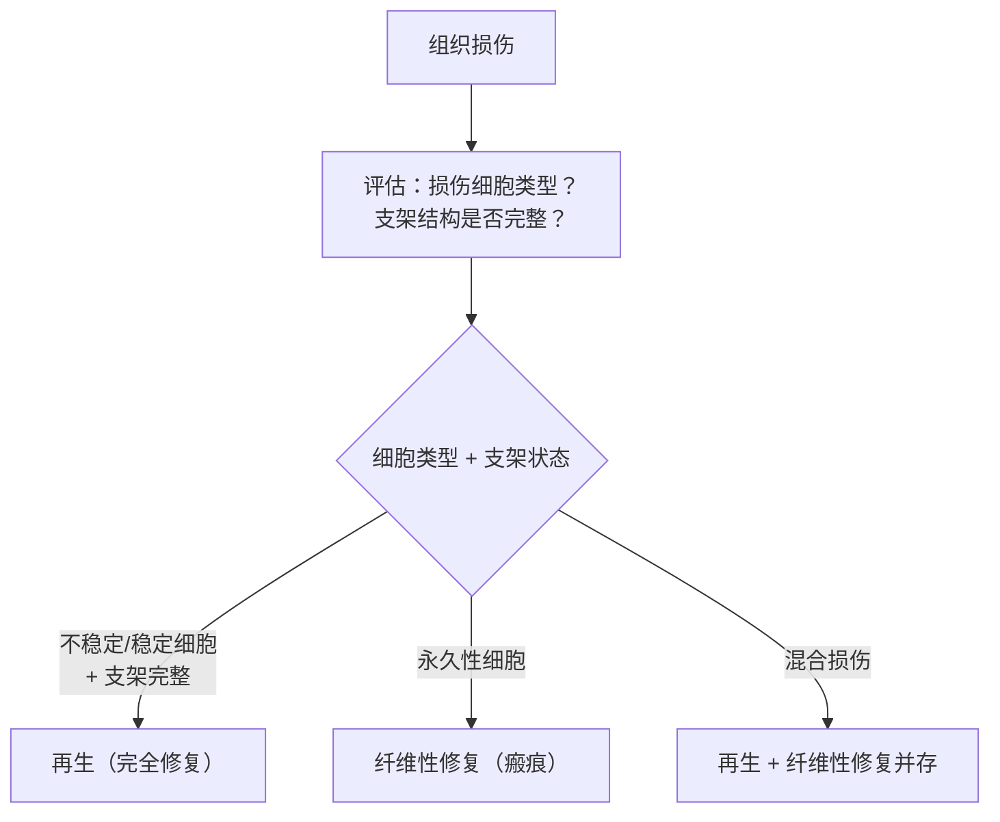

# 修复（Repair）

## 📌 定义
- 损伤造成机体部分细胞和组织丧失后，机体对所形成缺损进行**修补恢复**的过程
- 修复后可完全或部分恢复原组织的结构和功能
- 参与修复的主要成分：**细胞外基质** + 各种**细胞**

## 🔬 修复的两种形式

| 形式 | 机制 | 结果 |
|------|------|------|
| **[[再生]]** | 由损伤周围的**同种细胞**修复 | 完全再生→完全恢复结构及功能；不完全再生→部分恢复 |
| **[[纤维性修复]]（瘢痕修复）** | 由**纤维结缔组织**修复 | 形成瘢痕，无法恢复原功能 |

> 💡 多数情况下两种修复过程**同时存在**，且常伴有**炎症反应**

## 🩺 修复方式的选择

**关键概念**：[[再生]]、[[纤维性修复]]、[[修复]]

---
## 📎 相关笔记
- 再生相关：[[再生]]、[[细胞再生能力]]、[[干细胞]]
- 纤维修复相关：[[纤维性修复]]、[[肉芽组织]]、[[瘢痕组织]]
- 分子机制：[[细胞外基质]]、[[生长因子]]
- 临床应用：[[创伤愈合]]、[[骨折愈合]]
- 上一章：[[细胞适应]] → [[可逆性损伤]] → [[坏死]] → **修复**
- 炎症相关：[[炎症]]（修复常伴炎症反应，肉芽组织本质为慢性炎症）
