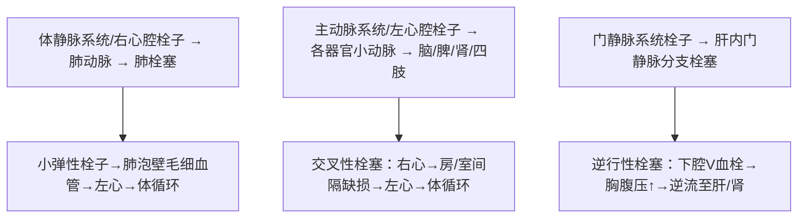

# 栓塞（Embolism）

## 📌 定义
- 在循环血液中出现的不溶于血液的异常物质，随血流运行阻塞血管腔的现象
- 阻塞血管的异常物质称为**栓子（embolus）**

## 🔬 栓子运行途径



## 🩺 栓塞类型

### 一、血栓栓塞（最常见，占99%以上）

#### 1. 肺动脉栓塞
**栓子来源**：95%以上来自膝以上下肢深部静脉（腘静脉、股静脉、髂总静脉）

| 栓子大小 | 栓塞部位 | 后果 |
|:---------|:---------|:-----|
| 中、小栓子 | 肺动脉小分支（肺下叶多见） | 一般不严重（肺双重血供+侧支代偿）；可溶解或机化 |
| **大栓子** | 肺动脉主干或大分支 | **骑跨性栓塞（saddle embolism）** → 呼吸困难、发绀、休克→猝死 |
| 小且数目多 | 广泛栓塞多数小分支 | 右心衰竭猝死 |

**猝死机制**：
```
① 肺动脉主干/大分支栓塞 → 肺动脉阻力↑ → 急性右心衰竭
   + 肺缺血缺氧 → 左心回心血量↓ → 冠脉灌流不足 → 心肌缺血
② 肺栓塞刺激迷走神经 → 反射性血管痉挛
③ 血栓内血小板释放5-HT及TXA₂ → 肺血管痉挛
```

![[病理_栓塞_肺动脉血栓栓塞大体.png]] 
— 肺动脉血栓栓塞猝死机制图

#### 2. 体循环动脉栓塞
**栓子来源**：约80%来自左心腔（亚急性感染性心内膜炎赘生物、二尖瓣狭窄左房附壁血栓、心肌梗死区附壁血栓）
**栓塞部位**：下肢、脑、肠、肾、脾

### 二、脂肪栓塞

| 项目 | 内容 |
|:-----|:-----|
| **来源** | 长骨骨折、脂肪组织严重挫伤/烧伤、脂肪肝时上腹部挤压 |
| **路径** | 静脉→右心→肺→（<20μm透过滤）→左心→体循环 |
| **表现** | 伤后1~3天突发呼吸急促、呼吸困难、心动过速、瘀斑皮疹；脑脂肪栓塞→谵妄昏迷 |
| **后果** | 少量→巨噬细胞吞噬/脂酶分解；大量（9~20g）→75%肺循环受阻→窒息+急性右心衰竭死亡 |

### 三、气体栓塞

| 类型 | 机制 | 后果 |
|:-----|:-----|:-----|
| **空气栓塞** | 静脉损伤破裂→空气进入（手术、创伤、正压输液） | 大量气体（>100ml）→右心泡沫状血液→循环障碍→猝死 |
| **减压病** | 高气压环境迅速减压→氮气形成气泡 | 皮下气肿、关节肌肉疼痛、无菌性坏死、冠状动脉阻塞 |

### 四、羊水栓塞

| 项目 | 内容 |
|:-----|:-----|
| **发生率** | 1/50000，**病死率>80%** |
| **机制** | 羊膜破裂/胎盘早剥+宫缩→羊水压入子宫壁破裂静脉窦→肺动脉 |
| **证据** | 肺小动脉和毛细血管内见羊水成分（角化鳞状上皮、胎毛、胎脂、胎粪、黏液） |
| **表现** | 分娩中/后突然呼吸困难、发绀、抽搐、休克、昏迷、死亡 |

**猝死机制**：
```
① 羊水中胎儿代谢产物 → 过敏性休克
② 羊水栓子阻塞肺动脉 + 血管活性物质 → 反射性血管痉挛
③ 羊水凝血致活酶作用 → DIC
```

### 五、其他栓塞
- 肿瘤细胞栓塞、胎盘滋养叶细胞栓塞、骨髓细胞栓塞
- 胆固醇结晶栓塞、血吸虫及虫卵栓塞、细菌/真菌团/异物栓塞

---
## 📎 相关笔记
- 上级：[[局部血液循环障碍]]
- 来源：→ [[血栓形成]]（血栓脱落→栓子）
- 后果：→ [[梗死]]
- 临床：[[深静脉血栓]]、[[肺梗死]]、[[DIC]]、[[减压病]]、[[羊水栓塞]]
