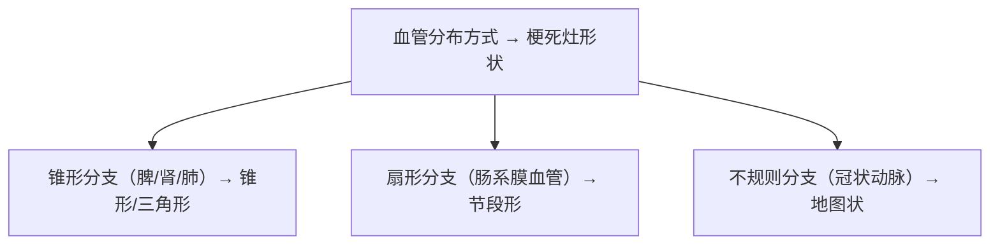
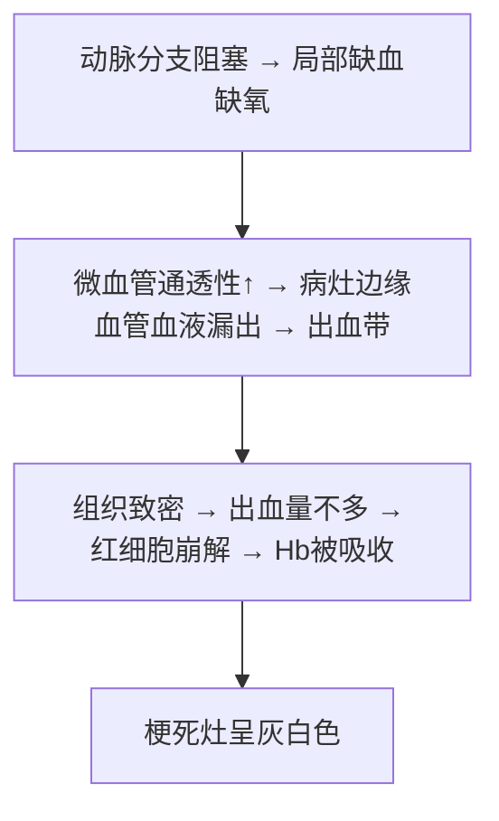
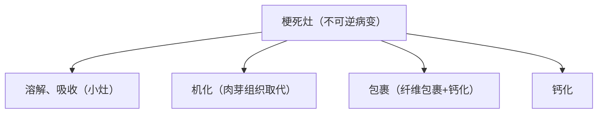
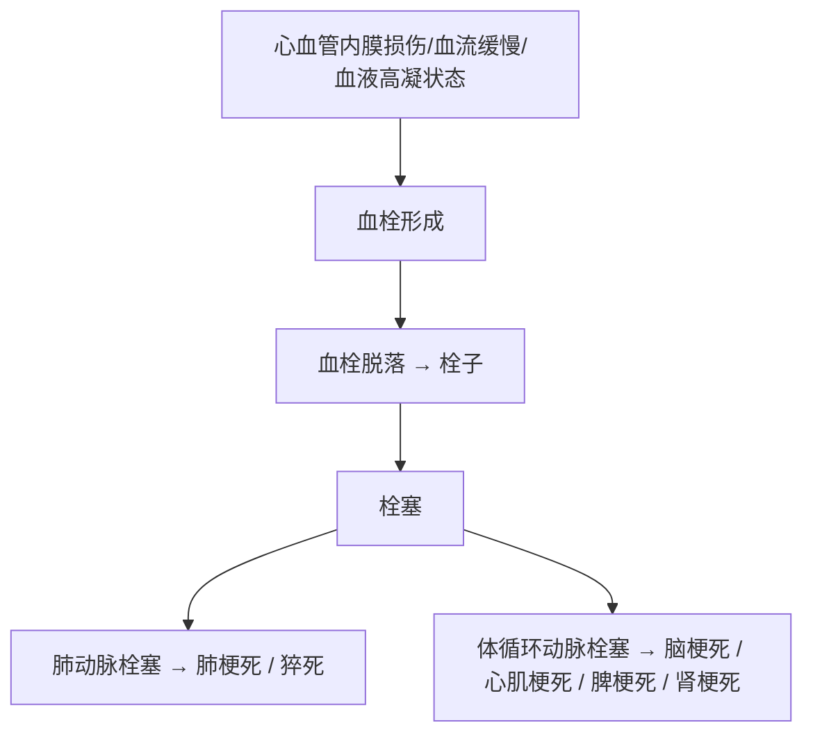
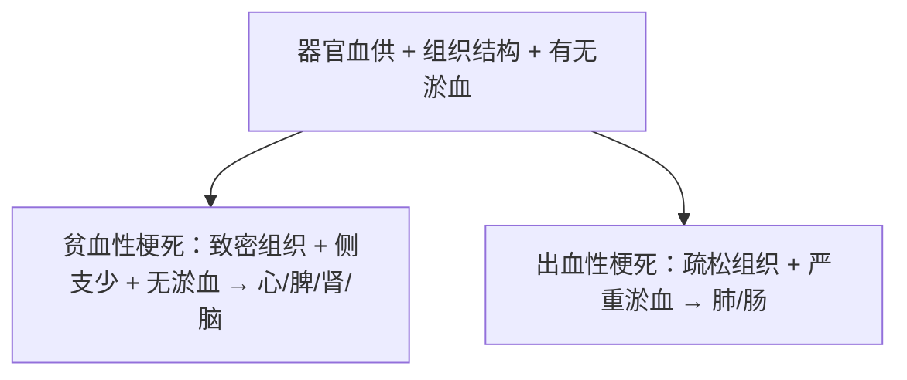

# 梗死（Infarction）

## 📌 定义
- 器官或局部组织血管阻塞、血流停滞导致**缺氧性坏死**
- 一般由**动脉阻塞**引起

## 🔬 病因

| 原因 | 机制 | 举例 |
|:-----|:-----|:-----|
| **血栓形成** | 动脉血流中断或灌流不足 | 冠状动脉/脑动脉粥样硬化+血栓→心肌/脑梗死 |
| **动脉栓塞** | 栓子阻塞动脉 | 脾、肾、肺、脑梗死 |
| **动脉痉挛** | 强烈持续痉挛 | 严重冠脉粥样硬化基础上痉挛→心肌梗死 |
| **血管受压闭塞** | 血管外压迫 | 肿瘤压迫、肠扭转/套叠/嵌顿疝 |

## ⚙️ 影响因素

### 1. 器官血供特性

| 血供类型 | 器官 | 梗死易感性 |
|:---------|:-----|:----------|
| **双重血供** | 肺（肺动脉+支气管动脉）、肝（肝动脉+门静脉）、前臂/手（桡动脉+尺动脉） | 不易梗死 |
| **吻合支少** | 肾、脾、脑 | **易梗死** |

### 2. 组织对缺血的敏感程度

| 组织 | 缺血耐受时间 |
|:-----|:------------|
| **神经细胞** | 3~4分钟 |
| **心肌细胞** | 20~30分钟 |
| 骨骼肌/纤维结缔组织 | 最强 |

## 🩺 形态特征

### 1. 梗死灶形状

### 2. 梗死灶质地与颜色

| 类型 | 质地 | 颜色 | 发生条件 |
|:-----|:-----|:-----|:---------|
| **[[贫血性梗死]]（白色）** | 凝固性坏死→干燥质硬 | 灰白色 | 致密组织+侧支少+**无**淤血 |
| **[[出血性梗死]]（红色）** | 含血量多 | 暗红色 | 疏松组织+**严重淤血** |

## 🔬 贫血性梗死

**好发**：脾、肾、心、脑（致密实质器官）

**机制**：

**形态**：
- 脾、肾：锥形，尖端向血管阻塞处，底部靠脏器表面
- 心：不规则地图状
- 早期：充血出血带；晚期：黄褐色→机化→瘢痕
- 镜下：凝固性坏死，组织结构轮廓保存

![[病理_梗死_肾梗死大体与镜下.png|690]] 
— 脾切面三角形梗死区；肾贫血性梗死灶边缘

## 🔴 出血性梗死

**发生条件**：
1. **严重淤血**（最重要先决条件）
2. **组织疏松**（肠和肺可容纳多量漏出血液）

### 1. 肺出血性梗死
- **好发**：肺下叶，肋膈缘
- **形态**：多发锥形（楔形），尖端朝向肺门，底部靠肺膜
- **大体**：质实，暗红色，略隆起→久后变浅→灰白色下陷
- **镜下**：凝固性坏死，肺泡轮廓可见，肺泡腔充满红细胞

### 2. 肠出血性梗死
- **原因**：肠系膜动脉栓塞、静脉血栓形成、肠套叠、肠扭转
- **形态**：节段性暗红色，肠壁增厚→坏死→质脆易破裂

### 3. 败血性梗死
- **机制**：含细菌的栓子阻塞血管
- **常见**：急性感染性心内膜炎
- **特点**：梗死灶内见细菌团+大量炎症细胞；化脓性感染→脓肿

## ⚠️ 对机体的影响

| 梗死情况 | 后果 |
|:---------|:-----|
| 重要器官大面积梗死 | **严重功能障碍甚至死亡**（大面积心梗、脑梗） |
| 脾、肾梗死 | 影响较小（局部症状：肾梗死→腰痛、血尿） |
| 肺梗死 | 胸痛、咳嗽、咯血 |
| 肠梗死 | 剧烈腹痛、呕吐、血便、麻痹性肠梗阻、腹膜炎 |
| 肺/肠/四肢梗死+腐败菌感染 | **坏疽**，后果严重 |

## 🔄 结局

## 🧠 临床推理链

---
## 📎 相关笔记
- 上级：[[局部血液循环障碍]]
- 来源：→ [[栓塞]]、[[血栓形成]]
- 对比：[[贫血性梗死]]、[[出血性梗死]]
- 组织联系 → [[凝固性坏死]]（心脾肾）、[[液化性坏死]]（脑）
- 后续愈合 → [[修复]]、[[肉芽组织]]（机化）
- 临床：[[心肌梗死]]、[[脑梗死]]、[[肺梗死]]、[[肠坏疽]]
