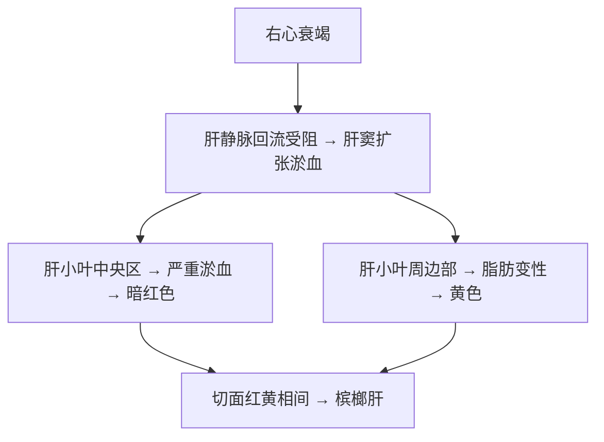

# 槟榔肝（Nutmeg Liver）

## 📌 定义
- **慢性肝淤血**的特征性大体改变
- 肝切面呈**红黄相间**，状似槟榔切面

## ⚙️ 形成机制

> 🖼️ **大体图**：肝脏切面红黄相间花纹，状似槟榔切面 → ![[病理_循环_槟榔肝淤血坏死镜下.jpeg|679]]

## 🔍 病理变化

| 层次 | 表现 |
|:----|:------|
| **大体** | 肝脏体积增大，切面红黄相间花纹，状似槟榔 |
| **镜下** | 中央静脉及肝窦扩张充满红细胞；中央区肝细胞萎缩/消失；周边区肝细胞脂肪变性 |

> 🖼️ **镜下图**：镜下见肝小叶中央肝窦高度扩张淤血，肝细胞萎缩；肝小叶周边部肝细胞脂肪变性，胞质出现脂滴空泡 → ![[病理_循环_槟榔肝大体与镜下.png]]![[病理_循环_槟榔肝切面红黄相间大体.jpg]]

## ⚠️ 转归
- **长期严重淤血** → 网状纤维塌陷 + 胶原化 + 肝星状细胞增生 → **[[淤血性肝硬化]]** → 腹水

---
## 📎 相关笔记
- 上级：[[淤血]]（慢性肝淤血）
- 结局：→ [[淤血性肝硬化]]
- 临床：[[右心衰竭]]

