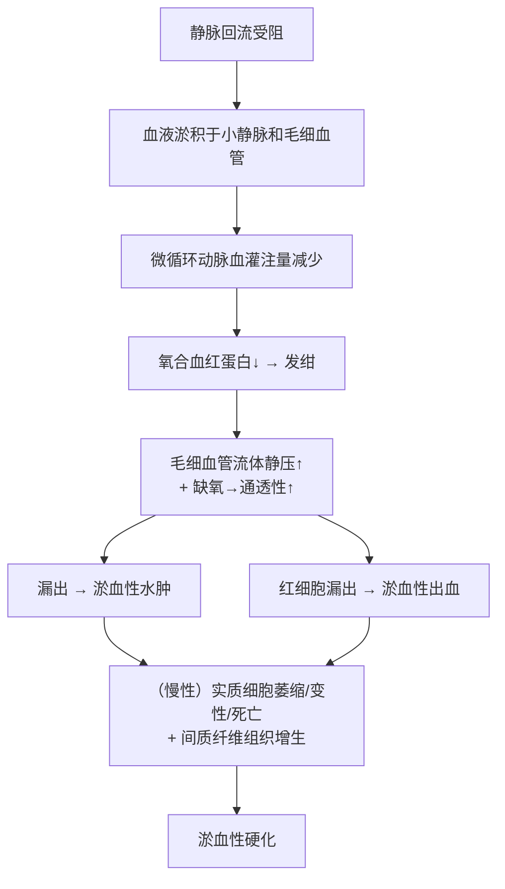

# 淤血（Congestion）

## 📌 定义
- 器官或局部组织**静脉血液回流受阻**，血液淤积于小静脉和毛细血管内
- 又称**静脉性充血（venous hyperemia）**
- 是一种**被动过程**

## 🔬 病因

> 📝 **手写分类**：
> ```
> 淤血原因
> ├── **心源性（内压）**：心力衰竭 → 心腔压力↑ → 静脉回流受阻
> └── **血管性（非心源性）**
>     ├── **外压性**：血管受外部压迫 → 管腔狭窄/闭塞
>     └── **阻塞性**：血管内占位 → 管腔堵塞
> ```

| 类型 | 机制 | 举例 |
| :------------ | :------------ | :------------------------------ |
| **心源性（内压）** | 心腔压力增高→阻碍静脉回流 | 左心衰→肺淤血；右心衰→体循环淤血 |
| **外压性（血管性）**  | 外部压迫→管腔狭窄/闭塞  | 肿瘤压迫、妊娠子宫压迫髂总静脉、肠疝嵌顿、肝硬化假小叶压迫肝窦 |
| **阻塞性（血管性）** | 血栓/瘤栓等堵塞管腔   | 下肢深静脉血栓形成 |

> 📝 **演变链**：急性淤血 → 慢性淤血 → 侧支循环开放 → 全身改变（可出现淤血性肝硬化→腹水）

## ⚙️ 机制与后果链



**关键概念**：[[水肿]]、[[出血]]、[[心衰细胞]]、[[淤血性肝硬化]]、[[肺褐色硬化]]

## 🩺 病理变化

| 层次 | 表现 |
|:-----|:------|
| **大体** | 体积增大、肿胀、重量增加；颜色暗红；体表温度下降 |
| **镜下** | 细静脉及毛细血管扩张，红细胞积聚 |

### 慢性淤血三联征
1. 实质细胞萎缩、变性、坏死
2. 间质纤维组织增生 + 网状纤维胶原化
3. **淤血性硬化**

## 🫁 重要器官：肺淤血（左心衰竭）

### 急性肺淤血
- **大体**：肺体积增大，暗红色，切面流出泡沫状红色血性液体
- **镜下**：肺泡壁毛细血管扩张充血，肺泡壁变厚，肺泡间隔水肿，肺泡腔内水肿液+出血

### 慢性肺淤血
- **镜下**：肺泡壁毛细血管扩张充血更明显，肺泡间隔变厚、纤维化
- **特征性细胞**：**心衰细胞（heart failure cell）**——吞噬含铁血黄素颗粒的巨噬细胞
- **结局**：**肺褐色硬化（brown induration）**——质地变硬，呈棕褐色
![[病理_循环_心衰细胞普鲁士蓝染色镜下.jpeg|689]]
— 慢性肺淤血，肺泡壁毛细血管扩张充血，肺泡腔内可见心衰细胞

### 临床推理链
```
左心衰竭 → 左心腔内压力↑ → 阻碍肺静脉回流 → 肺淤血
    ↓
急性：气促、发绀；严重肺水肿时咯粉红色泡沫痰、呼吸困难
慢性：肺褐色硬化
```

## 🫁 重要器官：肝淤血（右心衰竭）

### 急性肝淤血
- **大体**：肝脏体积增大，呈暗红色
- **镜下**：肝小叶中央静脉和肝窦扩张，充满红细胞；肝细胞脂肪变性、萎缩、坏死

### 慢性肝淤血
- **特征性病变**：**槟榔肝（nutmeg liver）**
  - 肝小叶中央区：暗红色（淤血区）
  - 肝小叶周边部：黄色（肝细胞脂肪变性区）
  - 切面：红黄相间，状似槟榔切面
- **长期严重淤血**→ 网状纤维塌陷胶原化 + 肝星状细胞增生→ **淤血性肝硬化**

![[病理_循环_槟榔肝淤血坏死镜下.jpeg|612]] 
— 槟榔肝，肝切面红黄相间，状似槟榔切面

### 临床推理链
```
右心衰竭 → 肝静脉回流受阻 → 肝小叶中央静脉及肝窦扩张淤血
    ↓
中央区肝细胞萎缩消失 + 周边区脂肪变性
    ↓
槟榔肝
    ↓
长期 → 淤血性肝硬化 → 腹水
```

---
## 📎 相关笔记
- 上级：[[局部血液循环障碍]]
- 对比：[[充血]]（被动 vs 主动）
- 概念：[[心衰细胞]]、[[槟榔肝]]、[[肺褐色硬化]]、[[淤血性肝硬化]]
- 后果：[[水肿]]、[[出血]]、[[血栓形成]]（静脉淤滞→Virchow三联征）
- 临床：[[左心衰竭]]、[[右心衰竭]]、[[肝硬化]]
