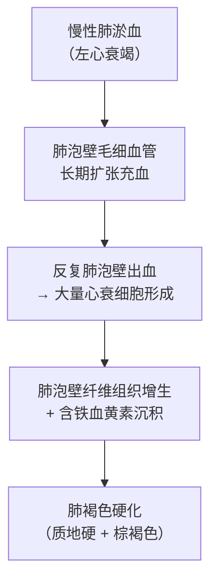

# 肺褐色硬化（Brown Induration）

## 📌 定义
- **慢性肺淤血**的最终结局
- 肺组织**质地变硬** + 颜色呈**棕褐色**

## ⚙️ 形成机制

**关键概念**：[[心衰细胞]]、[[左心衰竭]]、[[淤血]]

> 🖼️ **大体图**：肺体积增大、质地变硬、切面棕褐色 ![[病理_循环_肺褐色硬化大体.jpg]]
> 肺表面胸膜大致菲薄、透明，并暴露出其下黑色的斑点及铁锈色的斑点。肺组织切面呈均匀的淡棕黄色，并有散在的铁锈色斑点，肺组织较坚实

## 🔍 病理变化

| 层次 | 表现 |
|:----|:------|
| **大体** | 肺体积增大、质地变硬、切面呈棕褐色 |
| **镜下** | 肺泡壁增厚/纤维化；大量[[心衰细胞]]；含铁血黄素沉积 |

## 🆚 急性 vs 慢性肺淤血

| 对比 | 急性肺淤血 | 慢性肺淤血 |
|:----|:----------|:----------|
| **肺泡壁** | 毛细血管扩张充血、水肿 | 增厚、纤维化 |
| **特征细胞** | — | [[心衰细胞]]（吞噬含铁血黄素的巨噬细胞） |
| **结局** | 可恢复 | **肺褐色硬化** |

---
## 📎 相关笔记
- 上级：[[淤血]]（慢性肺淤血）
- 特征细胞：[[心衰细胞]]
- 临床：[[左心衰竭]]
