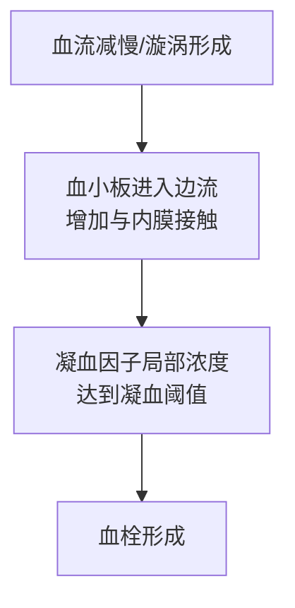
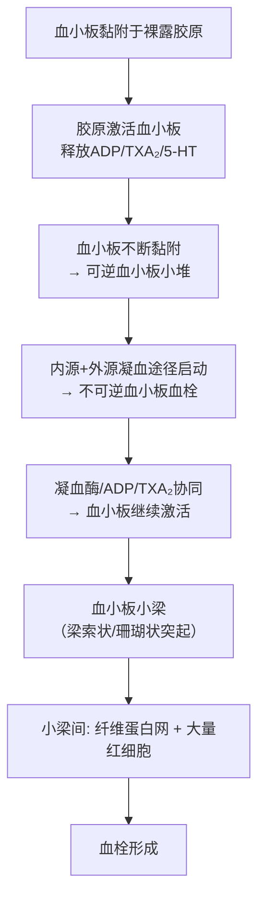
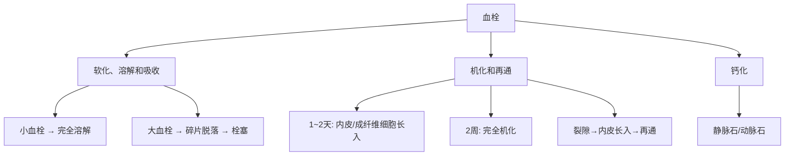

# 血栓形成（Thrombosis）

## 📌 定义
- 在活体的心脏和血管内，血液发生凝固或血液中某些有形成分凝集形成固体质块的过程
- 所形成的固体质块称为**血栓（thrombus）**
- 生理基础：**凝血系统 ↔ 抗凝血系统**动态平衡
- 📝 **三种基本成分**：血小板（形成小梁骨架）、纤维素（交织网架）、血细胞（填充网眼，占体积最多）

## 🔬 Virchow三联征（病因与机制）

### 一、心血管内皮细胞损伤（最重要、最常见）

> 📝 **凝血途径**：① 胶原暴露→激活因子Ⅻ→**内源性**凝血 ② 内皮损伤释放组织因子→激活因子Ⅶ→**外源性**凝血

**生理状态（抗凝为主）：**

| 抗凝机制 | 方式 |
|:---------|:-----|
| 屏障作用 | 分隔血小板/凝血因子与内皮下ECM |
| 抗血小板黏集 | 合成PGI₂、NO、ADP酶 |
| 合成抗凝物质 | 凝血酶调节蛋白、蛋白S、膜相关肝素样分子 |
| 促进纤溶 | 合成t-PA |

**损伤时（促凝为主）：**

| 促凝机制 | 方式 |
|:---------|:-----|
| 激活外源性凝血 | 释放组织因子→激活因子Ⅶ |
| 辅助血小板黏附 | 释放vWF→介导血小板与胶原黏附 |
| 抑制纤溶 | 分泌PAI |

**血小板活化三阶段**（血栓形成核心）：

| 阶段 | 机制 |
|:----|:-----|
| ① **黏附反应** | vWF介导血小板与胶原黏附 |
| ② **释放反应** | 释放α颗粒（纤维蛋白原、vWF、PDGF）和δ颗粒（ADP、ATP、Ca²⁺、5-HT） |
| ③ **黏集反应** | Ca²⁺、ADP、TXA₂作用下血小板彼此黏集成堆 |

📝 **级联反应**：黏附→释放→吸引更多血小板、纤维素、内皮细胞聚集（**"滚雪球"效应**）
![[病理_循环_血栓形成血小板聚集镜下.jpeg]] 
— 血小板黏附、聚集过程示意图
![[病理_血栓_血栓形成级联反应示意图.png|697]] 
— Virchow三联征示意图

### 二、血流状态异常

**静脉血栓多见的原因**（静脉比动脉多4倍）：
1. 静脉瓣膜处血流缓慢且出现漩涡
2. 静脉血流有时出现短暂停滞
3. 静脉壁较薄，容易受压
4. 血液经毛细血管后黏性增加

### 三、血液凝固性增加

| 类型 | 机制 | 疾病 |
|:-----|:-----|:-----|
| **遗传性高凝** | 第Ⅴ因子基因突变（抵抗蛋白C降解）；AT-Ⅲ/蛋白C/S缺乏 | 复发性深静脉血栓 |
| **获得性高凝** | 癌细胞释放促凝因子；DIC；血液浓缩；血小板增多 | 晚期恶性肿瘤、DIC、严重创伤、大面积烧伤、妊娠高血压 |

> 💡 三个条件往往**同时存在**。内皮损伤最重要，但血流缓慢和血液凝固性增高也是重要因素。

> 📝 **血栓好发部位**：**静脉 > 动脉 > 毛细血管**（静脉血流慢、有瓣膜、壁薄→发生率占绝大多数）

## 🔬 血栓形成过程

**关键概念**：[[血小板]](黏附→释放→聚集)、[[ADP]](ADP)、[[TXA₂]](TXA₂)、凝血酶

## 🩺 血栓类型与形态

| 类型 | 部位 | 肉眼 | 镜下 | 特点 |
|:-----|:-----|:-----|:-----|:-----|
| **白色血栓**（[[血栓形成]]） | 心瓣膜/心腔/动脉；静脉血栓头部 | 灰白色小结节/赘生物，表面粗糙质实 | 血小板+少量纤维蛋白 | 与管壁紧密黏着，不易脱落 |
| **混合血栓** | 静脉血栓体部；心腔内/动脉瘤内（附壁血栓） | 粗糙干燥圆柱状，灰白与褐色相间 | 血小板小梁+纤维蛋白网红细胞 | **层状结构** |
| **红色血栓** | 静脉血栓尾部 | 暗红色，新鲜时湿润有弹性 | 纤维蛋白网眼内充满血细胞 | 与管壁无粘连，易脱落→栓塞 |
| **透明血栓** | 毛细血管（[[DIC]]时） | 仅镜下可见 | 嗜酸性同质性纤维蛋白 | 又称微血栓/纤维蛋白性血栓 |

![[病理_血栓_四类血栓对比图.png]]
— 血栓类型对比（死后血凝块与混合血栓的对比）

## 🔄 血栓结局

## ⚖️ 对机体的影响

| 影响 | 机制 | 举例 |
|:-----|:-----|:-----|
| ✅ **有利：止血** | 血栓阻塞破裂血管 | 慢性胃溃疡、肺结核空洞 |
| ❌ **阻塞血管** | 未完全阻塞→缺血萎缩；完全阻塞→梗死 | 脑梗死、心肌梗死 |
| ❌ **栓塞** | 血栓脱落成为栓子 | 深静脉血栓、心室血栓脱落 |
| ❌ **心瓣膜变形** | 反复血栓→机化→瓣膜增厚变硬 | 风湿性心内膜炎 |
| ❌ **广泛性出血** | DIC时微血栓→凝血因子消耗→出血 | 严重创伤、羊水栓塞 |

---
## 📎 相关笔记
- 上级：[[局部血液循环障碍]]
- 概念：[[血栓形成|白色血栓]]、[[混合血栓]]、[[红色血栓]]、[[透明血栓]]
- 进程：→ 机化（[[肉芽组织]]取代）→ [[再通]]
- 临床：[[DIC]]、[[深静脉血栓]]、[[风湿性心内膜炎]]
- 发展：→ [[栓塞]] → [[梗死]]
