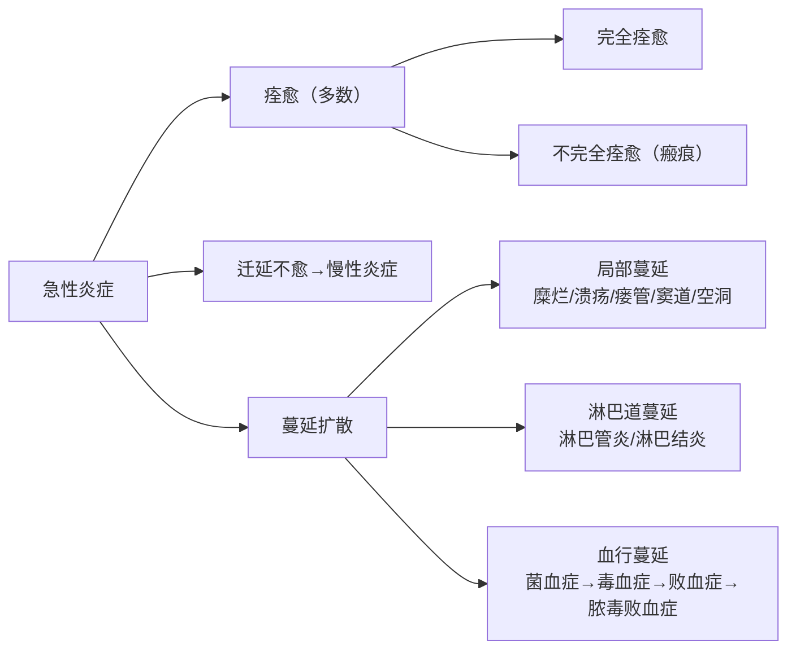

# 炎症（Inflammation）

## 📌 定义

**炎症**是具有血管系统的活体组织在各种损伤因子的刺激下所发生的以**防御反应为主**的基本病理过程。

> 本质三要素：
> - ✅ **防御反应**（不是单纯的损伤）
> - ✅ 必须有**血管系统**（单细胞生物无血管，不叫炎症）
> - ✅ **损伤、抗损伤、修复**的动态平衡

**炎症的中心环节**：**血管反应**

---

## 第一节 炎症的基本病理变化

[[炎症的基本病理变化]] — 三大基本过程：**变质、渗出、增生**

### 1. 变质（Alteration）
损伤性过程，早期为主。局部组织发生**变性**和**坏死**：
- **实质细胞**：[[细胞水肿]]、[[脂肪变|脂肪变性]]、[[凝固性坏死]]、[[液化性坏死]]
- **间质细胞**：[[黏液样变|黏液样变性]]、[[纤维蛋白样坏死]]

### 2. 渗出（Exudation）
抗损伤过程，是炎症的核心环节。包括：

| 子过程 | 内容 | 对应笔记 |
|:-------|:-----|:---------|
| **血管反应** | 血流动力学改变（收缩→扩张→淤滞）+ 通透性↑4种机制 | [[急性炎症的血管反应]] |
| **液体渗出** | 渗出液 vs 漏出液鉴别 | — |
| **细胞渗出** | 边集→滚动→黏附→游出→趋化→吞噬→杀伤 | [[白细胞渗出]]、[[白细胞功能缺陷]] |
| **炎症介质** | 细胞来源 + 体液来源，指挥放大全过程 | [[炎症介质]] |

> **渗出液 vs 漏出液**：渗出液（血管通透性↑，炎症）— 漏出液（血浆超滤，非炎症）

### 3. 增生（Proliferation）
修复过程，后期为主。实质细胞和间质细胞增生，限制炎症扩散、修复损伤。

---

## 第二节 炎症的病因与进展

### 1. 概念
- 炎症是**防御反应**，血管反应是其**中心环节**

### 2. 原因
[[炎症的病因|六大类致炎因子]]：
**物理性**、**化学性**、**生物性（最常见→感染）**、组织坏死、超敏反应、异物

### 3. 局部表现和全身反应
[[炎症的局部表现与全身反应]]
- **局部五大征**：**红**（充血）、**肿**（渗出）、**热**（血流↑+产热↑）、**痛**（介质刺激）、**功能障碍**
- **全身反应**：发热（IL-1/TNF→PGE₂）、白细胞↑/↓、核左移

### 4. 急性炎症的终止
[[急性炎症的结局]] 炎症不会无限持续，有其主动终止机制：
- **介质衰减**：炎症介质半衰期短，自行失活
- **中性粒细胞凋亡**：被巨噬细胞清除
- **终止信号释放**：脂质素、TGF-β、IL-10

### 5. 炎症的结局
[[急性炎症的结局]] — 三种归宿：



**关键概念**：[[慢性炎症]]、[[急性炎症的结局]]

---

## 第三节 各型炎症

### 一、按病程分类

| 类型 | 急性炎症 | 慢性炎症 |
|:-----|:---------|:---------|
| **病程** | 发展快、病程短 | 发展慢、病程长 |
| **病变特点** | 以**渗出**为主 | 以**增生**为主 |
| **炎细胞** | **中性粒细胞** | 单核/巨噬细胞、淋巴细胞、浆细胞 |
| **临床表现** | 体表时局部明显 | 局部不明显 |

### 二、按基本病理变化分类

#### 1. 变质性炎
以**变性、坏死**为主，渗出和增生轻微。
- 举例：病毒性肝炎、乙型脑炎、中毒性心肌炎、肠阿米巴病

#### 2. 渗出性炎（四大类）

| 类型 | 渗出物 | 特点 | 代表疾病 |
|:-----|:-------|:-----|:---------|
| **[[浆液性炎]]** | 浆液（清亮，3-5%蛋白） | 水疱、卡他 | 感冒、Ⅱ度烧伤、结核性胸膜炎 |
| **[[纤维素性炎]]** | 纤维蛋白（红染网状） | 假膜/绒毛心 | 白喉、菌痢、**绒毛心**、[[大叶性肺炎]] |
| **[[化脓性炎]]** | 中性粒细胞+脓液 | **脓肿**（金葡菌）vs **蜂窝织炎**（链球菌） | 皮肤脓肿、阑尾炎 |
| **[[出血性炎]]** | 大量红细胞 | 非独立类型，常合并出现 | 流行性出血热、钩体病、鼠疫 |

#### 3. 增生性炎

| 类型 | 特点 | 举例 |
|:-----|:-----|:-----|
| **非特异性** | 增生 + 慢性炎细胞 | 炎性息肉、炎性假瘤 |
| **特异性（[[肉芽肿性炎]]）** | 巨噬细胞结节状增生 | 结核、麻风、梅毒、结节病 |

> **肉芽肿性炎核心结构**：干酪样坏死 → 上皮样细胞 → Langhans巨细胞 → 淋巴细胞 → 成纤维细胞

---

## 📊 高频考点速记表

| 考点 | 关键词 |
|:-----|:-------|
| **炎症的中心环节** | **血管反应** |
| **急性炎症早期 / 化脓性炎的标志细胞** | **中性粒细胞** |
| **慢性炎症细胞** | 单核细胞、淋巴细胞、浆细胞 |
| **肉芽肿的主要细胞** | 巨噬细胞（→上皮样细胞→Langhans巨细胞） |
| **最有效的杀菌系统** | **H₂O₂—MPO—Cl⁻** 系统 |
| **假膜性炎的特征渗出物** | **纤维蛋白（纤维素）** |
| **绒毛心** | 纤维蛋白性心包炎（浆膜的纤维素性炎） |
| **脓肿致病菌** | 金葡菌（产凝血酶→局限化） |
| **蜂窝织炎致病菌** | 溶血性链球菌（透明质酸酶+链激酶→弥漫化） |
| **渗出液 vs 漏出液** | 血管通透性增加 vs 血浆超滤 |

---

## 🧠 临床推理链

### 推理链1：炎症类型判断
```
渗出物性质 → 炎症类型 → 常见疾病
  ├── 浆液 → 浆液性炎 → 感冒初期、结核性胸膜炎
  ├── 纤维蛋白 → 纤维素性炎 → 白喉、大叶性肺炎、绒毛心
  ├── 中性粒细胞+脓液 → 化脓性炎 → 脓肿/蜂窝织炎
  └── 红细胞 → 出血性炎 → 流行性出血热
```

### 推理链2：化脓性炎鉴别
```
金葡菌（毒力强+产凝血酶）→ 局限 → 脓肿
链球菌（透明质酸酶+链激酶）→ 弥漫 → 蜂窝织炎
```

### 推理链3：血行蔓延（轻→重）
```
菌血症 → 毒血症 → 败血症 → 脓毒败血症
菌入血    毒入血    菌入血+繁殖   败血症+转移性脓肿
无症状    有症状    全身中毒症状   多发性栓塞性脓肿
```

---

## 🧭 笔记地图

第一节 基本病理变化
  - [[炎症的基本病理变化]] — 变质 / 渗出 / 增生
  - [[急性炎症的血管反应]] — 血流动力学 + 通透性
  - [[白细胞渗出]] — 边集→滚动→黏附→游出→趋化→吞噬
  - [[白细胞功能缺陷]] — LAD / Chediak-Higashi / CGD
  - [[炎症介质]] — 细胞来源 + 体液来源
第二节 病因与进展
  - [[炎症的病因]] — 六大类致炎因子
  - [[炎症的局部表现与全身反应]] — 红肿热痛功能障碍
  - [[急性炎症的结局]] — 终止 / 痊愈 / 慢性 / 蔓延扩散
第三节 各型炎症
  - [[变质性炎]] — 变性坏死为主（病毒性肝炎/乙脑）
  - 渗出性炎
  - [[浆液性炎]] / [[纤维素性炎]]
  - [[化脓性炎]] / [[出血性炎]]
  - 增生性炎
    - 非特异性 → [[慢性炎症]]
    - 特异性 → [[肉芽肿性炎]]

---
## 📎 相关笔记
- 病因：[[炎症的病因]]
- 基本病理：[[炎症的基本病理变化]]
- 临床表现：[[炎症的局部表现与全身反应]]
- 急性炎症机制：[[急性炎症的血管反应]]、[[白细胞渗出]]、[[白细胞功能缺陷]]、[[炎症介质]]
- 急性炎症类型：[[浆液性炎]]、[[纤维素性炎]]、[[化脓性炎]]、[[出血性炎]]
- 结局：[[急性炎症的结局]]
- 慢性炎症：[[慢性炎症]]、[[肉芽肿性炎]]
- 跨章联系：[[充血]]、[[水肿]]、[[修复]]、[[肉芽组织]]、[[纤维蛋白样坏死]]、[[肿瘤]]（慢性炎症→癌变）
