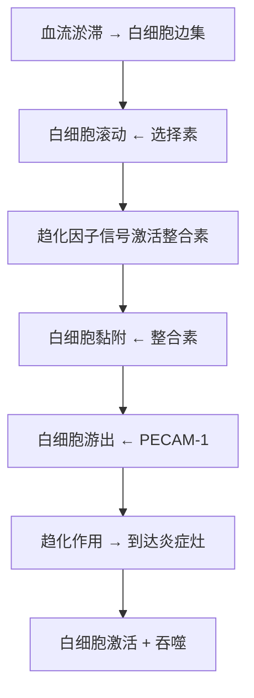

# 白细胞渗出

## 📌 定义
白细胞从血管内穿过血管壁进入炎症灶的过程称为**白细胞渗出**，是炎症反应最重要的环节。

## 🔬 白细胞渗出过程



**关键概念**：选择素（滚动）、整合素（黏附）、PECAM-1（游出）、趋化因子（趋化）

> 🖼️白细胞渗出过程模式图（边集→滚动→黏附→游出→趋化→吞噬）
> ![[病理_炎症_白细胞渗出过程模式图.png]]

### 1. 边集（Margination）
- 血流淤滞后，白细胞从轴流进入边流，靠近血管壁

### 2. 滚动（Rolling）— 选择素介导
- 选择素（P/E-selectin）与白细胞表面唾液酸化Lewis X结合
- 结合弱、可逆，白细胞沿血管壁"滚动"
- **P选择素**：储存于Weibel-Palade小体，组胺/凝血酶刺激后快速表达
- **E选择素**：TNF/IL-1诱导内皮细胞转录合成（2-6h后）

### 3. 黏附（Adhesion）— 整合素介导
- 趋化因子信号 → 白细胞整合素从低亲和力→**高亲和力构象**
- 整合素与内皮ICAM-1/VCAM-1结合 → **牢固黏附**
- 这是白细胞渗出的**关键限速步骤**

### 黏附分子总结

| 内皮细胞表达 | 白细胞表达 | 作用阶段 |
|:------------|:-----------|:---------|
| **P选择素** | 唾液酸化Lewis X | 滚动 |
| **E选择素** | 唾液酸化Lewis X | 滚动和黏附 |
| **ICAM-1** | αLβ2、αMβ2整合素 | 黏附、俘获、游出 |
| **VCAM-1** | α4β1整合素 | 黏附 |

### 4. 游出（Transmigration）
- **PECAM-1（CD31）** 介导白细胞通过内皮细胞连接
- 游出方向：**趋化因子浓度梯度**决定

### 5. 趋化作用（Chemotaxis）

| 趋化因子类型 | 代表 | 来源 |
|:------------|:-----|:-----|
| **外源性** | N-甲酰甲硫氨酸末端多肽 | 细菌产物 |
| **内源性** | C5a、LTB₄、趋化性细胞因子 | 补体、花生四烯酸代谢、细胞 |

**机制**：趋化因子与白细胞表面G蛋白偶联受体结合 → 激活Rac/Rho/Cdc42 → 肌动蛋白聚合 → 丝状伪足延伸 → 细胞移位

## 🔬 白细胞激活

白细胞通过以下受体识别微生物并被激活：

| 受体类型 | 识别对象 | 分布 |
|:---------|:---------|:----|
| **Toll样受体（TLRs）** | 微生物产物 | 细胞膜及内体小泡 |
| **G蛋白偶联受体** | N-甲酰甲硫氨酸细菌短肽 | 中性粒细胞、巨噬细胞 |
| **调理素受体** | 调理素化微生物（IgG Fc段、C3b、凝集素） | Fc受体、C3b受体 |
| **细胞因子受体** | 细胞因子（IFN-γ等） | 多种白细胞 |

## 🔬 吞噬作用（Phagocytosis）

```
识别和附着
（甘露糖受体、清道夫受体、调理素受体）
    ↓
吞入 → 形成吞噬体（phagosome）
    ↓
吞噬体 + 初级溶酶体 → 吞噬溶酶体（phagolysosome）
    ↓
杀伤和降解
```

### 杀伤机制

**依赖氧机制（主要）**：
```
NADPH氧化酶 → O₂⁻ → H₂O₂ → 羟自由基
    ↓
MPO-H₂O₂-卤素系统（最有效）
    ↓
MPO催化 H₂O₂ + Cl⁻ → HOCl（次氯酸）
```
- 活性氮（NO）也参与杀菌

**不依赖氧机制**：BPI、溶菌酶、MBP（主要碱性蛋白）、防御素（defensin）

## ⚠️ 白细胞介导的组织损伤
- **机制**：溶酶体酶、活性氧自由基释放到细胞外间质
- **相关疾病**：肾小球肾炎、哮喘、移植排斥反应、肺纤维化

---
## 📎 相关笔记
- 上级：[[炎症]]
- 前序：[[急性炎症的血管反应]]
- 缺陷：[[白细胞功能缺陷]]
- 介质：[[炎症介质]]

