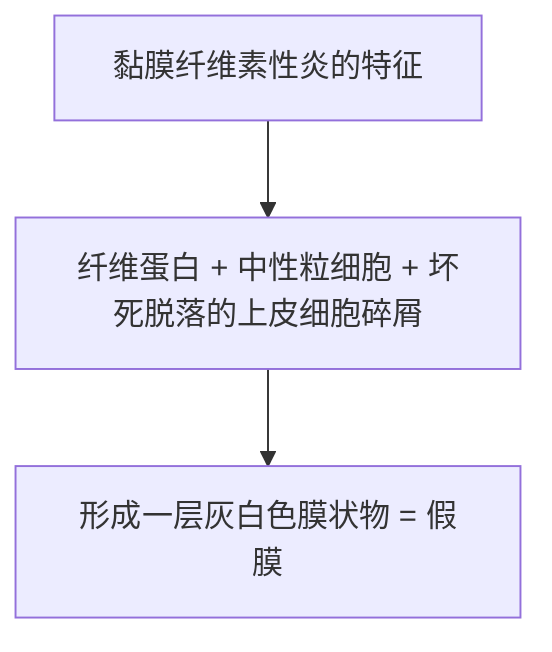

# 纤维素性炎（Fibrinous Inflammation）

## 📌 定义
以**纤维蛋白原渗出**并在组织中形成**纤维蛋白（纤维素）**为特征的急性渗出性炎症。

> HE切片中纤维蛋白呈红染网状、条状或颗粒状

## 🔬 病因
- **细菌毒素**：白喉杆菌、志贺菌（痢疾）、肺炎链球菌
- **内源性/外源性毒物**：尿素、汞

## 🔬 好发部位

| 部位 | 特点 | 举例 |
|:-----|:-----|:------|
| **黏膜** | 形成"假膜" → **假膜性炎** | 白喉、细菌性痢疾 |
| | **固膜性炎**（咽喉部，假膜不易脱落） | 白喉咽喉部 |
| | **浮膜性炎**（气管，假膜易脱落→窒息） | 白喉气管 |
| **浆膜** | 纤维素渗出→"**绒毛心**" | [[风湿病]]、结核性心包炎 |
| **肺** | 大量纤维蛋白 + 中性粒细胞渗出 | **大叶性肺炎**（红色/灰色肝样变期） |

### 假膜性炎

## ⚠️ 结局
- **溶解吸收**（少量纤维素，中性粒细胞释出蛋白水解酶）
- **机化**（纤维素过多或蛋白酶不足→不能完全溶解吸收）→ 浆膜粘连、肺肉质变

## 🩺 举例

### 1. 白喉假膜性炎
- **咽喉部**：假膜与深部组织粘连不易剥脱（**固膜性炎**）
- **气管支气管**：假膜易脱落（**浮膜性炎**）→ 窒息
- **病因**：白喉杆菌外毒素→黏膜上皮坏死+纤维蛋白渗出

### 2. 细菌性痢疾假膜性炎
- **结肠**：浅表黏膜坏死+纤维蛋白渗出→**假膜**→脱落→**地图状溃疡**

### 3. 绒毛心
- **纤维素性心包炎**：纤维蛋白沉积于心外膜→随心跳被拖刷成绒毛状→**"绒毛心"**

### 4. 大叶性肺炎
- 肺泡内充满纤维蛋白+中性粒细胞→肺实变
- 详见 [[大叶性肺炎]]

## 📎 相关笔记
- 上级：[[炎症]]
- 对比：[[浆液性炎]]、[[化脓性炎]]、[[出血性炎]]
- 典型疾病：[[大叶性肺炎]]、[[白喉]]、[[细菌性痢疾]]
