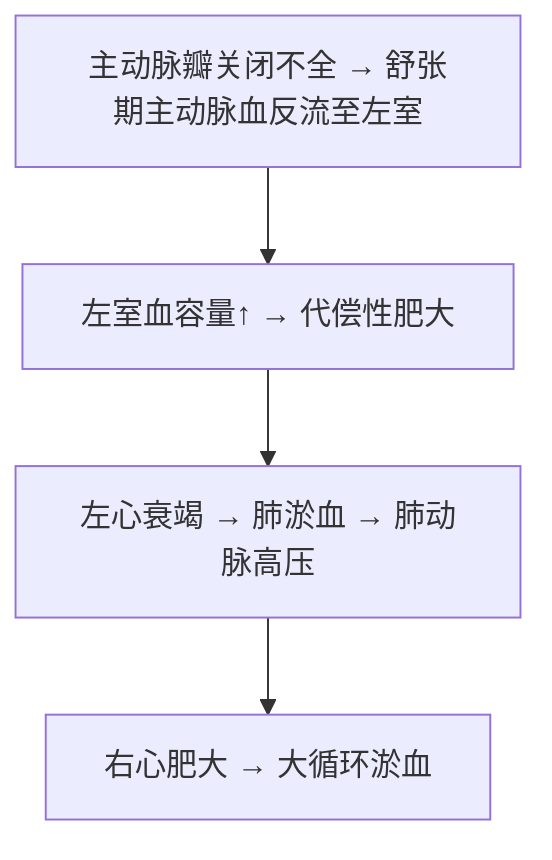

# 主动脉瓣关闭不全（Aortic Insufficiency）

## 📌 定义
舒张期主动脉血液经未完全闭合的主动脉瓣口**反流至左心室**。

## 🔬 病因
风湿性主动脉炎、感染性心内膜炎、主动脉粥样硬化、梅毒性主动脉炎、Marfan综合征。

## ⚙️ 血流动力学

**体征**：主动脉瓣区**舒张期吹风样杂音**；颈动脉搏动、**水冲脉**、血管枪击音、毛细血管搏动；X线：**靴形心**

## ❗ 易混点
- 🚨 **水冲脉+枪击音+毛细血管搏动=主动脉瓣关闭不全三联征**（周围血管征）

## 📎 相关笔记
- 上级：[[心瓣膜病]]
- 对比：[[主动脉瓣狭窄]]
- 病因：[[风湿病]]、[[感染性心内膜炎]]
