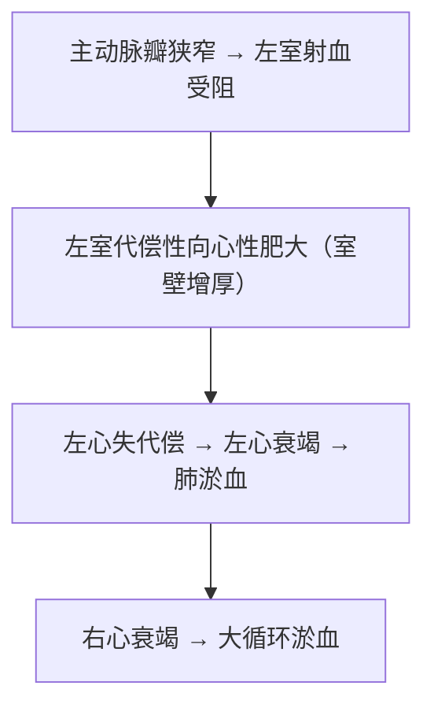

# 主动脉瓣狭窄（Aortic Stenosis）

## 📌 定义
主动脉瓣口狭窄→左心室射血受阻。左室代偿性向心性肥大。

## 🔬 病因
风湿性主动脉炎、先天性发育异常、动脉粥样硬化→瓣膜钙化。

## ⚙️ 血流动力学

**体征**：主动脉瓣区粗糙喷射性**收缩期杂音**；心绞痛、**脉压减小**

## ❗ 易混点
- 🚨 主动脉瓣狭窄→**脉压↓**（射血减少）；主动脉瓣关闭不全→脉压↑（反流导致舒张压低）

## 📎 相关笔记
- 上级：[[心瓣膜病]]
- 对比：[[主动脉瓣关闭不全]]
- 鉴别：[[冠心病]]（心绞痛但冠脉不一定狭窄→需鉴别）
