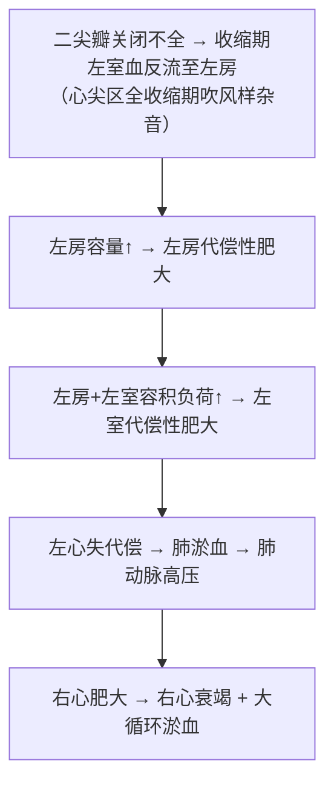

# 二尖瓣关闭不全（Mitral Insufficiency）

## 📌 定义
收缩期左室部分血液经未完全闭合的二尖瓣口**反流至左房**。

## 🔬 病因
风湿性心内膜炎（最常见）、亚急性IE、二尖瓣脱垂/瓣环钙化/腱索异常/乳头肌功能障碍。

## ⚙️ 血流动力学

**X线**：**球形心**（左心室肥大）

## ❗ 易混点
- 🚨 二尖瓣狭窄=左房压力负荷→肺静脉压↑；二尖瓣关闭不全=左房+左室**容量负荷**→球形心

## 📎 相关笔记
- 上级：[[心瓣膜病]]
- 对比：[[二尖瓣狭窄]]
- 病因：[[风湿病]]、[[感染性心内膜炎]]
