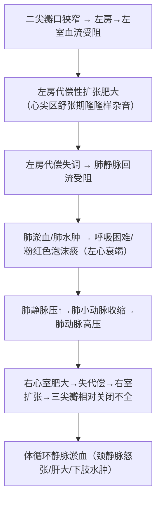

# 二尖瓣狭窄（Mitral Stenosis, MS）

## 📌 定义
二尖瓣口狭窄→舒张期左房→左室血流受阻。最常见的瓣膜病。

## 🔬 病因
**风湿热**（最常见），少数为感染性心内膜炎。20~40岁青壮年，**女性占70%**。

## 🔬 病理
- 正常瓣口面积：~5cm² → 狭窄1.0~2.0cm² → 严重可达0.5cm²
- 早期：瓣膜轻度增厚呈隔膜状
- 后期：瓣叶增厚硬化+腱索缩短→**鱼口状**

> 🖼️二尖瓣狭窄（鱼口状瓣膜）
> ![[病理_心瓣膜病_二尖瓣狭窄鱼口状.png]]

## ⚙️ 血流动力学

**X线**：**梨形心**（左房增大，晚期左室缩小）

## ❗ 易混点
- 🚨 单纯二尖瓣狭窄**不累及左心室**（左室缩小）；左心受累的主要是**左房**

## 📎 相关笔记
- 上级：[[心瓣膜病]]
- 对比：[[二尖瓣关闭不全]]
- 病因：[[风湿病]]
