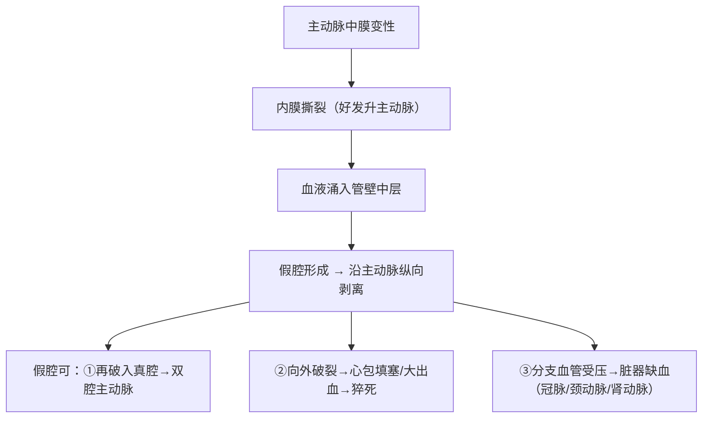

# 动脉瘤（Aneurysm）

## 📌 定义
动脉壁局限性**永久性扩张**（直径≥正常1.5倍）。可发生于任何动脉，以**腹主动脉**和**脑底动脉**最常见。

> 🔑 动脉瘤 ≠ 肿瘤——是血管壁结构破坏后的"膨出"，而非细胞异常增生。

## 🔬 分类

> 🖼️动脉瘤类型对比（囊状/梭形/夹层）
> ![[病理_动脉瘤_类型对比囊状梭形夹层.png]]

### 按形态

| 类型 | 形态 | 特点 |
|:-----|:-----|:------|
| **囊状动脉瘤** | 局部球囊状膨出（~2cm，可达5cm） | 多见于脑底动脉环（berry aneurysm），可使血流形成逆行漩涡 |
| **梭形动脉瘤** | 动脉全长均匀扩张，两端渐变回正常 | 多见于主动脉，常为AS性 |
| **蜿蜒性动脉瘤** | 不对称性扩张，呈蜿蜒状膨隆 | 血管走行扭曲 |
| **舟状动脉瘤** | 管壁一侧扩张，对侧正常 | 少见类型 |
| **夹层动脉瘤** | 内膜撕裂+血液涌入管壁中层→假腔 | 主动脉最典型，最凶险 |
| **假性动脉瘤** | 动脉壁破裂→血肿被周围组织包裹（与动脉腔相通） | 多由外伤引起，瘤壁无完整三层结构 |

### 按结构（真性 vs 假性）

| | 真性动脉瘤 | 假性动脉瘤（搏动性血肿） |
|:--|:---------|:---------------------|
| **管壁结构** | 动脉壁三层均完整（已扩张） | 动脉壁破裂→血肿被周围组织包裹 |
| **瘤壁构成** | 血管壁本身（内膜+中膜+外膜） | 机化的血凝块+纤维组织 |
| **病因** | AS、高血压、梅毒 | 创伤、吻合口漏 |
| **举例** | 腹主动脉瘤 | 股动脉假性动脉瘤（穿刺后） |

### 按病因

| 病因 | 好发部位 | 机制 |
|:-----|:---------|:-----|
| **动脉粥样硬化** ⭐ | 腹主动脉（肾动脉以下） | 中膜萎缩+斑块破坏管壁→管壁支撑力↓→扩张 |
| **高血压** | 主动脉 | 长期高压冲击→中膜平滑肌+弹力纤维断裂 |
| **先天性** | 脑底动脉环（Willis环） | 中膜先天性薄弱（弹力纤维缺失或减少） |
| **梅毒（三期）** | 升主动脉/主动脉弓 | 梅毒性主动脉炎→闭塞性内膜炎→vasa vasorum闭塞→中膜缺血坏死 |
| **感染/真菌性** | 任何动脉 | 细菌栓塞→管壁破坏 |
| **创伤性** | 胸主动脉（减速伤） | 管壁撕裂→假性动脉瘤 |

---

## 🔬 常见动脉瘤类型

> 🖼️腹主动脉瘤大体（主动脉局限性扩张）
> ![[病理_动脉瘤_腹主动脉瘤大体.png]]

### 一、腹主动脉瘤（最常见）

| 项目 | 内容 |
|:-----|:------|
| **病因** | **AS（90%以上）** + 高血压 |
| **好发** | **肾动脉以下**（腹主动脉分叉上方） |
| **形态** | 梭形为主 |
| **大体** | 管壁显著增厚（AS斑块）+ 中膜萎缩变薄；腔内附壁血栓常见 |
| **镜下** | AS斑块+中膜平滑肌/弹力纤维减少+纤维组织取代 |
| **并发症** | **破裂→致命性大出血**（腹膜后或腹腔）；附壁血栓→栓塞 |

> 🔑 腹主动脉瘤是**AS的继发性病变**之一——AS破坏管壁使其中膜萎缩失去支撑→在血压作用下逐渐扩张。

### 二、脑底动脉瘤（Berry Aneurysm）

| 项目 | 内容 |
|:-----|:------|
| **病因** | **先天性**中膜薄弱 + 高血压（加重因素） |
| **好发** | **脑底动脉环（Willis环）分支分叉处** |
| **形态** | 小囊状（直径多<1.5cm） |
| **特点** | 瘤壁仅含内膜+外膜，中膜缺失或极薄 |
| **并发症** | **破裂→蛛网膜下腔出血（SAH）** ——年轻成年人SAH最常见原因 |
| **临床表现** | 突发剧烈头痛（"雷击样"）+ 颈项强直+意识障碍 |

### 三、主动脉夹层（Dissecting Aneurysm）

| 项目 | 内容 |
|:-----|:------|
| **病因** | **高血压**（最重要）+ 遗传性结缔组织病（Marfan综合征） |
| **病理基础** | **主动脉中膜囊性变性**（cystic medial necrosis）——中膜平滑肌+弹力纤维断裂、黏液基质积聚 |
| **好发** | 升主动脉（**最常受累**）、主动脉弓、降主动脉 |
| **分型** | Stanford **A型**（累及升主动脉—外科急症）vs B型（仅降主动脉—可保守） |
| **临床表现** | 突发胸背部剧烈**撕裂样**疼痛→放射至背/腹；HR↑/BP↑ |
| **并发症** | 向外破裂→**心包填塞/大出血→猝死**；冠脉受累→心梗；颈动脉→脑梗；肾动脉→肾衰 |

> 🔑 主动脉夹层的"夹层"不是"分层"的意思——是内膜撕裂后血液在管壁中层剥离出一个**假腔**。**高血压是最重要的病因**（长期高压冲击→中膜变性→内膜撕裂）。

---

## ⚠️ 并发症

| 并发症 | 机制 | 后果 |
|:-------|:-----|:------|
| **破裂** ⭐ | 管壁继续扩张→最终破裂 | **致命性大出血/心包填塞→猝死** |
| **附壁血栓** | 瘤内血流缓慢→血栓形成 | 血栓脱落→**栓塞**（下肢/肾/肠） |
| **压迫周围器官** | 瘤体增大→压迫邻近组织 | 腹主动脉瘤→压迫输尿管/十二指肠；胸主动脉瘤→压迫食管/气管/喉返神经 |
| **感染** | 动脉瘤继发感染 | 真菌性动脉瘤 |

## ❗ 易混点
- 🚨 **动脉瘤 = 管壁膨出 ≠ 血栓栓塞性疾病**：动脉瘤本身是结构异常，其并发症才是血栓/栓塞
- 🚨 **腹主动脉瘤最常累及肾动脉以下段**（不是全段），因为该处弹力纤维较少+血流冲击大
- 🚨 **主动脉夹层 ≠ 主动脉瘤**：夹层是血液在管壁中层剥离形成假腔，不一定有管壁扩张；动脉瘤是管壁永久性扩张
- 🚨 **Stanford A型（累及升主动脉）= 外科急症**；B型（仅降主动脉）= 可药物保守
- 🚨 **脑底动脉瘤破裂→蛛网膜下腔出血**（不是脑实质出血，区别于高血压脑出血）

## 📎 相关笔记
- 前序病因：[[动脉粥样硬化]]（腹主动脉瘤最常见的病因）、[[高血压]]（主动脉夹层+脑底动脉瘤破裂的促进因素）
- 继发性病变：[[动脉粥样硬化#第四期：继发性病变]]（动脉瘤形成=AS的继发性病变之一）
- 血管病理：[[玻璃样变]]、[[纤维蛋白样坏死]]
- 并发症：[[血栓形成]]（附壁血栓→栓塞）、[[梗死]]（脏器缺血）
- 鉴别：[[高血压#脑出血]]（脑实质出血 vs 蛛网膜下腔出血）
