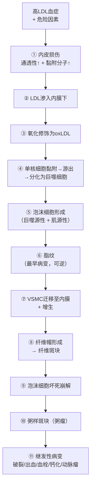

# 动脉粥样硬化（Atherosclerosis, AS）

## 📌 定义

动脉粥样硬化是**大中动脉**（弹性动脉和肌性动脉）的慢性进行性病变。核心病理是动脉内膜下**脂质沉积** → 巨噬细胞吞噬形成**泡沫细胞** → **纤维斑块** → **粥样斑块（粥瘤）** → 导致管壁变硬、管腔狭窄、血栓形成。

> 🔑 AS 是**冠心病、脑梗死、下肢缺血**等心脑血管疾病的共同病理基础——全球头号死因。

---

## 👥 易感人群与流行病学

- **地区**：发达国家 > 发展中国家（但中国发病率正快速上升）
- **年龄**：**40岁以上**中老年人多见，但病变从**青少年期**即开始（脂纹）
- **性别**：**男性 > 女性**（绝经前女性雌激素保护→HDL↑+LDL↓）；绝经后女性风险追上男性
- **高危人群**：高血压、糖尿病、肥胖、吸烟、高脂血症家族史者

---

## 🔬 病因——危险因素

AS 是多因素疾病。按临床意义分为**不可控**和**可控**两类：

### 不可控因素

| 因素 | 要点 |
|:-----|:-----|
| **年龄** | 40岁以上病变明显进展 |
| **性别** | 男性 > 女性（绝经前） |
| **遗传** | 家族史阳性者风险↑2~5倍 |

### 可控因素（预防/治疗靶点）

| 危险因素            | 致AS机制                         |   相对风险   | 临床干预          |
| :-------------- | :---------------------------- | :------: | :------------ |
| **高脂血症** ⭐⭐⭐    | LDL↑ → 氧化LDL → 泡沫细胞形成；**VLDL（极低密度脂蛋白）/IDL（中间密度脂蛋白）↑亦有致AS性**；**HDL↓ → 逆向转运胆固醇能力↓**（详见[[血浆脂蛋白]]） |    最高    | **他汀类（降LDL）+ 升高HDL（运动/烟酸）** |
| **高血压** ⭐⭐⭐     | 血流剪切力↑ → 内皮损伤 → LDL更易进入内膜     | 非药物+降压药  |               |
| **吸烟** ⭐⭐⭐      | 损伤内皮 + LDL氧化↑ + 血小板聚集↑ + HDL↓ |  **戒烟**  |               |
| **糖尿病** ⭐⭐      | 糖基化LDL ↑ + 内皮损伤 + HDL功能异常     |   控制血糖   |               |
| **肥胖** ⭐⭐       | 脂代谢异常 + 胰岛素抵抗 + 炎症因子↑         |  减重+运动   |               |
| **高同型半胱氨酸血症** ⭐ | 损伤内皮 + 促进VSMC（血管平滑肌细胞）增殖               | 叶酸+B族维生素 |               |

> 🔑 **核心中的核心：高LDL血症**——没有LDL渗入内膜，就不会有泡沫细胞和后续病变。他汀降低LDL是AS预防的基石。  
> **HDL是"好的脂蛋白"**——将血管壁内多余的胆固醇运回肝脏代谢（逆向转运胆固醇），HDL水平越低，AS风险越高。运动可升高HDL。

---

## ⚙️ 发病机制——三大学说合一

目前公认是**内皮损伤学说**为启动，**脂质浸润学说**为核心，**炎症学说**为全程驱动。

> 🖼️AS发病机制模式图
> ![[病理_AS_发病机制模式图.png]]
> ——低密度脂蛋白（LDL）通过内皮细胞渗入内皮下间隙，单核细胞迁入内膜；氧化LDL（ox-LDL）与巨噬细胞表面的清道夫受体结合而被摄取，形成巨噬细胞源性泡沫细胞；动脉中膜的平滑肌细胞（SMC）经内弹力膜窗孔迁入内膜，吞噬脂质形成肌源性泡沫细胞；SMC增生迁移，合成细胞外基质，形成纤维帽；ox-LDL使泡沫细胞坏死崩解，形成糜粥样坏死物，粥样斑块形成。

### 完整发病链条



**关键概念**：[[高血压]]、[[糖尿病]]、[[坏死]]、[[血栓形成]]、[[细胞外基质]]、[[动脉瘤]]
- ① 内皮损伤是**启动**环节
- ⑤ 泡沫细胞来源：**巨噬细胞**吞噬oxLDL + **VSMC**表型转化后吞噬脂质
- ⑥ 脂纹是唯一**可逆**的病变
- ⑨ 清道夫受体(SR-A, CD36)**无负反馈**→泡沫细胞持续吞噬直至崩解
- ⑪ **不稳定斑块**（薄帽+大核心+多炎症）是最危险的

### 关键分子与细胞

| 环节     | 关键分子/受体                 | 作用                  |
| :----- | :---------------------- | :------------------ |
| LDL氧化  | 活性氧（ROS）、脂氧合酶           | 产生oxLDL             |
| 单核细胞募集 | **VCAM-1**、ICAM-1（细胞间黏附分子-1）、MCP-1（单核细胞趋化蛋白-1） | 使单核细胞黏附并进入内膜        |
| 泡沫细胞形成 | **清道夫受体(SR-A, CD36)**   | 吞噬oxLDL（无负反馈！→无限吞噬） |
| VSMC迁移 | **PDGF**（血小板源性生长因子）     | VSMC从中膜→内膜          |
| 纤维帽形成  | VSMC分泌胶原、弹性蛋白           | 稳定斑块vs不稳定斑块         |
| 斑块破裂   | **MMP**（基质金属蛋白酶）↑       | 降解纤维帽→斑块不稳定         |

> 🔑 泡沫细胞**清道夫受体无负反馈调节**→ 巨噬细胞持续吞噬oxLDL直到胀破死亡→形成脂质池。这是粥瘤进展无法自行停止的原因之一。

---

## 🔬 病理变化——四期病变

> 🖼️主动脉AS大体（脂纹+纤维斑块）+ 镜下（纤维帽+胆固醇结晶裂隙）
> ![[病理_AS_主动脉大体脂纹纤维斑块.png|195]]![[病理_AS_镜下纤维帽泡沫细胞胆固醇结晶.png|459]]
> ①主动脉内膜表面可见隆起的脂纹、纤维斑块
> ②表层为纤维帽，其下可见散在的泡沫细胞，深层为一些坏死物质、沉积的脂质和胆固醇结晶裂隙

### 第一期：脂纹（Fatty Streak）

| 特征      | 内容                             |
| :------ | :----------------------------- |
| **本质**  | 动脉内膜下泡沫细胞聚集（巨噬源性+肌源性）          |
| **大体**  | 帽针头大小黄色斑点/条纹，平坦或微隆起            |
| **镜下**  | 泡沫细胞聚集于内膜下，胞质富含脂滴呈泡沫状；无纤维帽、无坏死 |
| **好发**  | 主动脉后壁、分支开口处                    |
| **年龄**  | 儿童/青少年即可出现                     |
| **可逆性** | **可逆**（危险因素控制后可消退）             |

### 第二期：纤维斑块（Fibrous Plaque）

| 特征 | 内容 |
|:-----|:------|
| **本质** | 内膜增厚：表面为**平滑肌+纤维帽**膜，深部为泡沫细胞+巨噬细胞 |
| **大体** | **灰白色、蜡滴状**隆起，半透明 |
| **镜下** | 表面为致密胶原纤维+VSMC（纤维帽），胶原纤维融合肿胀、呈均质嗜伊红色——**玻璃样变**；其下可见泡沫细胞、巨噬细胞、少量淋巴细胞 |
| **特征** | 管腔开始出现狭窄 |

### 第三期：粥样斑块（Atheromatous Plaque / Atheroma）

> 🔑 此期为AS的**典型病变**

**大体结构**：
```
管腔 ← 管腔狭窄
    ↓
纤维帽（胶原+VSMC）— 上方覆盖
    ↓
粥样核心（脂质池）
    ├── 胆固醇结晶（针状空隙）← 制片的特征性镜下表现
    ├── 泡沫细胞坏死碎片
    └── 钙盐沉积
    ↓
中膜萎缩变薄
```

| 特征 | 内容 |
|:-----|:------|
| **大体** | 灰黄色/灰白色，切面可见粥糜样物质（脂质+坏死碎屑） |
| **镜下** | 纤维帽（胶原+平滑肌，可见**玻璃样变**—均质嗜伊红）+ 粥样核心（胆固醇结晶针状空隙+钙化+坏死碎片）；纤维帽的玻璃样变与粥样坏死核心形成鲜明对比 |
| **管腔改变** | 管腔**显著狭窄** + 可继发[[血栓形成]] |

> 🖼️斑块内出血（斑块内新生血管破裂→血肿）
> ![[病理_AS_斑块内出血.png]]
> A—血管腔；B—出血（箭头示）斑块内血管破裂，形成血肿，致管腔进一步狭窄

### 第四期：继发性病变——斑块的"恶化"

| 继发性病变        | 机制               | 后果               | 临床意义                   |
| :----------- | :--------------- | :--------------- | :--------------------- |
| **斑块内出血**    | 斑块内新生血管破裂        | 斑块体积迅速↑ → 管腔急性狭窄 | 不稳定心绞痛                 |
| **斑块破裂/溃疡**  | 纤维帽变薄/MMP降解→破裂   | 脂质核心暴露→急性血栓      | 急性心梗/[[梗死]]的基础         |
| **[[血栓形成]]** | 斑块破裂→血小板聚集→纤维蛋白网 | 最严重并发症           | STEMI（ST段抬高型心梗）/不稳定心绞痛 |
| **[[病理性钙化|钙化]]** | 钙盐沉积于粥样核心 | 管壁变硬→顺应性↓ | 收缩压↑+脉压↑ |
| **动脉瘤形成**    | 中膜萎缩变薄+压力→血管壁膨出  | 破裂→致命性出血         | 腹主动脉瘤                  |

### 斑块稳定 vs 不稳定

| 特征 | 稳定斑块 | **不稳定斑块（易损斑块）** |
|:-----|:--------|:------------------------|
| **纤维帽** | 厚、胶原多 | **薄**、胶原少 |
| **脂质核心** | 小 | **大**、软 |
| **炎症** | 轻 | **巨噬细胞+MMP丰富** |
| **VSMC** | 多 | **少** |
| **破裂风险** | 低 | **高 → 急性冠脉综合征** |

> 🔑 **不稳定斑块是急性心血管事件的根本**——不是所有斑块都危险，薄帽大核心的"易损斑块"才是心梗的元凶。

---

## 🧭 好发部位

| 动脉 | 病变特点 | 临床后果 |
|:-----|:---------|:---------|
| **腹主动脉** | 病变最重、最常见 | 腹主动脉瘤 |
| **冠状动脉** | **左前降支>右冠状动脉>左旋支** | **冠心病（心绞痛/心梗）** |
| **颈动脉/脑底动脉** | 颈动脉分叉处 → 栓塞/血栓 | [[梗死]]/[[血栓形成]] |
| **肾动脉** | 粥样斑块→管腔狭窄→肾弥漫性缺血 | [[肾血管性高血压]] + **动脉粥样硬化性固缩肾**（肾单位坏死→瘢痕修复→瘢痕融合→肾缩小变硬→肾功能丧失） |
| **下肢动脉** | 股动脉/腘动脉狭窄 | **间歇性跛行→[[坏疽]]** |
| **肠系膜动脉** | 肠系膜动脉粥样硬化（少见） | 肠缺血/[[梗死]]（餐后腹痛→急腹症） |

---

## 🩺 临床后果

| 斑块位置 | 主要后果 |
|:---------|:---------|
| **冠状动脉** | 冠心病（稳定型心绞痛、不稳定型心绞痛、[[心肌梗死]]） |
| **脑动脉** | [[血栓形成]] → [[梗死]]（缺血性脑卒中） |
| **下肢动脉** | 间歇性跛行 → 静息痛 → [[坏死]]（[[坏疽]]） |
| **肾动脉** | [[肾血管性高血压]] + 肾功能障碍 |
| **肠系膜动脉** | 肠缺血/[[梗死]]（餐后腹痛→急腹症） |

---

## ❗ 易混点

- 🚨 **脂纹 ≠ 粥瘤**：脂纹在青少年即可出现、**可逆**；粥瘤不可逆
- 🚨 **AS最常累及动脉**：腹主动脉 > 冠状动脉 > 腘动脉 > 颈内动脉 > 脑底动脉——不是主动脉全程最重
- 🚨 **病变最重≠危害最大**：AS在腹主动脉病变最重（大体观），但**中动脉**（冠脉、脑动脉、肾动脉）的AS斑块导致的**临床后果最严重**（心梗、脑梗、肾衰）——因为中动脉是终末/功能性动脉，一旦狭窄/闭塞直接影响重要脏器供血
- 🚨 **不稳定斑块 = 薄纤维帽 + 大脂质池 + 多巨噬细胞**——不是管腔狭窄最重的斑块最危险
- 🚨 **清道夫受体无负反馈**→泡沫细胞持续吞噬直至崩死（不像LDL受体会被下调）
- 🚨 **泡沫细胞来源**：早期为**巨噬细胞源性**（吞噬oxLDL），晚期为**肌源性**（VSMC表型转化为巨噬细胞样细胞后吞噬脂质）
- 🚨 **AS中的玻璃样变 ≠ 高血压细动脉玻璃样变**：AS的玻璃样变位于**斑块纤维帽**的胶原纤维内（斑块成熟+稳定化的标志）；高血压时是**细动脉/小动脉管壁**的均匀玻璃样变（即[[细动脉硬化]]）。两者都叫"玻璃样变"但部位、机制和意义不同
- 🚨 **AS中玻璃样变的临床意义**：轻度→斑块相对稳定；重度→纤维帽脆性↑→易破裂+血栓形成→急性心梗/脑梗；伴钙化→管壁顺应性↓

---

## 📎 相关笔记

- 上级：[[心血管系统疾病]]
- 相关疾病：[[冠心病]]、[[心肌梗死]]、[[高血压]]（待创建）、[[肾血管性高血压]]（肾动脉AS→肾灌注↓→RAAS激活→BP↑）
- 基础病理：[[脂质浸润]]（待创建）、[[炎症]]（AS的炎症成分）、[[玻璃样变]]（纤维帽胶原融合→均质嗜伊红）、[[病理性钙化]]（钙盐沉积于粥样核心）
- 其他血管病变：[[细动脉硬化]]（待创建，与AS鉴别）、[[动脉中层钙化/Mönckeberg硬化]]（待创建）
