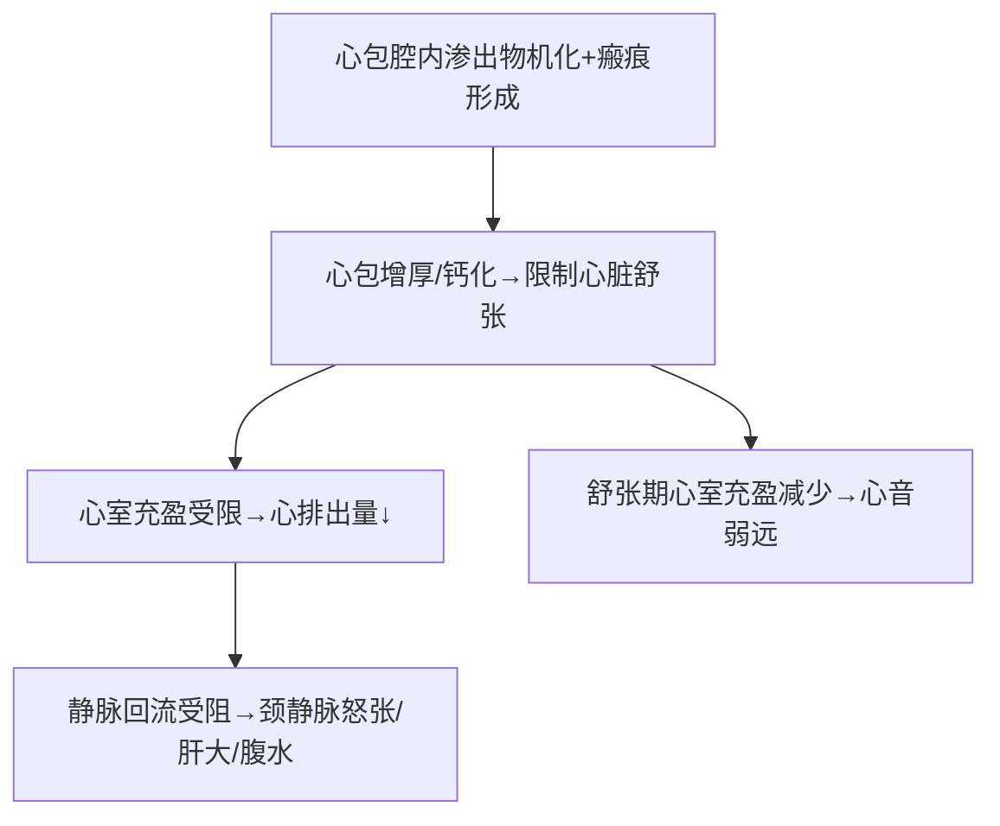

# 心包炎（Pericarditis）

## 📌 定义
心包脏层/壁层的炎症反应。多为**继发性**（超敏反应、尿毒症、心脏创伤、恶性肿瘤转移等）。

---

## 🔬 急性心包炎（渗出性炎症）

### 一、浆液性心包炎

| 项目 | 内容 |
|:-----|:------|
| **病因** | 非感染性（[[风湿病]]、SLE、硬皮病、肿瘤、尿毒症）；病毒感染 |
| **病理** | 心外膜血管扩张充血+通透性↑→心包腔浆液性渗出+少量中性粒细胞/淋巴细胞/单核细胞 |
| **临床** | 胸闷不适、心界扩大、心音弱而远 |

### 二、纤维蛋白性及浆液纤维蛋白性心包炎 ⭐ 最常见

| 项目 | 内容 |
|:-----|:------|
| **病因** | SLE、风湿病、尿毒症、结核、**急性心梗**、Dressler综合征、心外科手术 |
| **病理** | 心包脏壁层表面粗糙黄白色纤维蛋白性渗出→**绒毛心**（详见[[纤维素性炎]]） |
| **临床** | 心前区疼痛、**心包摩擦音** |

### 三、化脓性心包炎

| 项目 | 内容 |
|:-----|:------|
| **病因** | 化脓菌（链球菌、葡萄球菌、肺炎链球菌）→邻近组织直接蔓延/血行播散/心脏手术 |
| **病理** | 心包腔灰绿色浑浊黏稠纤维蛋白性脓性渗出+大量中性粒细胞；可累及心肌→心肌心包炎；累及纵隔→纵隔心包炎 |
| **结局** | 渗出物吸收不完全→机化→**缩窄性心包炎** |

### 四、出血性心包炎

| 项目 | 内容 |
|:-----|:------|
| **病因** | 结核分枝杆菌（最常见）、恶性肿瘤累及心包、心外科手术 |
| **病理** | 心包腔大量浆液性/血性积液；出血多→**心脏压塞**（cardiac tamponade） |

---

## 🔬 急性心包炎四型对比

| | 浆液性 | 纤维蛋白性 ⭐ | 化脓性 | 出血性 |
|:--|:-------|:-----------|:-------|:-------|
| **渗出物** | 浆液 | 纤维蛋白（绒毛心） | 脓性（灰绿色） | 血性浆液 |
| **主要病因** | 风湿/SLE/尿毒症 | 风湿/心梗/尿毒症/TB | 化脓菌 | **结核**/肿瘤 |
| **细胞浸润** | 少量中性粒+淋巴+单核 | 纤维蛋白+少量炎症细胞 | **大量中性粒细胞** | 浆液+红细胞 |
| **体征** | 心音弱而远 | **心包摩擦音** | 感染症状+摩擦音 | 可致心脏压塞 |

---

## 🔬 慢性心包炎（病程>3个月）

### 非特殊型
仅限心包本身，病变轻，临床无明显症状。常见于结核、尿毒症、风湿病。

### 特殊型

#### 1. 粘连性纵隔心包炎
心外膜纤维化闭塞+与纵隔及周围器官粘连→心脏工作负担↑→心脏肥大/扩张。常继发于化脓性/干酪样心包炎、心外科手术、纵隔放疗。

#### 2. 缩窄性心包炎（Constrictive Pericarditis）

多继发于化脓性/结核性/出血性心包炎。需与[[限制型心肌病]]鉴别（血流动力学类似）。

## ❗ 易混点
- 🚨 **绒毛心 = 纤维素性心包炎**，但绒毛心是心包炎的一种表现形式，不是独立疾病
- 🚨 **缩窄性心包炎（心包限制）≠ 限制型心肌病（心肌限制）**：两者都导致舒张受限，但病变部位不同

## 📎 相关笔记
- 上级：[[心血管系统疾病]]
- 鉴别：[[限制型心肌病]]（血流动力学相似→影像学鉴别）
- 病理基础：[[炎症]]（心包炎属炎症范畴）、[[浆液性炎]]、[[纤维素性炎]]（绒毛心）、[[化脓性炎]]、[[出血性炎]]
- 病因：[[风湿病]]、[[心肌梗死]]（Dressler综合征）
- 结局：慢性→缩窄性心包炎（见本笔记）
