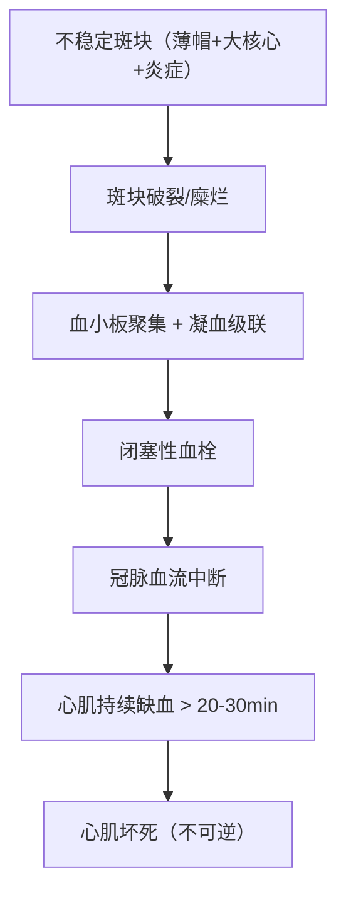

# 心肌梗死（Myocardial Infarction, MI）

## 📌 定义
冠状动脉**急性闭塞**导致**心肌缺血性坏死**。是冠心病最严重的类型。

> 🖼️心肌梗死镜下（收缩带+中性粒细胞浸润+机化）
> ![[病理_心梗_心肌收缩带镜下.png|212]]![[病理_心梗_中性粒细胞浸润镜下.png|210]]![[病理_心梗_机化瘢痕.png|247]]
> ①心肌纤维凝固性坏死，核固缩，胞质均质红染，大量收缩带形成
> ②心肌细胞间大量的中性粒细胞浸润
> ③梗死灶机化，逐渐形成瘢痕

## 🔬 发病机制

## 🔬 病理类型

### 按梗死范围

| 类型 | 累及层次 | 常见原因 |
|:-----|:---------|:---------|
| **透壁性心梗** | 心室壁全层 | 单支冠脉闭塞（斑块破裂+闭塞性血栓） |
| **心内膜下心梗** | 仅心内膜下1/3~1/2 | 多支冠脉严重狭窄无闭塞（休克/低血压→灌注不足） |

### 按ECG分类

| 类型 | ECG表现 | 病理 | 治疗 |
|:-----|:-------|:-----|:-----|
| **STEMI** | ST段**抬高** | **透壁性**，冠脉完全闭塞 | **紧急再灌注**（溶栓/PCI） |
| **NSTEMI** | ST段**压低**/T倒置 | **心内膜下**，冠脉非完全闭塞 | 抗血小板+抗凝+介入 |

## 🔬 病理变化（时间进程）

| 时间 | 大体 | 镜下 |
|:-----|:-----|:-----|
| **0~4h** | 无明显改变 | 心肌纤维呈波浪状，线粒体肿胀 |
| **4~12h** | 暗红色/苍白色 | 心肌纤维凝固性坏死+核消失+中性粒细胞浸润（**最早可辨认**） |
| **1~3天** | 梗死灶灰黄色，边界清 | 中性粒细胞大量浸润+肌纤维溶解 |
| **1~2周** | 梗死灶黄褐色，边缘肉芽组织长入 | 巨噬细胞清除坏死→肉芽组织取代 |
| **4~6周** | 瘢痕形成（灰白色，质硬） | 纤维结缔组织取代梗死灶 |

## 🩺 临床表现

- **剧烈胸痛**：胸骨后压榨性，>30分钟，硝酸甘油**不缓解**
- 放射至左肩、左臂、下颌
- 恶心、呕吐、大汗、气促
- 可无心绞痛（**糖尿病、老年人**——无痛性心梗）

## 🔍 检查

### ECG（关键）

| 阶段 | STEMI表现 | NSTEMI表现 |
|:-----|:---------|:----------|
| 超急性期 | T波高耸 | — |
| 急性期 | **ST段抬高** + Q波形成 | ST段压低 + T倒置 |
| 亚急性期 | T波倒置 | T倒置恢复 |
| 陈旧期 | 病理性Q波（永久） | ECG可正常 |

### 心肌损伤标志物

| 标志物 | 开始升高 | 达峰 | 恢复正常 | 特点 |
|:------|:--------|:----|:--------|:-----|
| **肌钙蛋白**（cTnI/cTnT） ⭐ | 2~4h | 12~24h | 7~10天 | **金标准，特异性最高** |
| CK-MB | 4~6h | 12~24h | 3~4天 | 判断再梗死（cTn持续升高时） |
| 肌红蛋白 | 1~3h | 4~8h | 1天 | 最早但特异性差 |

## ⚠️ 并发症

| 并发症 | 发生时间 | 机制 | 后果 |
|:-------|:--------|:-----|:-----|
| **心律失常** | 早期最常见 | 缺血→电不稳定 | **室颤→猝死**（主要死因） |
| **急性心衰/心源性休克** | 梗死面积>40% | 泵衰竭 | 死亡率极高 |
| **心脏破裂** | 3~7天 | 中性粒细胞浸润→室壁软化 | 心包填塞→猝死 |
| **室壁瘤** | 数周~数月 | 瘢痕形成→室壁膨出 | 心衰+附壁血栓 |
| **附壁血栓** | 急性期 | 内膜损伤→血栓 | 体循环栓塞 |
| **心包炎** | 2~3天（透壁性） | 坏死累及心外膜→炎症 | 胸痛（与体位有关） |

## ❗ 易混点
- 🚨 **心绞痛 ≠ 心梗**：心绞痛=可逆性缺血（标志物正常）；心梗=不可逆坏死（标志物↑）
- 🚨 **心梗后心肌标志物恢复正常后又升高** → **再梗死**（CK-MB更有价值）
- 🚨 糖尿病/老年人→**无痛性心梗**（神经病变→痛觉迟钝→易漏诊）
- 🚨 心梗**最早期（0~4h）大体和镜下无明显改变** → 临床诊断早于病理诊断

## 📎 相关笔记
- 上级：[[心血管系统疾病]]
- 前序：[[冠心病]]、[[动脉粥样硬化]]（不稳定斑块→破裂→血栓）
- 基础：[[梗死]]（贫血性梗死）、[[坏死]]（凝固性坏死）
- 并发症：[[心律失常]]（待创建）、[[心力衰竭]]（待创建）
