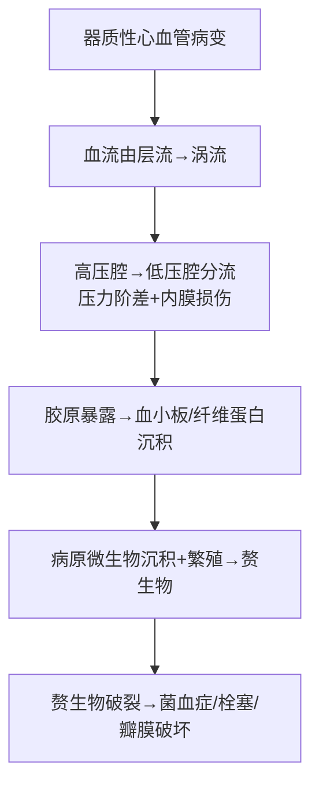

# 感染性心内膜炎（Infective Endocarditis, IE）

## 📌 定义
病原微生物经血行侵袭心内膜（尤其是心瓣膜）引起的炎症，常伴**赘生物**形成。

## 🔬 病因

| 类型           | 最常见病原体                       | 好发瓣膜                      |
| :----------- | :--------------------------- | :------------------------ |
| **急性**       | **金黄色葡萄球菌**（最多见）、肺炎链球菌、A群链球菌 | 正常瓣膜也可受累（二尖瓣+主动脉瓣）        |
| **亚急性**      | **甲型溶血性链球菌**（~75%）、肠球菌       | 原有病变的瓣膜（风心病~80%、先心病8~15%） |
| **人工瓣膜（早期）** | 表皮葡萄球菌、金葡菌                   | 手术期感染                     |
| **人工瓣膜（晚期）** | 金葡菌（>50%）                    | 一过性菌血症                    |

> 🔑 亚急性IE最常见的基础疾病是**风湿性心脏病**（约80%）。近年在心导管、心脏手术后及静脉药瘾者中发病率上升。

## ⚙️ 发病机制

## 🔬 病理分类

> 🖼️细菌性心内膜炎大体（主动脉瓣上鸡冠状赘生物）
> ![[病理_感染性心内膜炎_主动脉瓣鸡冠状赘生物.png]]

### 一、急性感染性心内膜炎

| 特征 | 内容 |
|:-----|:------|
| **病原体** | 强致病力化脓菌（金葡菌为主） |
| **来源** | 身体他处感染灶（骨髓炎/痈/产褥感染）→败血症→侵犯心内膜 |
| **瓣膜** | 可侵犯**正常瓣膜**（二尖瓣+主动脉瓣） |
| **赘生物** | **体积大、质地松软、灰黄/浅绿色**；由血小板+纤维蛋白+细菌团块+坏死组织+炎细胞混合（**本质=感染性血栓样赘生物，结构接近白色血栓但含大量细菌**） |
| **结局** | 瓣膜**破裂/穿孔/腱索断裂**→急性心瓣膜功能不全 |
| **栓塞** | **含菌栓子**→感染性梗死+脓肿（心/脑/肾/脾） |
| **病程** | 起病急、数日~数周内死亡 |

### 二、亚急性感染性心内膜炎

| 特征 | 内容 |
|:-----|:------|
| **病原体** | 毒力弱（甲型溶血性链球菌~75%） |
| **来源** | 感染灶（扁桃体炎/牙周炎/拔牙/心导管）→菌血症→侵入瓣膜 |
| **瓣膜** | **原有病变的瓣膜**（风心病最常见） |
| **赘生物** | **息肉状/菜花状、质松脆、易破碎脱落**；由血小板+纤维蛋白+细菌菌落+坏死组织+中性粒细胞组成；溃疡底有肉芽组织 |
| **结局** | 瓣膜变形→溃疡/穿孔→狭窄或关闭不全→心力衰竭 |
| **栓塞** | **无菌性栓子**（细菌毒力弱）→无菌性梗死（脑最多见→肾/脾） |
| **免疫反应** | 局灶性/弥漫性**肾小球肾炎**（超敏反应）；皮下**Osler小结**（红色微隆起有压痛） |
| **败血症** | 长期发热、脾大、白细胞↑、皮肤黏膜出血点、进行性贫血 |
| **病程** | 迁延数月甚至1年以上 |

## 🩺 急性 vs 亚急性对比

| | 急性IE | 亚急性IE |
|:--|:-------|:---------|
| **病原体** | 金葡菌（化脓菌） | 甲型溶血性链球菌 |
| **原有心脏病** | 可不需 | **常需（风心病/先心病）** |
| **赘生物** | 大、松软、含大量细菌 | 息肉状、质脆、菌少 |
| **栓塞** | **含菌→感染性梗死+脓肿** | **无菌→无菌性梗死** |
| **瓣膜破坏** | 穿孔/破裂/腱索断裂 | 变形/溃疡 |
| **肾病变** | 肾梗死+脓肿 | 肾小球肾炎（免疫性） |
| **病程** | 数日~数周 | 数月~1年以上 |

## ❗ 易混点
- 🚨 **感染性心内膜炎的赘生物 ≠ 风湿性心内膜炎的疣状赘生物**：IE赘生物=**感染性血栓样赘生物**（结构接近白色血栓但含大量细菌+坏死组织→体积大、易脱落）；风湿性疣状赘生物=**无菌性纤维素性疣状赘生物**（免疫反应→纤维素样坏死+微小血栓样沉积→体积小、附着牢固）
- 🚨 **亚急性IE = 无菌性梗死**（栓子含菌极少/毒力弱）；**急性IE = 感染性梗死+脓肿**（栓子含大量化脓菌）
- 🚨 **Osler小结**（亚急性IE的免疫反应）≠ **Janeway损害**（急性IE的化脓性栓塞）

## 📎 相关笔记
- 上级：[[心血管系统疾病]]
- 前序病因：[[风湿病]]（风心病→瓣膜病变→亚急性IE的基础）
- 鉴别：[[风湿病]]（风湿性心内膜炎 vs 感染性心内膜炎）
- 结局：瓣膜破坏→[[主动脉瓣关闭不全]]/[[二尖瓣关闭不全]]（感染性心内膜炎导致瓣膜穿孔/腱索断裂→关闭不全）
