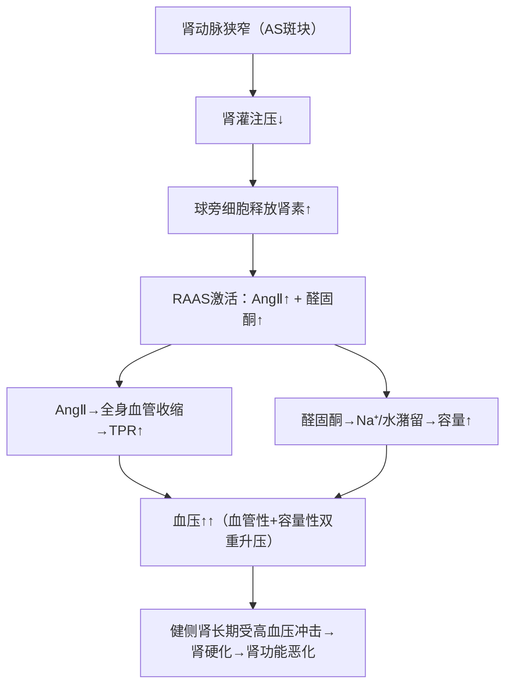

# 肾血管性高血压（Renovascular Hypertension）

## 📌 定义
肾动脉狭窄（AS最常见）→肾灌注↓→RAAS激活→**继发性高血压**。占全部高血压的1~5%。

## 🔬 病因

| 病因 | 比例 | 特点 |
|:-----|:----:|:-----|
| **动脉粥样硬化** ⭐⭐⭐ | 70~90%（中老年） | 肾动脉开口处/近端斑块，常双侧 |
| 纤维肌性发育不良 | 10~30%（青年女性） | 肾动脉中段，串珠样改变 |

## ⚙️ 机制



## 🩺 临床特征

| 特征 | 内容 |
|:-----|:------|
| **血压特点** | **难治性高血压**（三联降压药无效） |
| **腹部体征** | 上腹部/肋脊角**血管杂音**（收缩期+舒张期） |
| **影像** | 患侧肾缩小（>1.5cm）、肾动脉狭窄 |
| **实验室** | 肾素↑、醛固酮↑、低钾血症 |
| **肾功能** | 进行性肾功能不全 |

## 🔬 病理

### 患侧肾（缺血侧）—— 动脉粥样硬化性固缩肾

**发病过程**：
肾动脉主干近侧端 AS 斑块→管腔狭窄→肾**弥漫性**缺血→肾单位大面积**坏死**

```
肾动脉AS斑块 → 管腔狭窄
    ↓
肾灌注压持续↓ → 肾单位长期缺血
    ↓
肾单位（肾小球+肾小管）坏死
    ↓
瘢痕组织（无过滤功能→仅填充）修复坏死区
    ↓
瘢痕逐渐增多、融合 → 取代正常肾组织
    ↓
肾体积缩小、质地变硬 → 动脉粥样硬化性固缩肾
    ↓
肾功能丧失
```

- **大体**：肾体积**缩小**（可比健侧小1/3~1/2），表面细颗粒状，质硬
- **镜下**：肾单位[[坏死]]→[[瘢痕组织]]取代；残存肾小球代偿性肥大；肾动脉AS斑块+管腔狭窄

### 健侧肾（受高血压冲击侧）
- **细动脉硬化**（玻璃样变）→ 肾小球硬化 → 肾功能恶化
- 两者叠加→最终**双侧肾功能衰竭**

## 💊 治疗

| 方法             | 适应症                    |     |
| :------------- | :--------------------- | --- |
| **血管成形术+支架** ⭐ | AS性肾动脉狭窄（一线）           |     |
| ACEi/ARB       | 降压+保护健侧肾（**但双侧狭窄禁用！**） |     |
| 控制AS危险因素       | 他汀、戒烟、控制血糖             |     |

> ⚠️ **双侧肾动脉狭窄禁用ACEi/ARB**：出球小动脉扩张→肾小球滤过压↓→**急性肾衰竭**

## ❗ 易混点
- 🚨 单侧肾动脉狭窄 → ACEi有效且安全；**双侧** → ACEi禁用→急性肾衰
- 🚨 肾血管性高血压 ≠ 肾实质性高血压：前者RAAS激活为主（手术可治愈）；后者肾单位破坏为主（内科治疗）
- 🚨 纤维肌性发育不良（青年女性+肾动脉中段串珠样）vs AS性（中老年+开口处斑块）

## 📎 相关笔记
- 上级：[[心血管系统疾病]]
- 病因：[[动脉粥样硬化]]（肾动脉AS→狭窄）
- 机制：[[RAAS]]（肾素释放→AngⅡ+醛固酮→升压）
- 鉴别：[[细动脉硬化]]（良性高血压→肾小动脉玻璃样变→肾损害）
