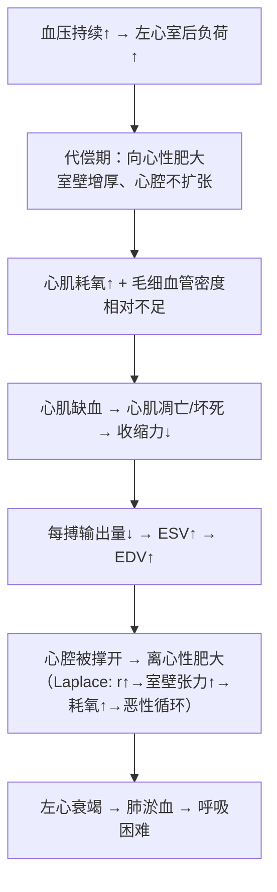

# 高血压（Hypertension）

## 📌 定义
以**体循环动脉血压持续升高**为主要表现的综合征。≥18岁成人：SBP≥140mmHg 和/或 DBP≥90mmHg。

> 🔑 **高血压的本质 = 全身细小动脉硬化**（细动脉玻璃样变+小动脉纤维化→管壁增厚→管腔狭窄→总外周阻力↑→血压持续↑）。这是所有靶器官损伤的病理基础。
> 🔑 **本文所述高血压特指体循环（大循环）血压升高**。肺循环（小循环）血压升高即**肺动脉高压**，病因和机制不同，详见[[慢性肺源性心脏病]]。

## 👥 分类

| 类型 | 比例 | 特点 |
|:-----|:----:|:-----|
| **原发性高血压** | 90~95% | 病因不明，多基因+环境因素 |
| **继发性高血压** | 5~10% | 由明确疾病引起→[[肾血管性高血压]]、肾实质性、内分泌性等 |

### 血压分级 *（测量标准：非同日3次测量）*

| 类别                   | SBP(mmHg) | DBP(mmHg) |
| :------------------- | :-------: | :-------: |
| **理想血压**             |   <120    |    <80    |
| **正常高值**             |  120~139  |   80~89   |
| **1级高血压**            |  140~159  |   90~99   |
| **2级高血压**            |  160~179  |  100~109  |
| **3级高血压**            |   ≥180    |   ≥110    |
| 单纯收缩期高血压（SBP和DBP均满足） |   ≥140    |    <90    |

---

## 🔬 良性高血压（占95%，缓进型）

病程长、进程缓慢，可达十余年或数十年。按病变发展分三期。

### 第一期：功能紊乱期

高血压**早期阶段**。全身细小动脉**间歇性痉挛**收缩→血压升高。动脉**无器质性病变**，痉挛缓解后血压可恢复正常。

> 临床表现不明显或有波动性血压升高，可伴头晕、头痛。适当休息和治疗后血压可恢复正常。

### 第二期：动脉病变期

> 🖼️肾入球动脉玻璃样变镜下（管壁增厚+红染均质状+管腔狭窄）
> ![[病理_高血压_肾入球动脉玻璃样变镜下.png]]

#### 1. 细动脉硬化（Arteriolosclerosis）——高血压的主要病变特征

**本质**：细动脉玻璃样变。最易累及肾入球动脉、视网膜动脉和脾中央动脉。

**发生机制**：

```
细动脉长期痉挛 + 高血压持续刺激
    ↓
内皮细胞及基底膜受损 → 内皮间隙扩大 → 通透性↑
    ↓
血浆蛋白渗入血管壁
    ↓
同时 SMC 分泌大量 ECM → SMC 因缺氧变性、坏死
    ↓
血管壁逐渐由血浆蛋白 + ECM + 坏死SMC产生的胶原纤维/蛋白多糖取代
    ↓
正常管壁结构消失 → 凝固成红染无结构均质的玻璃样物质
    ↓
细动脉壁增厚 → 管腔缩小甚至闭塞
```

#### 2. 小动脉硬化

主要累及**肌型小动脉**（肾小叶间动脉、弓状动脉、脑小动脉等）。

| 改变 | 内容 |
|:-----|:------|
| **内膜** | 胶原纤维+弹性纤维增生，内弹力膜分裂 |
| **中膜** | **SMC增生肥大** + 胶原纤维/弹力纤维增生 |
| **结果** | 血管壁增厚，管腔狭窄 |

#### 3. 大动脉硬化

弹力肌型/弹力型大动脉无明显病变或并发[[动脉粥样硬化]]。

> 此期血压**明显升高，失去波动性**，需服降压药。

---

### 第三期：内脏病变期

#### 1. 心脏——高血压性心脏病

> 🖼️心肌纤维化镜下（心肌细胞肥大+核固缩+间质纤维化）
> ![[病理_高血压_心肌纤维化镜下.png]]



| 参数 | 正常 | 高血压心脏病 |
|:-----|:----|:-----------|
| 心脏重量（男） | ~260g | **>400g** |
| 左室壁厚度 | ~1.0cm | **1.5~2.0cm** |
| 心腔 | — | 向心性→相对缩小；离心性→扩张 |

**镜下**：心肌细胞增粗、变长、分支增多；心肌细胞核肥大、圆形/椭圆形、深染。

> 🖼️细动脉性肾硬化镜下（肾单位萎缩+代偿肥大）
> ![[病理_高血压_细动脉性肾硬化镜下.png]]
> ——部分肾单位纤维化、萎缩，部分肾单位代偿性肥大、扩张
>  🖼️原发性颗粒性固缩肾大体 vs 正常肾
>  ![[病理_高血压_原发性颗粒性固缩肾大体.png]]
>  ——右侧为正常肾脏；左侧为原发性颗粒性固缩肾，肾脏缩小，质地变硬，肾表面凹凸不平，呈细颗粒状

#### 2. 肾脏——原发性颗粒性固缩肾

```
入球动脉玻璃样变 + 肌型小动脉硬化
    ↓
管壁增厚、管腔狭窄 → 肾小球缺血
    ↓
缺血肾小球→纤维化、硬化、玻璃样变
    ↓
相应肾小管萎缩 + 间质纤维组织增生+淋巴细胞浸润
    ↓
相对正常的肾单位：肾小球代偿性肥大 + 肾小管代偿性扩张
    ↓
双侧肾对称性缩小、质地变硬、表面细颗粒状
    ↓
原发性颗粒性固缩肾（皮质变薄≤0.2cm）
```

| 参数 | 正常 | 原发性固缩肾 |
|:-----|:----|:-----------|
| 单侧肾重量 | ~150g | **<100g** |
| 肾皮质厚度 | 0.3~0.6cm | **≤0.2cm** |
| 表面 | 光滑 | **细颗粒状** |

> 🔑 **注意区分**：高血压→双侧对称性**原发性颗粒性固缩肾**（入球动脉玻璃样变）；AS→单侧**动脉粥样硬化性固缩肾**（肾动脉主干AS斑块→肾弥漫性缺血）。

**临床**：早期肾功能正常；晚期→肾单位不断减少→肾血流↓→滤过率↓→蛋白尿、水肿、肾病综合征→严重者尿毒症。

#### 3. 脑

| 病变 | 机制 | 表现 |
|:-----|:-----|:------|
| **高血压脑病/脑水肿** | 细小动脉硬化和痉挛→局部缺血→毛细血管通透性↑→脑水肿 | 头痛、头晕、**喷射样呕吐**（颅内高压→延髓呕吐中枢受刺激）、视力障碍；**高血压危象**=BP急剧↑+剧烈头痛+意识障碍+抽搐 |
| **脑软化（微梗死）** | 细小动脉病变→供血区缺血→微小坏死灶 | 坏死灶→筛网状→吸收后胶质瘢痕修复 |
| **脑出血 ⚠️ 最严重** | 细小动脉硬化→血管壁变脆；局部膨出→小动脉瘤/微动脉瘤→BP突升→破裂 | **基底节/内囊最常见**（豆纹动脉从MCA直角发出→受冲击最大→易破裂） |

> 🔑 豆纹动脉从大脑中动脉呈**直角分支**，直接承受MCA高压血流的冲击，故**豆状核区**是脑出血最常见部位。

**脑出血的临床定位**：
- 内囊出血→对侧偏瘫+感觉消失
- 破入侧脑室→昏迷→死亡
- 左侧脑出血→失语
- 脑桥出血→同侧面神经+对侧肢体瘫痪

#### 4. 视网膜

| 分级 | 眼底表现 |
|:----|:---------|
| I级 | 视网膜小动脉狭窄、反光增强 |
| II级 | 动静脉交叉压迫征 |
| III级 | 视网膜出血+渗出（棉絮斑） |
| IV级 | **视乳头水肿**（恶性高血压标志） |

---

> 🖼️恶性高血压增生性小动脉硬化（血管壁同心圆状增厚+管腔狭窄）
> ![[病理_高血压_恶性高血压增生性小动脉硬化.png]]

## 🔴 恶性高血压（急进型，占1~5%）

多见于**青少年**。血压**显著升高**（常>230/130mmHg），进展迅速。

### 特征性血管病变

| 病变 | 动脉类型 | 病理 | 本质 | 好发 |
|:-----|:---------|:-----|:-----|:-----|
| **增生性小动脉硬化** | 小动脉 | 内膜显著增厚+**SMC增生**+胶原纤维↑→**层状洋葱皮样**增厚→管腔狭窄 | 与良性高血压的小动脉纤维化不同，增生更显著 | **肾** |
| **坏死性细动脉炎** | 细动脉 | 血管内膜+中膜**纤维蛋白样坏死**，周围单核细胞+中性粒细胞浸润 | 与良性高血压的玻璃样变不同，纤维素样坏死更重 | 肾入球小动脉最常受累 |

> 🔑 恶性高血压=**增生性小动脉硬化(洋葱皮样)**+ **坏死性细动脉炎(纤维素样坏死)**

### 靶器官损伤

| 器官 | 表现 |
|:-----|:------|
| **肾 ⭐** | 入球小动脉最常受累→可波及肾小球毛细血管袢→节段性坏死→**快速肾衰竭（最常见死因）** |
| **脑** | 局部缺血→微梗死→脑出血 |
| **眼底** | **视乳头水肿（IV级）** —诊断关键标志 |

---

## 🧠 良性 vs 恶性高血压对比

| | 良性高血压 | 恶性高血压 |
|:--|:---------|:---------|
| 比例 | >95% | 1~5% |
| 起病 | 缓慢（10~20年） | 急剧 |
| DBP | 轻~中度↑ | **持续>130mmHg** |
| **细动脉** | **玻璃样变** | **纤维素样坏死** |
| **小动脉** | 纤维化+肌层增厚 | **增生性硬化（洋葱皮样）** |
| 眼底 | I~III级 | **IV级（视乳头水肿）** |
| 肾 | 良性肾硬化（缓慢） | 恶性肾硬化（快速→肾衰竭） |
| 预后 | 可控 | **差** |

## ❗ 易混点
- 🚨 **体循环高血压 ≠ 肺动脉高压**：本文所述高血压=体循环（大循环）血压↑；肺动脉高压（肺循环）由[[慢性肺源性心脏病]]等引起
- 🚨 **高血压=诊断 ≠ 高血压病=病因学诊断**：前者是血压数值标准，后者是病因未明的原发性高血压
- 🚨 **原发性颗粒性固缩肾（高血压）≠ 动脉粥样硬化性固缩肾（肾动脉AS）**：前者双侧对称+入球动脉玻璃样变；后者单侧+主干AS斑块
- 🚨 **高血压脑出血好发部位=基底节/豆状核**，不是颞叶或额叶（豆纹动脉直角分支→受压最大）

## 📎 相关笔记
- 上级：[[心血管系统疾病]]
- 病因关联：[[动脉粥样硬化]]（AS与高血压互为因果）、[[肾血管性高血压]]（继发性高血压最常见原因之一）
- 血管病理：[[玻璃样变]]（细动脉玻璃样变=良性高血压的标志）、[[纤维蛋白样坏死]]（恶性高血压→细动脉纤维素样坏死）
- 靶器官：[[冠心病]]、[[心肌梗死]]、[[肾血管性高血压]]
- 靶器官损害：[[心力衰竭]]（待创建）、[[脑出血]]（待创建）
- 血管病变：[[动脉瘤]]（主动脉夹层+脑底动脉瘤破裂均与高血压密切相关）
- 鉴别：[[慢性肺源性心脏病]]（肺循环高压→右心衰竭）
