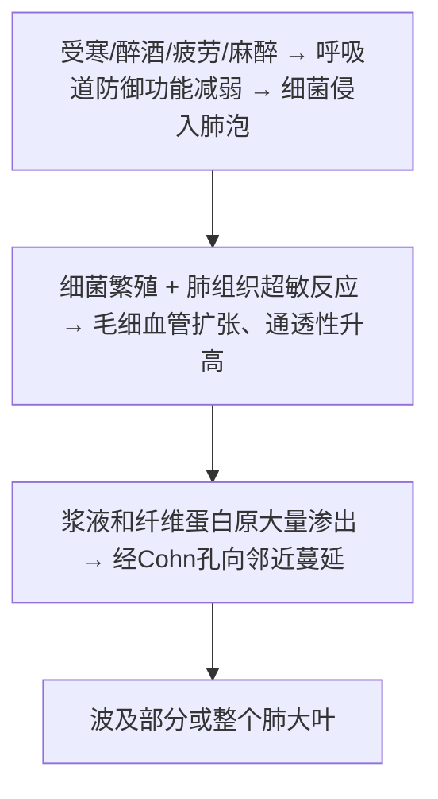
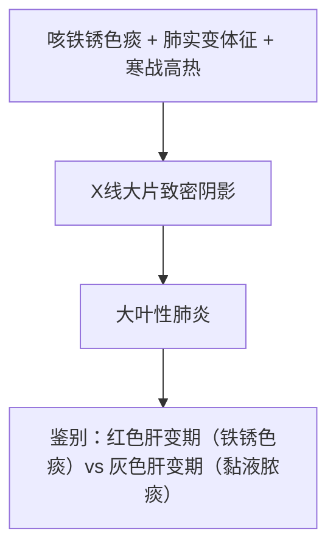

# 大叶性肺炎（Lobar Pneumonia）

## 📌 定义
主要由**肺炎链球菌**引起的以肺泡内弥漫性**纤维蛋白渗出**为主的炎症，病变通常累及肺大叶的全部或大部。

## 🔬 病因
- **90%以上**由肺炎链球菌引起（1、2、3、7型多见，**3型毒力最强**）
- 少数：肺炎杆菌、金葡菌、流感嗜血杆菌、溶血性链球菌
- **传播源**：带菌正常人鼻咽部

## ⚙️ 机制

## 👥 易感人群
- **青壮年**（20～40岁）多见，男性多于女性
- **诱因**：受寒、醉酒、疲劳、麻醉、病毒感染等 → 呼吸道防御功能削弱
- 发病前常健康，典型"健康人突发病"

## 🔬 病理变化（典型四期）

| 分期 | 时间 | 肉眼观 | 镜下观 | 临床表现 |
|:-----|:-----|:-------|:-------|:---------|
| **充血水肿期** | 第1～2天 | 肺叶肿胀，暗红色 | 肺泡间隔毛细血管扩张充血，肺泡腔大量浆液性渗出液，含少量RBC、中性粒细胞、巨噬细胞 | 寒战、高热、外周血WBC↑；X线：片状模糊阴影 |
| **红色肝样变期** | 第3～4天 | 肺叶充血呈暗红色，质地变实，似肝脏 | 肺泡间隔毛细血管扩张充血，肺泡腔充满**纤维蛋白及大量RBC**，纤维蛋白连接成网穿过肺泡间孔 | 发绀、**铁锈色痰**（RBC被吞噬→含铁血黄素）、胸痛（纤维蛋白性胸膜炎）；X线：大片致密阴影 |
| **灰色肝样变期** | 第5～6天 | 肺叶肿大，充血消退，灰白色，质实如肝 | **纤维蛋白增多达极值**，相邻肺泡纤维蛋白丝经肺泡间孔互相连接；大量中性粒细胞，肺泡壁毛细血管受压，RBC少见 | 缺氧改善（毛细血管受压，血流量减少）；铁锈色痰→黏液脓痰；**细菌不易检出**（抗体已形成） |
| **溶解消散期** | 1周左右 | 肺组织质地较软 | 中性粒细胞变性坏死，释放蛋白水解酶溶解纤维蛋白，经淋巴管吸收或气道咳出 | 体温下降，症状消退；X线恢复正常；历时1～3周 |

> 🖼️ 大叶性肺炎（大体标本&灰色肝样变期镜下观）
> ![[病理_大叶肺炎_四期病变对比图.png|208]]![[病理_大叶肺炎_灰色肝样变期镜下.png|336]]
>
> **关键点**：灰色肝样变期纤维蛋白达极值；抗生素干预后典型四期已少见，多表现为节段性肺炎

## 🩺 临床表现
- 起病急，寒战高热
- 咳嗽、胸痛、呼吸困难
- **咳铁锈色痰**（特征性）
- 肺实变体征
- 外周血白细胞增多

## ⚠️ 并发症（现已少见）

| 并发症                               | 机制                                            |
| :-------------------------------- | :-------------------------------------------- |
| **肺肉质变（pulmonary carnification）** | 中性粒细胞渗出过少，蛋白酶不足以溶解纤维蛋白→ **肉芽组织取代机化** → 褐色肉样外观 |
| **胸膜肥厚和粘连**                       | 纤维蛋白性胸膜炎 → 纤维蛋白机化                             |
| **肺脓肿及脓胸**                        | 金葡菌和肺炎链球菌混合感染                                 |
| **败血症或脓毒败血症**                     | 细菌侵入血液大量繁殖                                    |
| **感染性休克（中毒性/休克性肺炎）**              | 严重全身中毒症状 + 微循环衰竭，死亡率较高                        |

> 🖼️肺肉质变镜下观
> ![[病理_大叶肺炎_肺肉质变大体.png|371]]

## 🧠 临床推理链

## ❗ 易混点
- 🚨 **红色肝变期** → 铁锈色痰（RBC + 纤维蛋白）；**灰色肝变期** → 黏液脓痰（纤维蛋白极值，RBC少见）
- 🚨 大叶性肺炎 = **纤维素性炎**（肺泡内纤维蛋白渗出为主）
- 🚨 肺肉质变 = 纤维蛋白未被充分溶解 → 机化

---
## 📎 相关笔记
- 上级：[[呼吸系统疾病]]
- 对比：[[小叶性肺炎]]
- 类型：[[病毒性肺炎和SARS]]、[[支原体肺炎和军团菌肺炎]]
- 跨章：[[纤维素性炎]]、[[急性炎症的结局]]（肺肉质变→机化）
- 修复：[[肉芽组织]]、[[修复]]
