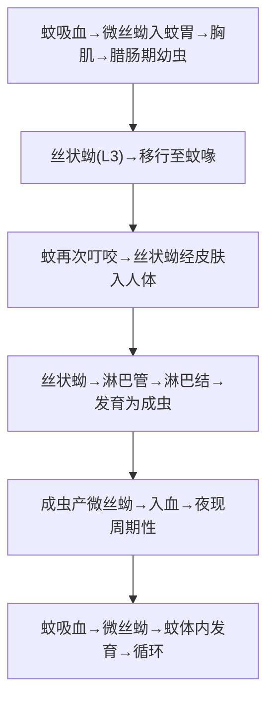

# 丝虫（淋巴丝虫）— 班氏吴策线虫 & 马来布鲁线虫

## 📌 定义
- 寄生于人体**淋巴系统**的丝状线虫，引起**淋巴丝虫病**
- 中国致病的两种：**班氏吴策线虫**（*W. bancrofti*）& **马来布鲁线虫**（*B. malayi*）
- 经**蚊虫**叮咬传播，**微丝蚴夜现周期性**
- 中国已基本消灭丝虫病（2007年WHO认证），但输入/残留病例仍有

---

## 🔬 形态

### 两种鉴别

| 特征 | 班氏丝虫 | 马来丝虫 |
|:----|:--------|:---------|
| **成虫** | 雌58.5~72mm，雄28.2~40mm | 雌40~55mm，雄13~23mm（略小） |
| **分布** | 全球热带/亚热带 | 东亚/东南亚 |
| **寄生部位** | **深部淋巴系统**（腹膜后/精索/下肢） | **浅部淋巴系统**（下肢/阴囊） |
| **主要并发症** | **阴囊象皮肿、乳糜尿**、鞘膜积液 | 下肢象皮肿（阴囊/乳糜尿少见） |
| **动物宿主** | **人（唯一）** | **人+猴/猫** |

### 🌙 微丝蚴（microfilaria）— 夜现周期性

> **夜现周期性**：微丝蚴白天在肺毛细血管→**夜间（22:00~次日2:00）出现在外周血**→利于蚊虫叮咬传播

| 特征 | 班氏微丝蚴 | 马来微丝蚴 |
|:----|:----------|:----------|
| **大小** | (244~296)×(5.3~7.0)μm | (177~230)×(5~6)μm |
| **体态** | 柔和，弯曲自然 | 僵硬，弯曲不自然 |
| **头隙** | 短（长宽比1:1） | **长**（长宽比2:1） |
| **尾核** | **无尾核** | **有2个尾核**（鉴别关键 🥇） |
| **鞘膜** | 有 | 有 |

> 🖼️班氏和马来微丝蚴对比![[寄生虫_丝虫_班氏和马来丝虫微丝蚴对比.png|514]]

---

## 🔄 生活史



> 丝状蚴=感染阶段；成虫阻塞淋巴管→象皮肿/乳糜尿=主要致病

### 关键信息

| 项目 | 说明 |
|:----|:------|
| **传播媒介** | 班氏→**库蚊**（主要）/按蚊；马来→**按蚊**/曼蚊 |
| **感染阶段** | **丝状蚴（L3）**（蚊体内） |
| **感染途径** | **蚊叮咬** |
| **寄生部位** | **淋巴管/淋巴结**（成虫）；**血液**（微丝蚴） |
| **潜伏期** | 4~12月（从感染→微丝蚴血症） |
| **生活史完成** | 需经过**人体+蚊子**两个宿主 |

---

## ⚙️ 致病机制

### 核心病理链

```
成虫寄居淋巴管 → 机械性损伤+代谢产物刺激
    ↓ 急性和慢性炎症
淋巴管炎、淋巴结炎
    ↓ 反复发作+淋巴管阻塞
淋巴回流障碍 → 淋巴管曲张 → 淋巴液淤积
    ↓
组织蛋白含量高→刺激纤维组织增生 → **象皮肿（elephantiasis）**
                    ↓
           班氏特殊 → 乳糜尿（胸导管阻塞→肾盂淋巴瘘）
```

### 分期

| 分期 | 机制 | 表现 |
|:----|:----|:------|
| **潜伏期** | 幼虫发育（4~12月） | 无症状 |
| **急性期** | 成虫代谢+细菌继发感染 | **淋巴管炎/淋巴结炎**（逆行性红线/丹毒样皮炎）、**丝虫热**（周期性发热） |
| **慢性期** | 淋巴管纤维化阻塞 | 象皮肿、乳糜尿、鞘膜积液 |
| **隐性丝虫病** | 免疫超敏 | **热带肺嗜酸性粒细胞增多症（TPE）**—咳嗽、哮喘、IgE↑、嗜酸↑↑ |

---

## 🩺 临床表现

### 急性期
| 表现 | 特点 |
|:----|:------|
| **急性淋巴结炎/淋巴管炎** | **逆行性**（从肢体近端→远端），下肢常见；可伴**丹毒样皮炎** |
| **丝虫热** | 周期性高热（1~3天自退），腹股沟/腋窝淋巴结肿大压痛 |
| **精索炎/附睾炎** | 班氏丝虫特有的急性表现 |

### 慢性期
| 类型 | 表现 | 虫种 |
|:----|:----|:------|
| **象皮肿 🥇** | 下肢最多见；皮肤增厚粗糙（"**大象腿**"）；晚期不可逆 | 班氏+马来 |
| **鞘膜积液** | **淋巴液**（非炎性）| 班氏 |
| **乳糜尿 🥇** | 尿液如牛奶样（含脂肪+蛋白）；胸导管阻塞→肾盂淋巴瘘破裂 | **班氏特有** |
| **阴囊象皮肿** | 阴囊肿大变形 | 班氏 |

### 隐性丝虫病（TPE）
- 咳嗽、哮喘、呼吸困难
- 血嗜酸性粒细胞极度↑↑（>3000/μL）
- **微丝蚴血症阴性**（虫体被免疫清除）
- IgE显著↑

---

## 🔬 检查

| 方法 | 说明 | 注意 |
|:----|:----|:------|
| **厚血膜（夜查）🥇** | **夜间21:00~02:00采血**→观察微丝蚴 | **夜现周期性**—白天查常阴性❗ |
| **浓集法（Knott法）** | 静脉血溶血后离心→提高检出率 | 比厚血膜更敏感 |
| **微丝蚴浓集薄膜过滤** | 高敏感 | — |
| **ICT（免疫色谱）🥇** | 班氏抗原检测（白天可做） | 快速，不受夜现周期限制 |
| **PCR** | 鉴定虫种 | 高敏感/特异 |
| **B超** | **"丝虫舞动征"**（成虫在淋巴管内活动） | 活虫诊断 |
| **血常规** | 嗜酸性粒细胞↑ | 辅助 |

---

## 💊 治疗

| 药物 | 用法 | 说明 |
|:----|:----|:------|
| **乙胺嗪（DEC，海群生）🥇** | 6mg/kg/d×12天（分次）或 3g 单次 | **首选**，杀微丝蚴+部分成虫 |
| DEC佐剂 | 拌食盐（0.3% DEC药盐） | **群体防治**—中国消灭丝虫的关键策略 |
| **阿苯达唑 + DEC** | — | 联合治疗提高疗效 |
| **伊维菌素** | 200μg/kg | 主要是杀微丝蚴（对成虫弱） |
| **多西环素** | 100mg/d×6周 | 杀**Wolbachia**（共生菌）→间接杀成虫（WHO推荐方案的一部分） |

**对症治疗**：
- 急性期：抗炎（NSAIDs）+ 卧床+抬高患肢
- 慢性象皮肿：**综合物理疗法**（皮肤护理+抬高+弹力袜）
- 乳糜尿：低脂饮食，重度→肾盂冲洗/手术
- 鞘膜积液：手术

---

## 🛡️ 预防
- **防蚊灭蚊 🥇**（蚊帐、驱蚊、环境灭蚊）
- **群体防治**：DEC药盐（中国经验）
- 流行区群体筛查+治疗（阻断传播链）
- 中国已消除丝虫病（维持监测防输入）

---

> 💡 **临床推理链**：**急性**：蚊虫叮咬 + 逆行性淋巴管炎/精索炎 + 丝虫热 → 夜间厚血膜查微丝蚴(+) → DEC治疗。**慢性**：象皮肿/乳糜尿/鞘膜积液 + 流行区生活史 → ICT抗原(+)或B超"舞动征" → 已晚期→对症治疗（物理疗法/手术）→ 多西环素杀Wolbachia

---
## 📎 相关笔记
- 鉴别：[[钩虫]]（经皮、贫血、非蚊媒）
- 对比：[[粪类圆线虫]]（自身感染、机会性）
- 临床：[[象皮肿]]、[[乳糜尿]]、[[嗜酸性粒细胞增多症]]
- 药物：[[乙胺嗪]]、[[伊维菌素]]、[[多西环素]]
