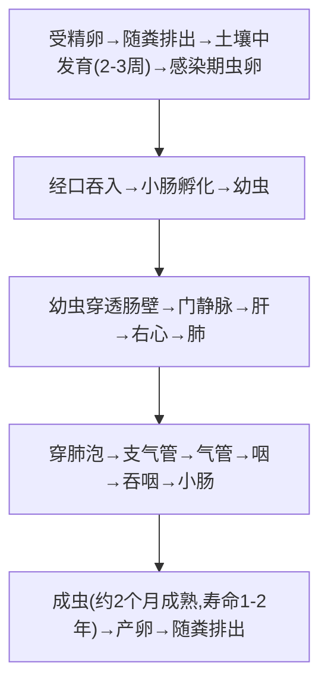

# 似蚓蛔线虫（*Ascaris lumbricoides*）— 蛔虫

## 📌 定义
- 人体**最大**的肠道线虫，**土源性线虫**（soil-transmitted helminth）
- 全球感染人数最多（约8亿~10亿），中国农村曾高度流行
- 经**粪-口**途径传播（**虫卵经口感染**）

---

## 🔬 形态

| 阶段         | 大小                | 特征                                |
| :--------- | :---------------- | :-------------------------------- |
| **成虫**     | 雌20~35cm，雄15~31cm | 粉红色/淡黄色，圆柱形，**头端三唇瓣**             |
| **受精卵 🥇** | (45~75)×(35~50)μm | 椭圆形，**棕黄色，表面蛋白质膜（凹凸不平乳突状）**，内含卵细胞 |
| **未受精卵**   | (88~94)×(39~44)μm | 长椭圆形，蛋白质膜不规则，内含卵黄颗粒（**无发育能力**）    |
| **脱蛋白膜卵**  | —                 | 失去蛋白质膜→光滑→不易识别                    |
|            |                   |                                   |

> 🖼️蛔虫受精卵和未受精卵对比![[寄生虫_蛔虫_似蚓蛔线虫虫卵形态.png|679]]![[寄生虫_蛔虫_蛔虫成虫大体.png]]

---

## 🔄 生活史



> 感染期虫卵=感染阶段；成虫钻孔习性→胆道蛔虫/肠梗阻=主要危害

### 关键信息

| 项目 | 说明 |
|:----|:------|
| **感染阶段** | **含蚴卵**（感染期虫卵，土壤中发育） |
| **感染途径** | **经口吞入**（污染食物/手/水源）🥇 |
| **寄生部位** | **小肠**（空肠为主） |
| **虫体移行** | 肠→肝→心→肺→气管→咽→小肠（**需经肺**） |
| **产卵量** | 每条雌虫每日产卵**约20万个** |

---

## ⚙️ 致病机制

### 幼虫期（Loeffler综合征）
```
幼虫穿肺泡 → 机械性损伤 + 变态反应
    → 发热、咳嗽、哮喘样发作、嗜酸性粒细胞↑
    → X线：一过性/游走性肺部浸润影（**Loeffler综合征**）
```

### 成虫期
| 类型 | 表现 |
|:----|:------|
| **轻度** | 无症状或消化不良、腹痛（脐周） |
| **重度（儿童）** | 营养不良、发育迟缓、烦躁、磨牙 |
| **并发症 🚨** | **胆道蛔虫病**（最常见并发症→右上腹阵发性钻顶样剧痛）、**肠梗阻**（大量虫体扭结成团）、**蛔虫性阑尾炎**、**肝脓肿**、**胰腺炎** |
| **蛔虫迁徙** | 发热/驱虫不当→虫体乱窜→从口鼻出/入胆道/入阑尾 |

---

## 🔬 检查

| 方法 | 说明 |
|:----|:------|
| **粪便查虫卵 🥇** | **直接涂片法**/改良加藤法—简便高效（产卵量大） |
| **查成虫** | 粪便排出/呕吐排出/影像 |
| **血常规** | 幼虫移行期→嗜酸性粒细胞↑↑ |
| **腹部X线/CT** | 肠梗阻/胆道蛔虫 |

---

## 💊 治疗

| 药物 | 用法 | 说明 |
|:----|:----|:------|
| **阿苯达唑 🥇** | 400mg（儿童200mg）单次 | **首选**（广谱、高效） |
| **甲苯达唑** | 200mg/d×3天 | 也可 |
| **伊维菌素** | 150~200μg/kg 单次 | 次选 |
| **哌嗪（驱蛔灵）** | 3g/d×2天 | 老药（可麻痹虫体→适合胆道蛔虫/不全梗阻） |

**并发症处理**：
- **胆道蛔虫**：解痉+镇痛+阿苯达唑 → 内镜取虫/手术
- **肠梗阻**：禁食+胃肠减压+哌嗪 → 梗阻不缓解→手术

> ⚠️ **治疗注意**：混合感染（蛔虫+钩虫/鞭虫）时，阿苯达唑可一次性解决

---

## 🛡️ 预防
- **粪便无害化处理**（堆肥、化粪池）
- **饭前便后洗手**
- 不生食不洁蔬菜
- 普治（群体驱虫—儿童/农村重点人群）

---

> 💡 **临床推理链**：脐周腹痛 + 营养不良（儿童）+ 粪便查见蛔虫卵（特征性蛋白质膜）→ 蛔虫病 → 阿苯达唑单次。**胆道蛔虫病**：**阵发性钻顶样右上腹痛** + 恶心呕吐 + 既往排虫史 → B超示胆管内虫体 → 解痉镇痛+阿苯达唑/内镜取虫

---
## 📎 相关笔记
- 对比：[[钩虫]]（经皮感染、贫血）、[[毛首鞭形线虫和蠕形住肠线虫]]（土源性）
- 临床：[[胆道蛔虫病]]、[[Loeffler综合征]]、[[肠梗阻]]
- 药物：[[阿苯达唑]]
