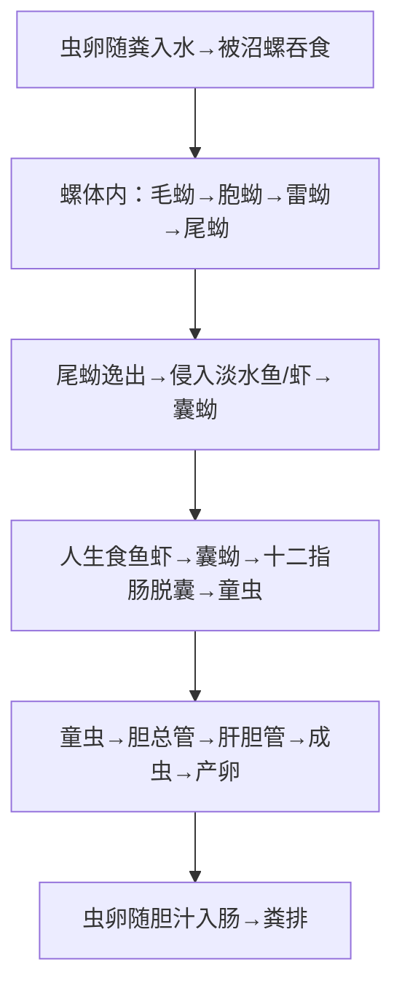

# 华支睾吸虫（*Clonorchis sinensis*）— 肝吸虫

## 📌 定义
- 寄生在人体**肝胆管内**的吸虫，引起**华支睾吸虫病**（clonorchiasis）
- 因**生食或半生食含囊蚴的淡水鱼虾**而感染
- 中国流行最广的吸虫病之一（广东、广西、东北等地高发）

---

## 🔬 形态

| 阶段 | 大小 | 特征 |
|:----|:----|:------|
| **成虫** | (10~25)×(3~5)mm | 葵花籽状，前端尖后端钝；**分支状睾丸**（前后排列） |
| **虫卵 🥇** | (27~35)×(12~20)μm | **最小**的吸虫卵；**灯泡形**，有**小盖**（肩峰）；内含**毛蚴** |

> 🖼️华支睾吸虫各形态模式图
>  ![[寄生虫_华支睾吸虫_虫卵镜下.png]]
>  🖼️华支睾吸虫成虫
>  ![[寄生虫_华支睾吸虫_成虫形态.png]]
>  🖼️华支睾吸虫虫卵
>  ![[寄生虫_华支睾吸虫_各形态模式图.png]]

---

## 🔄 生活史



> 囊蚴=感染阶段；成虫寄生于肝胆管→胆管上皮增生→胆管癌风险

### 关键信息

| 项目 | 说明 |
|:----|:------|
| **传染源** | 病人、带虫者、保虫宿主（猫、狗） |
| **第一中间宿主** | **沼螺、豆螺、涵螺**（淡水螺类） |
| **第二中间宿主** | **淡水鱼虾**（麦穗鱼、鲫鱼等） |
| **感染阶段** | **囊蚴**（鱼虾肌肉内） |
| **感染途径** | **生食/半生食淡水鱼虾** 🥇 |
| **寄生部位** | **肝胆管** |
| **成虫寿命** | 可达20~30年 |

---

## ⚙️ 致病机制

```
虫体刺激+代谢产物 → 胆管上皮增生、腺样增生、管壁增厚
    ↓
胆管扩张、胆汁淤积 → 继发胆管炎、胆囊炎
    ↓ 长期慢性
胆管周围纤维化 → 肝硬化、门脉高压
    ↓ 部分患者
**胆管癌**（cholangiocarcinoma）— WHO确认的致癌因素
```

### 临床分型
| 期型 | 表现 |
|:----|:------|
| **轻度**（虫数~100） | 无症状或轻微消化不良 |
| **中度** | 上腹不适、腹痛、腹泻、肝大（左叶明显） |
| **重度**（反复感染） | 胆管炎、胆囊炎、胆石症、肝硬化，儿童→发育不良 |

---

## 🔬 检查

| 方法 | 说明 |
|:----|:------|
| **粪便查虫卵 🥇** | 直接涂片法（检出率低）→ **改良加藤法/集卵法**提高检出率 |
| **十二指肠引流** | 胆汁查卵 |
| **ELISA** | 检测抗体（辅助诊断） |
| **B超/CT** | 肝内胆管扩张、胆管壁增厚 |
| **血常规** | **嗜酸性粒细胞↑** |

---

## 💊 治疗

| 药物 | 用法 | 说明 |
|:----|:----|:------|
| **吡喹酮（Praziquantel）🥇** | 25mg/kg tid×2~3天 | **首选**，高效低毒 |
| 阿苯达唑 | 10mg/kg/d×7天 | 次选 |

---

## 🛡️ 预防
- **不生食淡水鱼虾 🥇**（最有效）
- 生熟砧板分开（防止交叉污染）
- 治疗病人+保虫宿主（猫狗）
- 粪便无害化处理

---

> 💡 **临床推理链**：食用生鱼片史 + 肝大（左叶）+ 上腹不适 + 嗜酸性粒细胞↑ → 疑诊 → 粪便查见华支睾吸虫卵（灯泡形、最小）→ 确诊 → **吡喹酮**治疗

---
## 📎 相关笔记
- 对比：[[布氏姜片吸虫和肝片形吸虫]]（肠道/肝胆管吸虫，生食水生植物）
- 对比：[[血吸虫]]（血管内寄生，皮肤感染）
- 临床：[[胆管炎]]、[[胆管癌]]
- 药物：[[吡喹酮]]
