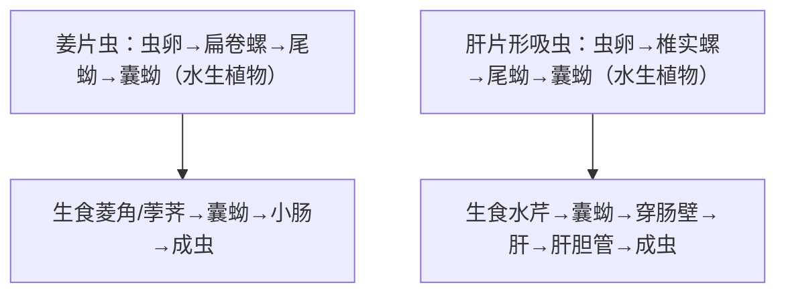

# 布氏姜片吸虫 & 肝片形吸虫

## 📌 概述
两种**大型吸虫**，均以**生食水生植物**为主要感染途径（常合并讲述）。

| 项目 | 布氏姜片吸虫 | 肝片形吸虫 |
|:----|:------------|:-----------|
| **疾病** | 姜片虫病（fasciolopsiasis） | 肝片形吸虫病（fascioliasis） |
| **大小** | **(20~75)×(8~20)mm** — **人体最大吸虫** | (20~40)×(8~13)mm |
| **寄生部位** | **小肠**（十二指肠/空肠） | **肝胆管**（→肝实质） |
| **主要终宿主** | 人、猪 | 羊、牛（人→偶然） |
| **在中国** | 浙江/江苏/江西等水乡 | 牧区散发 |

---

## 🔬 形态对比

| 特征 | 姜片虫卵 | 肝片形吸虫卵 |
|:----|:---------|:-------------|
| **大小** | **(130~140)×(80~85)μm** | (130~150)×(60~90)μm |
| **形态** | 椭圆形，淡黄色，**小盖** | 长椭圆形，**小盖** |
| **内容** | 卵细胞+卵黄细胞 | 卵细胞+卵黄细胞 |

> 两种虫卵形态**极相似**，临床需结合流行病学和临床表现鉴别
> 🖼️ **姜片虫卵 vs 肝片形吸虫卵大小形态对比** 
> ![[寄生虫_姜片虫_姜片虫成虫形态.png|298]]![[寄生虫_姜片虫_姜片虫卵与肝片形吸虫卵对比.png|232]]

---

## 🔄 生活史对比

> 姜片虫→小肠（人体最大吸虫）；肝片形吸虫→肝胆管

### 关键信息

| 项目 | 姜片虫 | 肝片形吸虫 |
|:----|:-------|:-----------|
| **中间宿主** | **扁卷螺** | **椎实螺** |
| **感染阶段** | 囊蚴（水生植物表面） | 囊蚴（水生植物/水） |
| **感染途径** | 生食菱角/荸荠/茭白 🥇 | 生食水芹/生饮含囊蚴水 🥇 |
| **潜伏期** | 1~3月 | 数周~数月 |

---

## 🩺 临床表现

### 姜片虫病
| 程度 | 表现 |
|:----|:------|
| **轻度** | 消化不良、腹痛、腹泻 |
| **中度** | 间歇性腹泻/便秘、恶心、食欲异常 |
| **重度**（儿童） | 营养不良、贫血、水肿、**肠梗阻**（大量成虫团块） |

### 肝片形吸虫病
| 分期 | 表现 |
|:----|:------|
| **急性期**（童虫移行） | 发热、右上腹痛、肝大、**嗜酸性粒细胞显著↑** |
| **慢性期**（成虫寄生） | 胆管炎、胆囊炎、黄疸、肝硬化 |
| **肝外寄生** | 皮下结节（童虫异位寄生） |

---

## 🔬 检查

| 方法 | 姜片虫 | 肝片形吸虫 |
|:----|:-------|:-----------|
| **病原学** | **粪检查虫卵 🥇** | 粪/胆汁查虫卵 🥇 |
| 免疫学 | ELISA（辅助） | ELISA/IFA（急性期有用） |
| 影像 | — | B超/CT（肝内占位、胆管扩张） |
| 血常规 | 嗜酸性粒细胞↑ | **嗜酸性粒细胞显著↑** |
| **注意** | **虫卵易漏检**—需多份送检 | 急性期粪便查卵常阴性→血清学 |

---

## 💊 治疗

| 药物 | 姜片虫 | 肝片形吸虫 |
|:----|:-------|:-----------|
| **吡喹酮 🥇** | 5~10mg/kg 单次 | ⚠️ **效果差** |
| **三氯苯达唑（Triclabendazole）🥇** | — | **首选**（10mg/kg 单次或bid） |

> ⚠️ **关键区别**：吡喹酮治疗姜片虫有效，但治**肝片形吸虫效果不佳**→需用**三氯苯达唑**

---

## 🛡️ 预防
- **不生食菱角/荸荠/茭白**（姜片虫）
- **不生食水芹，不饮生水**（肝片形吸虫）
- 水生植物充分洗净、削皮
- 猪不散养（姜片虫）、加强牧区检疫（肝片形吸虫）

---

> 💡 **临床推理链**：**姜片虫**：生食荸荠/菱角史 + 消化不良/腹痛 → 粪检见大型虫卵 → **吡喹酮**。**肝片形吸虫**：生食水芹/牧区接触 + 发热右上腹痛 + 嗜酸性粒细胞↑↑ + 肝内占位 → 血清学(+) + 粪/胆汁虫卵 → **三氯苯达唑**

---
## 📎 相关笔记
- 对比：[[华支睾吸虫]]（淡水鱼→肝胆管）、[[血吸虫]]（血管内）
- 临床：[[胆管炎]]、[[嗜酸性粒细胞增多症]]
- 药物：[[吡喹酮]]、[[三氯苯达唑]]
