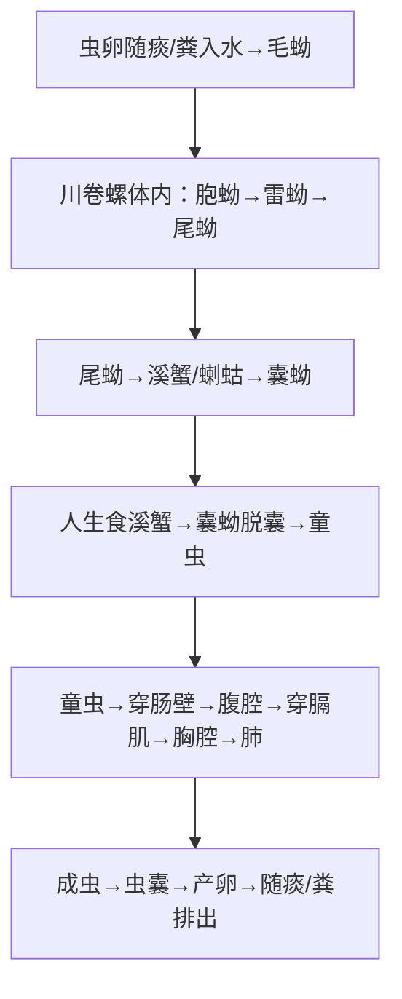

# 并殖吸虫（*Paragonimus* spp.）— 肺吸虫

## 📌 定义
- 主要寄生在**肺脏**的吸虫，引起**并殖吸虫病**（paragonimiasis）
- 中国以**卫氏并殖吸虫**（*P. westermani*）为主，其次为**斯氏狸殖吸虫**（*Pagumogonimus skrjabini*）
- 因**生食/半生食含囊蚴的溪蟹或蝲蛄**而感染

---

## 🔬 形态

| 阶段 | 大小 | 特征 |
|:----|:----|:------|
| **成虫** | (7~12)×(4~7)mm | 红褐色，**卵圆形**似咖啡豆；**口吸盘=腹吸盘**（大小相近） |
| **虫卵 🥇** | (80~120)×(45~60)μm | 金黄色、椭圆形、**大盖**；内含卵细胞+10+卵黄细胞；卵壳厚薄不均（无盖端厚） |

> 🖼️卫氏并殖吸虫形态模式图
> ![[寄生虫_并殖吸虫_卫氏并殖吸虫虫卵镜下.png|658]]
> 🖼️卫氏并殖吸虫虫卵镜下观
> ![[寄生虫_并殖吸虫_卫氏并殖吸虫形态模式图.png|662]]

---

## 🔄 生活史

> 囊蚴=感染阶段；童虫穿膈肌→肺=胸肺型；入脑→脑型

### 关键信息

| 项目 | 说明 |
|:----|:------|
| **第一中间宿主** | **川卷螺** |
| **第二中间宿主** | **溪蟹、蝲蛄** |
| **保虫宿主** | 犬、猫、虎、豹等肉食动物 |
| **感染阶段** | **囊蚴**（蟹/蝲蛄体内） |
| **感染途径** | **生食/醉腌溪蟹或蝲蛄** 🥇 |
| **主要寄生部位** | **肺**（形成虫囊） |
| **虫体移行** | 肠→腹腔→**膈肌**→胸腔→肺（特征性移行路径） |

---

## ⚙️ 致病机制

### 病理分期
| 分期 | 机制 |
|:----|:------|
| **童虫移行期** | 组织破坏+出血+炎症（肠壁、肝、腹腔、胸膜） |
| **成虫寄生病** | 肺虫囊形成→**隧道状空腔**→内含虫体+虫卵+坏死物+Charcot-Leyden晶体 |
| **慢性期** | 虫囊壁纤维化→钙化 |

### 异位寄生
> 🚨 童虫/成虫可异位至**脑、皮下、肝、眼、心包**等

| 部位 | 表现 |
|:----|:------|
| **脑型**（儿童多见） | 癫痫、偏瘫、颅内高压（**最严重的并殖吸虫病**） |
| **皮下型** | 游走性皮下结节/包块（斯氏狸殖吸虫多见） |
| **肝型** | 肝大、腹痛（斯氏狸殖吸虫多见） |
| **心包型** | 心包积液 |

---

## 🩺 临床表现

| 类型 | 表现 |
|:----|:------|
| **胸肺型 🥇** | **咳嗽、胸痛、铁锈色/烂桃样血痰**（特征性）、胸腔积液 |
| **脑型** | 癫痫、头痛、呕吐、偏瘫、视力障碍 |
| **皮下包块型** | 游走性皮下结节（多见于斯氏狸殖吸虫—无肺虫囊，以皮下/肝为主） |
| **心包型** | 心包炎、心包积液 |

---

## 🔬 检查

| 方法 | 说明 |
|:----|:------|
| **痰/粪查虫卵 🥇** | **痰液查卵**阳性率最高（铁锈色痰）；咽下痰→粪中也可见 |
| **皮下结节活检** | 查见童虫/虫卵（斯氏狸殖吸虫常见） |
| **ELISA** | 检测抗体（敏感/特异） |
| **影像** | **X线/CT**：胸膜增厚、渗出、虫囊肿块（隧道状阴影）；**CT/MRI**：颅内钙化/占位 |
| **血常规** | **嗜酸性粒细胞显著↑** |
| **皮内试验** | 筛查 |

---

## 💊 治疗

| 药物 | 用法 | 说明 |
|:----|:----|:------|
| **吡喹酮 🥇** | 25mg/kg tid×2~3天 | **首选** |
| **三氯苯达唑** | 10mg/kg bid×2~3天 | 也可选用 |

**对症**：脑型 + 激素（减轻炎症反应）；皮下结节→手术切除

---

## 🛡️ 预防
- **不生食/半生食溪蟹、蝲蛄 🥇**
- 不饮生溪水（尾蚴也可经口感染）
- 治疗病人+保虫宿主
- 加强健康教育（流行区—山区/丘陵地区）

---

> 💡 **临床推理链**：生食溪蟹/蝲蛄史 + **铁锈色/烂桃样痰** + 胸痛咳嗽 + 嗜酸性粒细胞↑ → 疑诊肺吸虫病 → **痰查虫卵**(+) → 确诊 → 吡喹酮治疗。**脑型**：流行区儿童 + 癫痫 + 颅脑CT钙化灶 → 鉴别结核瘤/脑囊虫

---
## 📎 相关笔记
- 对比：[[华支睾吸虫]]（肝胆管，淡水鱼虾）、[[血吸虫]]（门脉系统）
- 鉴别：[[肺结核]]（血痰但无嗜酸↑，抗酸杆菌(+)）
- 临床：[[嗜酸性粒细胞增多症]]、[[脑囊虫病]]
- 药物：[[吡喹酮]]
