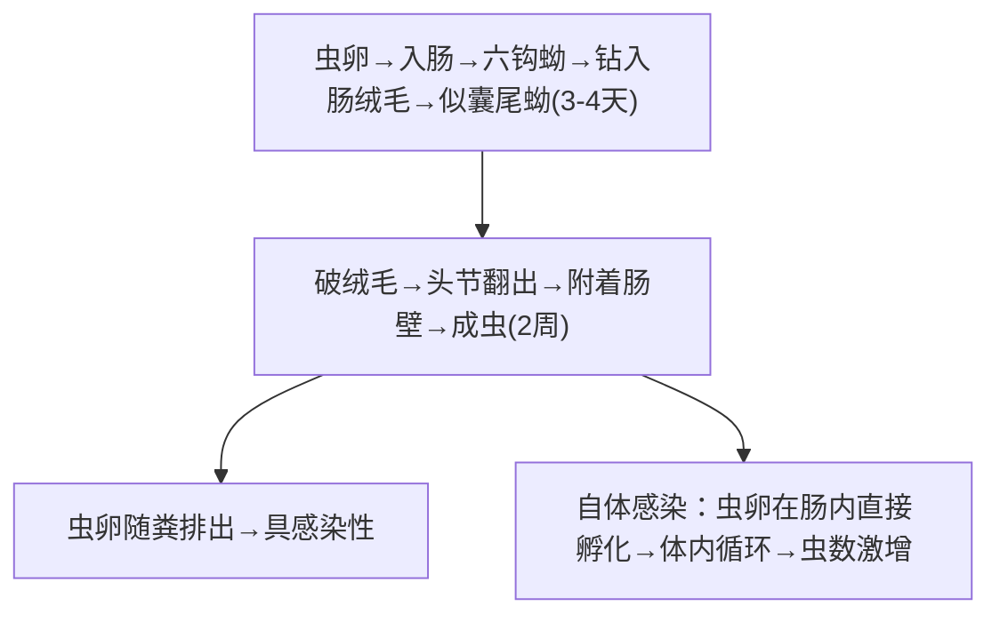

# 微小膜壳绦虫 & 缩小膜壳绦虫

## 📌 概述
两种**膜壳科**绦虫，体小、节片多。共同特征：头节**4吸盘+可伸缩顶突**。

| 项目 | **微小膜壳绦虫**（短膜壳绦虫） | **缩小膜壳绦虫**（长膜壳绦虫） |
|:----|:----------------------------|:----------------------------|
| **大小** | 25~40mm × 0.5~1mm | 200~600mm × 2~4mm |
| **节片数** | 100~200个 | 800~1000个 |
| **顶突** | **有小钩**（20~30个） | 无钩（退化的） |
| **中间宿主** | **可无**（直接发育）或**昆虫** | **必需**（甲虫/蚤/蟑螂） |
| **主要感染人群** | **儿童 🥇** | 各年龄（少见） |
| **流行情况** | **全球性**，中国儿童较常见 | 散发，罕见 |

---

## 🔄 生活史

### 微小膜壳绦虫（直接发育型）


> 唯一不需中间宿主的绦虫；自体感染→持续数十年

- **可无中间宿主**（直接发育）→ 粪便污染食物→经口感染（儿童最常见）
- **有中间宿主**：谷蛾、鼠蚤等昆虫吞食虫卵→似囊尾蚴
- **可自体感染**→大量繁殖

### 缩小膜壳绦虫（必需中间宿主）
```
虫卵 → 被甲虫/蚤/蟑螂吞食 → 似囊尾蚴
    ↓ 昆虫被误食
似囊尾蚴释放 → 小肠 → 成虫
```

---

## 🩺 临床表现

### 微小膜壳绦虫
| 程度 | 表现 |
|:----|:------|
| **轻度** | 无症状 |
| **中重度**（儿童） | 腹痛、腹泻、食欲减退、烦躁、失眠、肛门瘙痒 |
| **免疫低下者** | 自身感染→虫数暴增→症状加重（类似重症感染） |

### 缩小膜壳绦虫
- 通常**无症状**或轻度消化道症状

---

## 🔬 检查

| 方法 | 微小膜壳卵 | 缩小膜壳卵 |
|:----|:----------|:----------|
| **粪检 🥇** | **直接涂片/集卵法** | 同左 |
| **卵大小** | (48~60)×(36~48)μm | (60~79)×(72~86)μm |
| **卵特征** | 圆形，胚膜两端有**丝状物（极丝）** | 圆形，较大，**无极丝** |
| **内含** | 六钩蚴 | 六钩蚴 |

> 两种卵的**鉴别要点**：微小膜壳卵有**极丝**（4~8条伸出胚膜外），缩小膜壳卵**无极丝**且较大

---

## 💊 治疗

| 药物 | 用法 | 说明 |
|:----|:----|:------|
| **吡喹酮 🥇** | 15~25mg/kg 单次 | **首选** |
| 氯硝柳胺 | 减量（因人小） | 次选 |

---

## 🛡️ 预防
- **个人卫生**（勤洗手—儿童）
- 防鼠灭鼠（缩小膜壳绦虫）
- 防昆虫（谷蛾/甲虫/蚤）

---

> 💡 **临床推理链**：儿童 + 腹痛腹泻 + 粪检见膜壳绦虫卵 → **微小膜壳绦虫**（极丝）vs **缩小膜壳绦虫**（无极丝、较大）→ 鉴别 → **吡喹酮** 单次

---
## 📎 相关笔记
- 对比：[[链状带绦虫和肥胖带绦虫和亚洲带绦虫]]（大型肠道绦虫）
- 药物：[[吡喹酮]]
