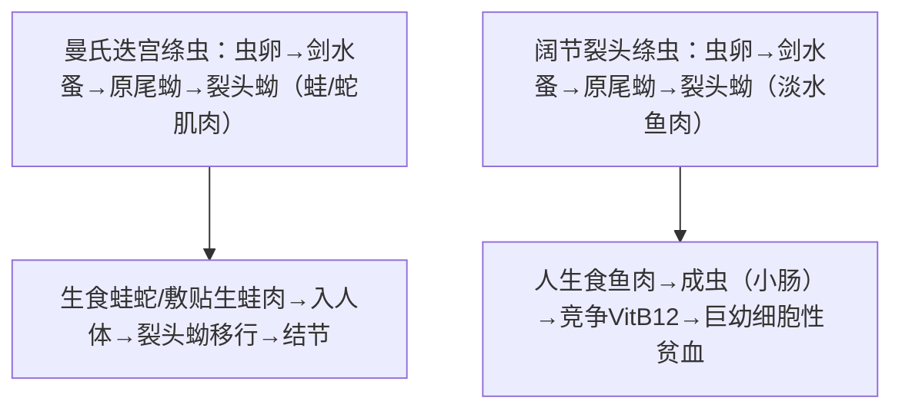

# 曼氏迭宫绦虫 & 阔节裂头绦虫

## 📌 概述
两者均为**假叶目**绦虫，生活史均需**两个中间宿主**（剑水蚤+鱼/蛙），虫卵均有**卵盖**（似吸虫卵）。

> 🖼️ 曼氏迭宫绦虫&阔节裂头绦虫
> ![[寄生虫_裂头绦虫_假叶目虫卵有卵盖.png|511]]![[寄生虫_裂头绦虫_曼氏迭宫绦虫形态.png|513]]

| 项目 | 曼氏迭宫绦虫 | 阔节裂头绦虫 |
|:----|:------------|:-------------|
| **疾病** | **裂头蚴病**（sparganosis） | **阔节裂头绦虫病**（鱼绦虫感染） |
| **主要致病阶段** | **幼虫（裂头蚴）**  | **成虫**（肠道内） |
| **终宿主** | 猫、狗（人→偶然中间宿主） | 人、犬、猫等 |
| **Ⅱ中间宿主** | 蛙、蛇 | **淡水鱼** |
| **感染途径** | 蛙/蛇肉敷贴伤口、生食蛙/蛇 | **生食淡水鱼** |

---

## 🔄 生活史

> 曼氏→裂头蚴病（皮下/眼/脑）；阔节→巨幼细胞性贫血（竞争VitB12）

### 关键信息

| 项目 | 曼氏迭宫绦虫 | 阔节裂头绦虫 |
|:----|:------------|:-------------|
| **感染阶段** | **裂头蚴**（蛙/蛇肉） | **裂头蚴**（鱼肉） |
| **感染途径** | 生蛙蛇肉/蛙肉敷贴伤口 🥇 | 生食淡水鱼 |
| **寄生部位** | 幼虫→皮下/眼/脑 | 成虫→小肠 |
| **成虫大小** | 约(60~100)cm×(0.5~0.6)cm | 可达**10m**（30~3000节片） |
| **头节** | 指状，背腹有吸槽 | 匙形，背腹有吸槽 |

---

## 🩺 临床表现

### 曼氏裂头蚴病

| 类型 | 比例 | 表现 |
|:----|:----|:------|
| **皮下型 🥇** | 最常见 | 游走性皮下结节（胸腹/四肢多见） |
| **眼型 🥇** | 常见❗ | **眼睑红肿、结膜炎、眼球突出**（与眶内肿瘤鉴别）；中国最常见因**蛙肉敷贴眼** |
| **脑型** | 少见 | 癫痫、偏瘫、类似脑瘤 |
| **口腔颌面型** | — | 颊部/颈部皮下包块 |

### 阔节裂头绦虫病

| 表现 | 说明 |
|:----|:------|
| **多数无症状** | 或轻微消化道症状 |
| **巨幼细胞性贫血 🥇** | 虫体大量吸收**维生素B12**→B12缺乏→**恶性贫血**（**唯一**可引起贫血的绦虫） |
| **肠梗阻** | 大量成虫少见 |

---

## 🔬 检查

| 方法 | 曼氏迭宫/裂头蚴 | 阔节裂头 |
|:----|:---------------|:---------|
| **病原学** | **手术切除结节→查裂头蚴** 🥇 | **粪检虫卵/节片** 🥇 |
| 虫卵特征 | — | 卵圆形，**(55~76)×(41~56)μm**，有**卵盖**（似吸虫卵） |
| 影像 | CT/MRI（脑型鉴别） | — |
| 免疫学 | ELISA（辅助） | — |

---

## 💊 治疗

| 疾病 | 治疗 |
|:----|:------|
| **裂头蚴病 🥇** | **手术完整切除**（药物难以杀灭） |
| 裂头蚴辅助 | 吡喹酮（可能有效，但手术为主） |
| **阔节裂头绦虫 🥇** | **吡喹酮**（5~10mg/kg 单次）+ 补充B12 |

---

## 🛡️ 预防
- **不生食蛙肉、蛇肉**（裂头蚴病）
- 不用生蛙肉敷贴伤口/眼睛（民间偏方⚠️）
- **不生食淡水鱼**（阔节裂头绦虫）

---

> 💡 **临床推理链**：**裂头蚴病**：眼睑红肿/游走性皮下结节 + 蛙蛇接触史/生蛙肉敷贴史 → B超/CT → 手术切除→病理查见裂头蚴 → 确诊。**阔节裂头绦虫**：生食淡水鱼 + 粪检见宽大虫卵（有盖）→ 吡喹酮 + B12补充

---
## 📎 相关笔记
- 对比：[[链状带绦虫和肥胖带绦虫和亚洲带绦虫]]（圆叶目，无卵盖）
- 对比：[[细粒棘球绦虫和多房棘球绦虫]]（幼虫致病→包虫囊肿）
- 临床：[[巨幼细胞性贫血]]、[[眼内寄生虫]]
- 药物：[[吡喹酮]]
