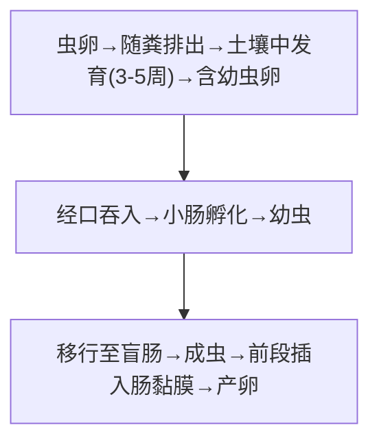
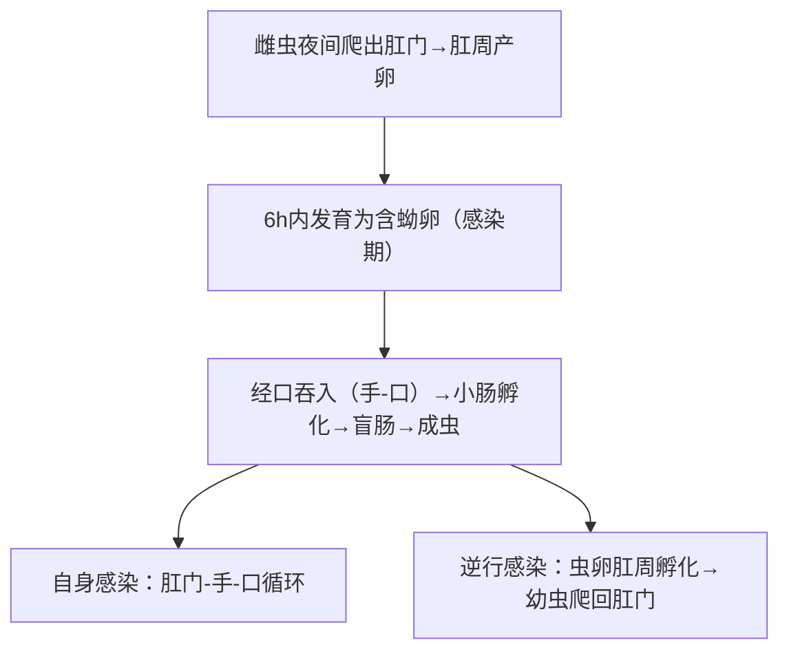

# 毛首鞭形线虫 & 蠕形住肠线虫 — 鞭虫·蛲虫

## 📌 概述
两种**土源性线虫**（soil-transmitted），感染率高但致病性一般较弱。虽常合并记忆，但感染方式和生活史不同。

| 项目 | **毛首鞭形线虫**（鞭虫） | **蠕形住肠线虫**（蛲虫） |
|:----|:----------------------|:----------------------|
| **形态特征** | **鞭状**（前3/5细如发丝，后2/5粗） | **梭形**，头端**两侧膨大（翼膜）** |
| **大小** | 雌3~5cm，雄3~4.5cm | 雌8~13mm，雄2~5mm（很小） |
| **寄生部位** | **盲肠/结肠**（严重→直肠） | **盲肠/阑尾/结肠** |
| **主要症状** | 腹泻/痢疾样、直肠脱垂 | **肛周瘙痒（夜间）** |
| **诊断方法** | 粪检虫卵 🥇 | **胶带法 🥇** |

---

## 🔬 形态对比

### 虫卵（鉴别要点 🥇）

| 虫种 | 大小 | 特征 |
|:----|:----|:------|
| **鞭虫卵** | (50~54)×(22~23)μm | **腰鼓形**或**纺锤形**，两端各有一个**透明栓（黏液栓）**，棕黄色 |
| **蛲虫卵** | (50~60)×(20~30)μm | **一侧扁平一侧凸出（D形/柿核形）**，无色透明，内含蝌蚪期幼虫 |

> 🖼️鞭虫和蛲虫对比模式图
> ![[寄生虫_蛲虫_蠕形住肠线虫虫卵.png|311]] ![[寄生虫_鞭虫_毛首鞭形线虫虫卵.png|220]]

---

## 🔄 生活史对比

### 鞭虫（直接发育）

> 含幼虫卵=感染阶段；成虫前段插入盲肠黏膜

### 蛲虫（直接发育，无需土壤）

> 含蚴卵=感染阶段；肛周产卵+夜间瘙痒=特征性表现

### 关键信息

| 项目 | 鞭虫 | 蛲虫 |
|:----|:----|:------|
| **感染阶段** | **含蚴卵**（土壤中发育） | **含蚴卵**（肛周6h即发育） |
| **感染途径** | **经口**（污染食物/手） | **经口**（手-口） |
| **特异性** | 不需中间宿主 | 不需土壤/中间宿主，**直接人传人** |
| **产卵方式** | 粪便中排卵 | **肛周产卵**（夜间，不是粪便中） |
| **好发人群** | 儿童、农村 | **儿童（托幼机构）👶** |

---

## 🩺 临床表现

### 鞭虫病
| 程度 | 表现 |
|:----|:------|
| **轻度** | 无症状 |
| **中度** | 腹痛、腹泻、食欲减退 |
| **重度（儿童）** | **慢性痢疾样**（黏液血便）、里急后重、**直肠脱垂**（持续排便用力→直肠脱出），可致贫血 |

### 蛲虫病
| 表现 | 说明 |
|:----|:------|
| **肛周瘙痒 🥇** | **特征性**，夜间加重（雌虫产卵刺激） |
| 继发症状 | 烦躁、失眠、注意力不集中、夜间磨牙 |
| **异位寄生** | 女性→阴道炎、尿道炎（蛲虫爬入阴道/尿道） |
| **肛周湿疹/抓痕** | 搔抓→皮肤感染 |
| **集体机构** | 托幼机构**群发**（密切接触传播） |

---

## 🔬 检查

| 方法 | 鞭虫 | 蛲虫 |
|:----|:----|:------|
| **首选方法** | **粪便直接涂片法/集卵法** | **胶带法（透明胶纸肛拭法）🥇** |
| 检查时机 | 不限 | **清晨便前/洗澡前**（不要洗肛周） |
| 虫卵特征 | 腰鼓形，双极黏液栓 | D形，一侧平一侧凸 |
| 查成虫 | — | 夜间肛周检查→见白色小虫（1cm左右蠕动） |

> ⚠️ **蛲虫检查关键**：不要查粪便！需用**胶带法**在清晨排便前粘贴肛周→镜检

---

## 💊 治疗

| 药物 | 鞭虫 | 蛲虫 |
|:----|:----|:------|
| **阿苯达唑 🥇** | 400mg/d×3天（**需连服3天**，单次效果差） | 400mg 顿服/2周后重复一次 |
| **甲苯达唑** | 200mg/d×3天 | 100mg 顿服/2周后重复 |
| 双羟萘酸噻嘧啶 | — | 可用 |
| **注意** | 阿苯达唑须连服3日（鞭虫对单次疗程不敏感） | **全家/全托同服**（2周后重复防再感染） |

---

## 🛡️ 预防

| 鞭虫 | 蛲虫 |
|:----|:----|
| 粪便无害化处理 | 勤洗手（尤其便后/饭前） |
| 不食不洁蔬菜 | **剪短指甲、不搔肛** |
| 饭前便后洗手 | **全家/全托同时驱虫** |
| — | 内衣裤/床单勤换勤洗（日光暴晒） |
| — | 穿睡衣睡裤减少手污染肛周 |

---

> 💡 **临床推理链（鞭虫）**：腹泻/黏液血便 + 粪检见腰鼓形双极栓虫卵 → 鞭虫病 → 阿苯达唑×3天
> 💡 **临床推理链（蛲虫）**：儿童 + **夜间肛周瘙痒** + 班级有多例同样症状 → 胶带法(+) → 蛲虫病 → 阿苯达唑全家/全托驱虫 + 2周后重复

---
## 📎 相关笔记
- 对比：[[似蚓蛔线虫]]（土源性，经肺移行）、[[钩虫]]（经皮感染+贫血）
- 临床：[[直肠脱垂]]、[[肛周瘙痒]]
- 药物：[[阿苯达唑]]
