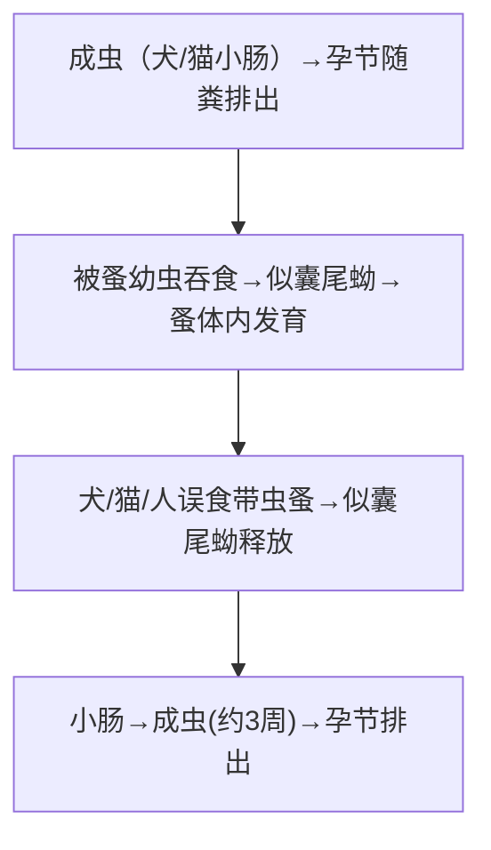

# 犬复孔绦虫（*Dipylidium caninum*）

## 📌 定义
- 犬、猫常见的肠道绦虫，偶可感染人（**儿童多见**）
- **中间宿主**：蚤类（**犬栉首蚤/猫栉首蚤**）
- 人因**误食含似囊尾蚴的蚤类**而感染

---

## 🔬 形态

| 阶段 | 特征 |
|:----|:------|
| **成虫** | 10~70cm，头节有4吸盘+**顶突**（小钩玫瑰刺状）；**孕节似黄瓜籽**（"**黄瓜籽样**"） |
| **孕节** | 两端尖的椭圆形，含多个**卵囊**（每个含8~15个虫卵） |
| **虫卵** | 圆形，直径35~60μm，放射状胚膜 |

> 🖼️犬复孔绦虫 
> ![[寄生虫_绦虫_犬复孔绦虫孕节黄瓜籽样.png|668]]

---

## 🔄 生活史

> 蚤=中间宿主；误食带虫蚤=感染途径

- **感染途径**：儿童与犬猫密切接触→误食犬蚤
- **感染阶段**：似囊尾蚴（蚤体内）

---

## 🩺 临床表现

| 程度 | 表现 |
|:----|:------|
| **多数无症状** | 或轻度 |
| **主要症状** | 腹痛、腹泻、**肛门瘙痒**（孕节逸出） |
| **体征** | 粪便中排出**黄瓜籽样节片**（家长常发现） |

---

## 🔬 检查

| 方法 | 说明 |
|:----|:------|
| **粪检/肛周查孕节 🥇** | 见**黄瓜籽样孕节**（特征性鉴别） |
| 虫卵 | 卵囊（8~15卵/囊）— 也可通过孕节压片观察 |

---

## 💊 治疗

| 药物 | 用法 | 说明 |
|:----|:----|:------|
| **吡喹酮 🥇** | 5~10mg/kg 单次 | **首选** |
| 氯硝柳胺 | 也可选用 | — |

---

## 🛡️ 预防
- **养犬/猫定期驱虫**
- 儿童接触宠物后**洗手**
- 灭蚤（环境杀虫）

---

> 💡 **临床推理链**：儿童 + 犬猫接触史 + 粪便中查见**黄瓜籽样节片** → 犬复孔绦虫 → 吡喹酮单次 + 宠物驱虫

---
## 📎 相关笔记
- 对比：[[链状带绦虫和肥胖带绦虫和亚洲带绦虫]]（人→人/猪/牛，大型带绦虫）
- 药物：[[吡喹酮]]
