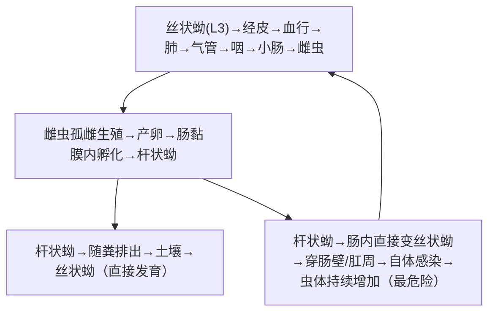

# 粪类圆线虫（*Strongyloides stercoralis*）

## 📌 定义
- 兼性寄生线虫，可在**自由生活**与**寄生生活**间转换
- **唯一可在宿主体内完成全部生活史的线虫**（自身感染）
- **机会性致病原虫**：免疫正常→轻度/自限；免疫低下（激素/HTLV-1）→**超感染综合征**→**致命**
- 土源性线虫，丝状蚴经皮感染（类似钩虫）

---

## 🔬 形态

| 阶段 | 大小 | 特征 |
|:----|:----|:------|
| **丝状蚴（L3）🥇** | 约600μm | 食管占体长1/2（最具鉴别特征：**尾端分叉**，钩虫尾尖）|
| **杆状蚴（L1）** | 200~300μm | 急性短食管（与钩虫需要鉴别） |
| **成虫（寄生）** | 雌2.2mm，雄**不存在**（孤雌生殖） | 纤细，透明，寄生于**小肠黏膜**内 |
| **虫卵** | 50~70μm | 椭圆形，壳薄，似钩虫卵但**已在肠黏膜产出→粪便中一般见不到虫卵**（已孵出杆状蚴） |

> 🖼️ **丝状蚴尾端分叉**（与钩虫丝状蚴尾尖鉴别）
> ![[寄生虫_粪类圆线虫_丝状蚴形态.png|385]]

---

## 🔄 生活史（独特❗）

### 三种生活史模式


> 丝状蚴=感染阶段；自体感染→免疫缺陷者→播散性超度感染→致命

### 关键信息

| 项目 | 说明 |
|:----|:------|
| **感染阶段** | **丝状蚴（L3）** 🥇 |
| **感染途径** | **经皮 🥇**（赤足）、**自身感染**（肠内/肛周） |
| **寄生部位** | **小肠黏膜**（雌虫钻入黏膜产卵） |
| **致病阶段** | 雌虫（黏膜内寄生）+ 丝状蚴（移行+自身感染） |
| **传播特点** | 无需中间宿主、可在**同一个体持续感染数十年** |

---

## ⚙️ 致病机制

### 免疫正常者
```
丝状蚴经皮 → 局部皮炎（荨麻疹/移行性线状风团——"匍行疹"）
    ↓ 肺移行 → 咳嗽、支气管痉挛
小肠黏膜寄生 → 轻度腹痛、间歇性腹泻
    ↓
Th2免疫 + IgE → 多数为无症状/轻度
```

### 🚨 超感染综合征（Hyperinfection Syndrome）

> **触发条件**：免疫低下（激素治疗🥇、HTLV-1、器官移植、肿瘤化疗、AIDS）
> **注意**：激素是最大的危险因素（糖皮质激素直接促进虫体发育）

```
免疫屏障崩溃 → 自身感染大量发生
    ↓
丝状蚴大量侵入肠壁 → 肠道溃疡/出血/穿孔
    ↓ 大量丝状蚴穿入血行
播散至肺（肺炎/ARDS）、脑（脑膜炎）、心（心肌炎）、肝等
    ↓ 肠道细菌**搭便车**
革兰阴性菌败血症、化脓性脑膜炎（混合感染）
    → **死亡率高达60%~80%**
```

---

## 🩺 临床表现

| 类型 | 表现 |
|:----|:------|
| **无症状型**（免疫正常） | 大部分感染者，轻度嗜酸性粒细胞↑ |
| **皮肤型** | **匍行疹**（larva currens）— 臀部/肛周/大腿，**高速移行**（每小时数厘米→比钩虫快得多） |
| **肺型** | 咳嗽、支气管炎、哮喘 |
| **肠型** | 腹痛、腹泻/便秘交替、恶心 |
| **超感染型 🚨** | **大量杆状蚴入血 → 发热+消化道溃疡+ARDS+败血症 → 多器官衰竭** |

> ⚠️ **鉴别"匍行疹"**：钩虫幼虫移行症爬行**慢**（数日/月），粪类圆线虫**快**（每小时数厘米）

---

## 🔬 检查

| 方法 | 说明 | 注意 |
|:----|:----|:------|
| **粪便查杆状蚴 🥇** | 新鲜粪便→查活动杆状蚴（虫卵罕见） | **需多次送检**（排卵不规则，易漏检） |
| **贝氏法（Baermann）🥇** | 浓集法—提高检出率 | 敏感 |
| **琼脂平板培养** | 见幼虫爬行痕迹（细菌线） | 敏感 |
| **ELISA** | 血清抗体检测 | 高敏感度（与丝虫/线虫有交叉） |
| **PCR** | 粪便DNA | 高特异 |
| **血常规** | 嗜酸性粒细胞↑（免疫低下者可能消失→不良预后） | — |

> 🚨 **诊疗要点**：任何免疫抑制治疗前（尤其激素），应排查粪类圆线虫！流行区患者激素前→预防性伊维菌素

---

## 💊 治疗

| 情况 | 方案 | 说明 |
|:----|:----|:------|
| **无并发症感染 🥇** | **伊维菌素** 200μg/kg/d×1~2天 | **首选** |
| 次选 | 阿苯达唑 400mg bid×7天 | 疗效不如伊维菌素 |
| **超感染综合征 🚨** | **伊维菌素** 200μg/kg/d×持续（至症状消失） | **需重复给药** + 抗细菌+停激素 |
| **HTLV-1合并感染** | 伊维菌素多次足量 | 抵抗治疗 |

> ⚠️ **不要使用激素**（严重程度与激素量直接相关）

---

## 🛡️ 预防
- 流行区避免赤足
- 粪便无害化
- **免疫抑制治疗前筛查**（尤其流行区患者→激素前→伊维菌素预防）
- **HTLV-1患者**常规筛查

---

> 💡 **临床推理链**：**免疫正常**：赤足史 + 匍行疹（高速移行）+ 腹痛/腹泻 + 嗜酸性粒细胞↑ → 粪检 Baermann法(+) → 伊维菌素。**免疫低下/激素治疗**：发热+肠道溃疡+ARDS+败血症 → 立即查粪/痰找杆状蚴 → 超感染综合征 → 伊维菌素持续性给药 + 抗感染 + 停激素

---
## 📎 相关笔记
- 对比：[[钩虫]]（经皮、贫血、无自身感染）
- 对比：[[似蚓蛔线虫]]（经口、经肺移行）
- 对比：[[丝虫]]（蚊媒、淋巴系统）
- 临床：[[机会性感染]]、[[HTLV-1]]、[[免疫抑制]]
- 药物：[[伊维菌素]]、[[阿苯达唑]]
