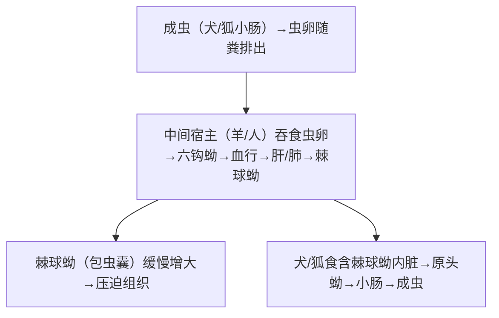

# 细粒棘球绦虫 & 多房棘球绦虫 — 包虫病

## 📌 定义
- **细粒棘球绦虫**（*E. granulosus*）→ **囊型包虫病**（cystic echinococcosis）
- **多房棘球绦虫**（*E. multilocularis*）→ **泡型包虫病**（alveolar echinococcosis）
- 两种幼虫（棘球蚴）寄生于人体，预后差别巨大
- 中国西部（新疆、青海、西藏、四川等）是主要流行区

### 两种对比

| 项目 | 细粒棘球绦虫 | 多房棘球绦虫 |
|:----|:------------|:------------|
| **成虫大小** | 2~7mm（3~4节片） | 1.2~4.5mm（4~5节片） |
| **终宿主** | 犬、狼 | **狐**（主）、犬、狼 |
| **中间宿主** | 羊、牛、人 | **鼠**（田鼠/沙鼠）、人 |
| **幼虫（棘球蚴）** | **单房性囊肿**（囊型） | **多房性/海绵状**（泡型） |
| **生长方式** | 膨胀性（挤压周围） | **浸润性**（似恶性肿瘤） |
| **生长速度** | 慢（1~5cm/年） | 更快 |
| **预后** | 相对较好 | **差**（"虫癌"） |

---

## 🔬 形态

### 细粒棘球蚴（包虫囊肿）
```
囊壁结构：
  ├── 外层：角皮层（乳白色，分层状，1~2mm厚）
  └── 内层：生发层（胚层）→ 生发囊 → 原头蚴（protoscolex）
       ↓
      子囊（daughter cyst）→ 孙囊 → 囊液（含抗原，破囊→过敏休克）
```

> 🖼️细粒棘球绦虫模式图![[寄生虫_棘球绦虫_细粒棘球绦虫包虫囊肿结构.png]]

### 多房棘球蚴
- 无完整的角质层
- **海绵状**小囊泡（0.1~1cm）浸润组织
- 囊液少，原头蚴少
- 生发层不断向外芽生→**破坏性生长**

---

## 🔄 生活史



> 虫卵=感染阶段；棘球蚴囊液含强抗原→破囊→过敏性休克

### 关键信息

| 项目 | 说明 |
|:----|:------|
| **感染阶段** | **虫卵**（经口，犬粪污染） |
| **感染途径** | **接触犬/狐 + 吞食虫卵**（手-口）🥇 |
| **棘球蚴最常见部位** | **肝脏（70%~80%）** > 肺(15%~25%) > 脑/骨等 |
| **人非适宜中间宿主** | 棘球蚴在人体内生长慢、易自破 |

---

## 🩺 临床表现

### 囊型包虫病（细粒棘球蚴）

| 部位 | 表现 |
|:----|:------|
| **肝囊型 🥇** | 右上腹无痛性包块（光滑、囊性感）；压迫→黄疸/门脉高压 |
| **肺囊型** | 咳嗽、胸痛、咯血；破入支气管→咳出囊内容物→可自愈 |
| **脑囊型** | 癫痫、颅内高压（儿童多见） |
| **骨囊型** | 骨痛、病理骨折 |
| **囊肿破裂 🚨** | **过敏性休克**（囊液入血→抗原性→可致死）+ **播散种植**（原头蚴播散→新囊肿） |

### 泡型包虫病（多房棘球蚴）— "虫癌"

| 特征 | 说明 |
|:----|:------|
| **浸润性生长** | 类似**肝癌**：边界不清、向周围侵犯 |
| **症状** | 上腹隐痛、肝大、质硬如石 |
| **转移** | 可经血行/淋巴→肺、脑等 |
| **晚期** | 肝功能衰竭、门脉高压、恶病质 |
| **自然史** | 未经治疗→10年死亡率>90% |

---

## 🔬 检查

| 方法 | 囊型 | 泡型 |
|:----|:----|:------|
| **影像 🥇** | **B超/CT**：圆形囊肿、囊壁钙化、"**水上浮莲征**"（内囊剥离） | CT/MRI：**地图状/海绵状**浸润，中心坏死钙化 |
| **血清学 🥇** | ELISA检测抗体（敏感/特异）— 确认试验 | 同左 |
| **穿刺** | ⚠️ **禁忌**（囊液外漏→过敏性休克+播散） | ⚠️ **禁忌**（一般不做诊断性穿刺） |
| **血常规** | 嗜酸性粒细胞↑ | 嗜酸性粒细胞↑ |

> ⚠️ **包虫囊肿严禁诊断性穿刺** — 囊液泄漏可致过敏性休克死亡和腹腔播散

---

## 💊 治疗

| 类型 | 方案 |
|:----|:------|
| **囊型包虫病 🥇** | **手术（PAIR）**：穿刺→抽囊液→注入杀原头蚴剂（20%~30% NaCl/95%乙醇）→再抽吸 |
| 囊型（手术不可行） | **阿苯达唑**（10~15mg/kg/d，**长期**3~6月~数年） |
| **泡型包虫病 🥇** | **根治性手术切除**（早期）+ **阿苯达唑长期治疗（≥2年）** |
| 泡型（晚期/无法切除） | 阿苯达唑终身治疗；肝移植（终末期） |

> 🚨 **阿苯达唑**是包虫病的核心药物，需**长疗程**（不同于肠道线虫的单次用药）

---

## 🛡️ 预防
- **流行区不接触犬/狐粪**（尤其儿童）
- 牧羊犬定期驱虫（吡喹酮）
- 病畜内脏不喂犬（切断生活史的关键）
- 加强屠宰检疫
- 个人卫生（洗手）

---

> 💡 **临床推理链**（囊型）：牧区生活/犬接触史 + 肝区无痛性肿块 + B超囊性占位（"水上浮莲征"）+ 血清抗体(+) → 包虫囊肿 → ⚠️**禁穿刺** → **PAIR/手术 + 阿苯达唑**
> 💡 **泡型**：同上 + CT示海绵状浸润 + 血清抗体(+) → 泡型包虫病 → **早期根治性手术 + 阿苯达唑长期治疗**

---
## 📎 相关笔记
- 对比：[[链状带绦虫和肥胖带绦虫和亚洲带绦虫]]（囊尾蚴病—皮下/脑）
- 对比：[[曼氏迭宫绦虫和阔节裂头绦虫]]（裂头蚴病—皮下/眼）
- 临床：[[肝占位]]、[[过敏性休克]]
- 药物：[[阿苯达唑]]
