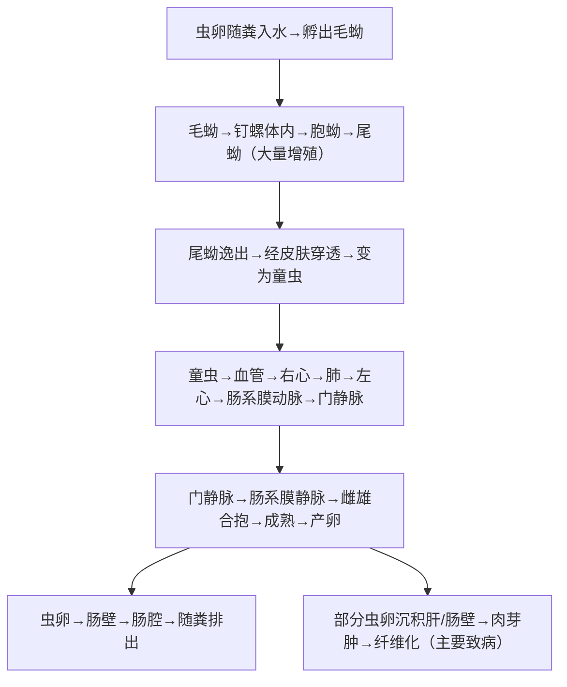

# 血吸虫（*Schistosoma* spp.）— 裂体吸虫

## 📌 定义
- 唯一**雌雄异体**的吸虫，寄生在**人体门脉-肠系膜静脉系统**
- 中国致病的为**日本血吸虫**（*S. japonicum*）
- 感染阶段**尾蚴经皮肤侵入**（接触疫水）
- WHO：全球超2.4亿人感染，非洲最重

### 主要虫种对比

| 虫种 | 地区 | 寄生部位 | 虫卵特征 |
|:----|:----|:---------|:---------|
| **日本血吸虫** *S. japonicum* | 东亚（中国/菲律宾/印尼） | 肠系膜上静脉 | **卵圆形，侧棘短小（侧刺）** |
| **埃及血吸虫** *S. haematobium* | 非洲、中东 | 膀胱静脉丛 | 纺锤形，**端突** |
| **曼氏血吸虫** *S. mansoni* | 非洲、南美 | 肠系膜下静脉 | 卵圆形，**侧棘长大** |

---

## 🔬 形态

| 阶段 | 大小 | 特征 |
|:----|:----|:------|
| **成虫**（雌雄异体） | 雌(12~28)×0.3mm，雄(10~20)×0.5mm | 雄虫**抱雌沟**（gynecophoral canal）→雌虫在沟内合抱 |
| **虫卵 🥇** | **90×70μm** | **卵圆形，侧方有小棘/刺**；无卵盖；内含**毛蚴** |
| **毛蚴** | 约90μm | 梨形，体表纤毛，在水中游动→找中间宿主 |
| **尾蚴** | 体部100~150μm+尾干140~160μm | 叉尾型（**分叉尾**），经皮感染 |

> 🖼️ 日本血吸虫形态与结构模式图![[寄生虫_血吸虫_日本血吸虫毛蚴.png|679]]
> 🖼️ 日本血吸虫虫卵镜下观![[寄生虫_血吸虫_日本血吸虫尾蚴.png]]🖼️ 日本血吸虫成虫雌雄合抱镜下观
> ![[寄生虫_血吸虫_日本血吸虫形态与结构模式图.png|678]]

---

## 🔄 生活史



> 尾蚴=感染阶段；虫卵肉芽肿=主要致病环节

### 关键信息

| 项目 | 说明 |
|:----|:------|
| **传染源** | 病人、病畜（牛、猪、羊等） |
| **中间宿主** | **钉螺**（*Oncomelania hupensis*—中国唯一的中间宿主） |
| **感染阶段** | **尾蚴**（水体中，自由游动） |
| **感染途径** | **接触疫水→尾蚴经皮侵入** 🥇 |
| **寄生部位** | **门静脉-肠系膜静脉系统** |
| **产卵** | 雌虫每日产卵约1000~3500个（日本血吸虫产卵最多） |
| **保虫宿主** | 多种家畜+野生动物 |

---

## ⚙️ 致病机制

### 核心致病环节—**虫卵**

> **血吸虫病的根源是虫卵**（非成虫也非尾蚴）

```
成虫产卵 → 虫卵沉积肝/肠壁
    ↓
毛蚴分泌**可溶性虫卵抗原（SEA）**
    ↓
CD4⁺T细胞介导 → **虫卵肉芽肿**
    ↓ 反复+长期
肉芽肿 → 纤维化 → **肝纤维化（干线型/pipe-stem纤维化）** → 窦前性门脉高压
```

### 分期

| 分期 | 机制 | 表现 |
|:----|:----|:------|
| **尾蚴性皮炎** | 尾蚴经皮→局部炎症 | 接触疫水后数小时→瘙痒性丘疹 |
| **急性期**（童虫移行+虫卵初沉积） | 血清病样反应 | **发热（弛张热）、荨麻疹、腹痛、嗜酸性粒细胞↑↑** |
| **慢性期** | 虫卵肉芽肿持续 | 慢性腹泻、肝脾大、肠壁增厚 |
| **晚期**（纤维化→不可逆） | 干线型肝纤维化 | **巨脾、腹水、食管胃底静脉曲张（→上消化道出血→致死）** |
| **异位** | 虫卵沉积 | 脑型（癫痫）、肺型（肺动脉高压） |

### 临床表现

#### 急性血吸虫病（Katayama热）
| 体征 | 特点 |
|:----|:------|
| **发热** | **弛张热/间歇热**，可伴寒战 |
| **过敏反应** | 荨麻疹、血管神经性水肿、**嗜酸性粒细胞显著↑** |
| **消化道** | 腹痛、腹泻、肝脾大 |
| **好发人群** | 初次接触疫水的**无免疫力者**（非流行区进入疫区） |

#### 慢性血吸虫病
| 类型 | 表现 |
|:----|:------|
| **无症状型** | 流行区常见，轻度感染 |
| **肝脾型** | 肝左叶大→脾大→门脉高压 |
| **结肠型** | 慢性腹泻、腹痛、肠壁增厚（晚期→结肠肉芽肿→肠狭窄） |
| **侏儒型** | 儿童反复感染→垂体功能受抑→生长发育障碍 |

#### 晚期血吸虫病（不可逆损害）
| 类型 | 表现 |
|:----|:------|
| **巨脾型** | 脾大达盆腔、脾功能亢进→全血↓ |
| **腹水型** | 门脉高压 → 腹水（反复→难治性） |
| **结肠肉芽肿型** | 肠梗阻、肠狭窄（可误诊为结肠癌） |
| **上消化道出血 🥇** | **最常见死因**（食管胃底静脉曲张破裂） |

---

## 🔬 检查

| 方法 | 说明 |
|:----|:------|
| **粪便查虫卵 🥇** | **改良加藤法**（Kato-Katz）— 流行区筛查；**毛蚴孵化法**—提高检出率 |
| **直肠黏膜活检** | 直接压片→查虫卵（慢性期/晚期粪便查卵常阴性） |
| **ELISA/IFA** | 检测抗体（筛查/辅助诊断，不能区分现症vs既往） |
| **抗原检测** | 循环抗原（CCA/CAA）检测—可区分现症感染 |
| **B超 🥇** | 肝实质**网络状/鱼鳞状**回声（肝纤维化）、脾大、门静脉内径↑ |
| **血常规** | 急性→嗜酸性粒细胞↑↑；晚期→脾亢→全血↓ |

---

## 🆚 鉴别诊断

| 疾病 | 鉴别要点 |
|:----|:---------|
| **疟疾** | 周期性热、血涂片查见疟原虫、肝大但质软 |
| **伤寒** | 稽留热、相对缓脉、肥达反应(+) |
| **肝硬化（乙肝后）** | 肝表面不平结节、乙肝标记(+) |
| **结肠癌** | 便血+里急后重、结肠镜+活检 |

---

## 💊 治疗

| 药物 | 用法 | 说明 |
|:----|:----|:------|
| **吡喹酮 🥇** | 急性→10mg/kg tid×4天；慢性→40mg/kg 顿服/分2次 | **首选**，对各期各虫种均高效 |
| **蒿甲醚/青蒿琥酯** | 预防 | 杀灭童虫（疫水接触后用） |

**对症治疗**：
- 巨脾→脾切除+门脉断流
- 上消化道出血→内镜套扎/硬化、三腔二囊管
- 腹水→利尿、限盐、腹腔穿刺

---

## 🛡️ 预防

| 措施 | 说明 |
|:----|:------|
| **灭螺 🥇** | 药物灭螺（氯硝柳胺）+ 环境改造—中国血防核心策略 |
| **粪便管理** | 无害化处理、不施鲜粪 |
| **安全用水** | 水源保护、杀灭尾蚴 |
| **个人防护** | 避免接触疫水、涂防护剂 |
| **治疗病人+病畜** | 同步化疗 |
| **健康教育** | — |

> 🌍 **中国血防成就**：经过70年综合防治，全国血吸虫病已降至历史最低水平，多个省份达到传播阻断/消除标准

---

> 💡 **临床推理链**：疫水接触史 + 发热（弛张热）+ 荨麻疹+腹痛+嗜酸↑  → 血吸虫抗体(+) + 粪检虫卵(+) → 急性血吸虫病 → **吡喹酮**治疗。慢性/晚期：疫区 + 肝脾大/腹水/上消化道出血史 → 直肠活检虫卵(+) + B超肝纤维化 → 吡喹酮 + 对症治疗

---
## 📎 相关笔记
- 对比：[[华支睾吸虫]]（淡水鱼虾→肝胆管）、[[并殖吸虫]]（溪蟹→肺）
- 临床：[[门脉高压]]、[[上消化道出血]]、[[嗜酸性粒细胞增多症]]
- 药物：[[吡喹酮]]
