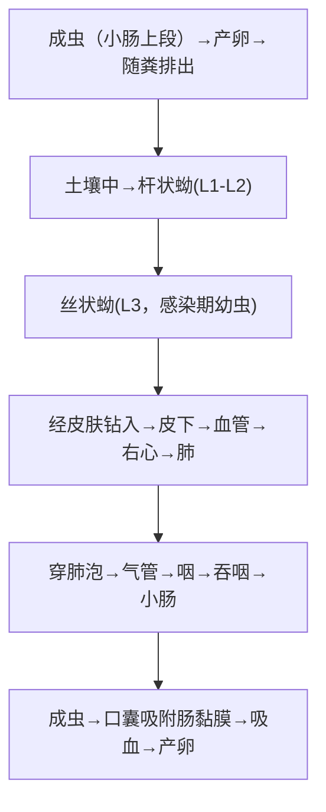

# 钩虫（十二指肠钩口线虫 & 美洲板口线虫）

## 📌 定义
- 寄生于人体**小肠上段**的线虫，以**吸血**为生 → 引起**缺铁性贫血**
- 两种主要虫种：**十二指肠钩口线虫**（*A. duodenale*）& **美洲板口线虫**（*N. americanus*）
- 土源性线虫，**丝状蚴经皮肤侵入**（赤足下地）

---

## 🔬 形态

### 两种钩虫鉴别（考试重点 🥇）

| 特征 | **十二指肠钩虫** | **美洲钩虫** |
|:----|:---------------|:------------|
| **大小** | 较大：雌10~14mm，雄8~11mm | 较小：雌9~11mm，雄7~9mm |
| **口囊 🥇** | **腹侧2对钩齿**（钩口线虫→有齿） | **腹侧1对半月形切板**（板口线虫→有板） |
| **交合伞** | **圆形**，背辐肋分支远端再分2支 | **扁圆形**，背辐肋分支基部即分2支 |
| **交合刺** | 2根，**末端分开** | 2根，**末端合并成一倒钩** |
| **尾刺（雌）** | 有尾刺 | **无尾刺** |
| **产卵量** | 1万~3万/日 | 5千~1万/日 |
| **致病力** | **更强**（吸血量更大） | 较弱 |

### 虫卵
- 两种钩虫卵**形态无法区分**
- 椭圆形，无色透明，**(56~76)×(36~40)μm**，壳薄，内含**4~8个卵细胞**（新鲜粪便）

> 🖼️钩虫成虫对比
> ![[寄生虫_钩虫_钩虫卵镜下.png|435]]
>  ![[寄生虫_钩虫_钩虫成虫对比.png|431]]
>  🖼️钩虫卵
>  ![[寄生虫_钩虫_钩虫形态生活史.png|428]]

---

## 🔄 生活史



> 丝状蚴=感染阶段；成虫吸血→缺铁性贫血=主要危害

### 关键信息

| 项目 | 说明 |
|:----|:------|
| **感染阶段** | **丝状蚴（L3）** 🥇 |
| **主要感染途径** | **皮肤接触含丝状蚴的土壤 🥇**（赤足下地、徒手耕作） |
| **次要感染途径** | 经口（十二指肠钩虫→乳汁；幼虫可经口黏膜侵入） |
| **寄生部位** | **小肠上段**（十二指肠/空肠） |
| **成虫寿命** | 十二指肠钩虫约5~7年，美洲钩虫约3~5年 |
| **吸血量** | 十二指肠钩虫0.2~0.34ml/天·条；美洲钩虫0.02~0.1ml/天·条 |

---

## ⚙️ 致病机制

### 分期
| 阶段 | 机制 | 表现 |
|:----|:----|:------|
| **皮肤期** | 丝状蚴侵入→局部炎症 | **钩蚴性皮炎（"粪毒"/"地痒疹"）**—足趾间丘疹/水疱、奇痒 |
| **肺期** | 幼虫穿肺泡→出血+炎症 | 咳嗽、痰中带血丝、发热（通常轻微） |
| **成虫期 🥇** | 口囊吸附→吸血+伤口渗血 | **慢性失血→缺铁性贫血**（核心表现） |
| **成虫期** | 吸附处黏膜破损→更换吸附点→新旧伤口同时渗血 | — |

### 贫血机制
```
每条钩虫每日吸血0.02~0.34ml
    + 吸附点渗血（伤口持续出血）
    + 抗凝血物质分泌（钩虫分泌抗凝素）
    ↓
长期慢性失血 → 铁储备耗竭 → 缺铁性贫血
    ↓
重度 → 低蛋白血症 → 贫血性心脏病 → 心力衰竭
```

---

## 🩺 临床表现

| 症状 | 说明 |
|:----|:------|
| **贫血 🥇** | 头晕、乏力、面色苍白、心悸、活动后气促；**异食癖**（食土/生米/墙皮—钩虫病的特征性表现） |
| **消化道** | 上腹部隐痛/不适（类似消化性溃疡）、食欲亢进/减退 |
| **儿童** | 生长发育迟缓、智力下降 |
| **妇女** | 月经不调、闭经、流产 |
| **心脏** | 重度贫血→贫血性心脏病→心衰 |
| **低蛋白血症** | 水肿（下肢、颜面部） |

---

## 🔬 检查

| 方法 | 说明 |
|:----|:------|
| **粪便查虫卵 🥇** | **直接涂片/改良加藤法/饱和盐水浮聚法**（钩虫卵轻→浮聚法检出率高） |
| 钩蚴培养 | 鉴别虫种（滤纸试管培养法） |
| **血常规 🥇** | Hb↓（缺铁性贫血）、**嗜酸性粒细胞↑**（早期及活动期） |
| 胃镜 | 偶见十二指肠虫体 |

---

## 💊 治疗

| 药物 | 用法 | 说明 |
|:----|:----|:------|
| **阿苯达唑 🥇** | 400mg/d×3天 | 高效、广谱 |
| **甲苯达唑** | 200mg/d×3天 | 也是首选 |
| 双羟萘酸噻嘧啶 | 11mg/kg/d×3天 | 对十二指肠钩虫效果更好 |

**支持治疗**：
- **补充铁剂**（硫酸亚铁/富马酸亚铁+维生素C）→贫血纠正
- **高蛋白饮食**
- 重度贫血→输血

> 🚨 **单纯驱虫不补铁→贫血不会完全恢复**

---

## 🛡️ 预防
- **不赤足下地耕作**（穿鞋/穿雨靴）🥇
- 粪便无害化处理（堆肥灭卵）
- 流行区群体驱虫
- 加强健康教育

---

> 💡 **临床推理链**：**赤足下地史** + 钩蚴性皮炎 + 缺铁性贫血 + 异食癖 + 嗜酸性粒细胞↑ → 粪检见钩虫卵（椭圆薄壳4~8细胞期）→ 钩虫病 → 阿苯达唑×3天 + **补铁治疗**

---
## 📎 相关笔记
- 对比：[[似蚓蛔线虫]]（经口、营养不良）、[[毛首鞭形线虫和蠕形住肠线虫]]（土源性）
- 对比：[[粪类圆线虫]]（经皮感染+自身感染+机会性）
- 鉴别：[[丝虫]]（淋巴系统、蚊媒）
- 临床：[[缺铁性贫血]]、[[异食癖]]
- 药物：[[阿苯达唑]]
