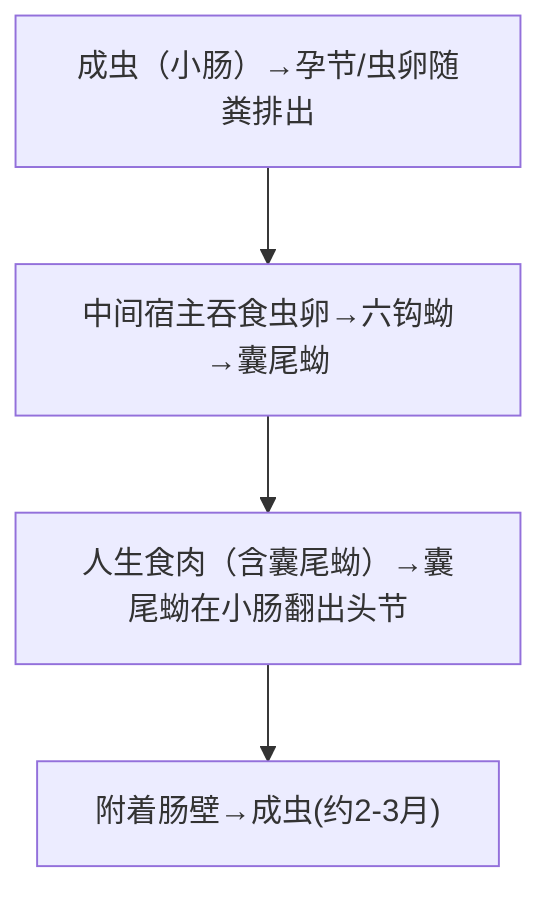

# 肠道带绦虫三种 — 猪带·牛带·亚洲带

## 📌 定义
三种寄生于人**小肠**的带绦虫，属于**圆叶目**。**鉴别诊断是考试重点**。

| 项目 | **猪带绦虫** ⚠️ | **牛带绦虫** | **亚洲带绦虫** |
|:----|:---------------|:------------|:--------------|
| 虫种 | *T. solium* | *T. saginata* | *T. asiatica* |
| 肠绦虫病 | ✅ | ✅ | ✅ |
| **囊虫病（人）** | **✅ 极危险❗** | ❌ | ❌ |
| **头节** | 4吸盘+**顶突+小钩**(25~50) | **4吸盘，无钩** | 4吸盘+**顶突+小钩**(退化的) |
| **成节** | 卵巢3叶 | 卵巢2叶 | 卵巢2叶 |
| **孕节（子宫分支）** | **7~13支**（侧支） | **15~30支**（侧支） | 16~21支 |
| **虫卵鉴别** | **无法鉴别**—猪/牛/亚洲卵形态完全相同 | 同上 | 同上 |
| **中间宿主** | **猪/人** | 牛 | **猪** |
| **人体最长** | 2~4m | **4~8m**（最长可达25m） | 约4m |

> 🖼️
> ![[寄生虫_绦虫_猪牛带绦虫孕节对比.png|188]]![[寄生虫_绦虫_猪牛带绦虫成节对比.png|370]]![[寄生虫_绦虫_猪牛带绦虫头节对比.png|163]]![[寄生虫_绦虫_猪牛带绦虫虫卵对比.png|212]]![[寄生虫_绦虫_猪牛带绦虫囊尾蚴.png|209]]

---

## 🔬 形态

### 头节鉴别（关键考点 🥇）
```
猪带绦虫：球形，4吸盘 + 顶突 + 两圈小钩（25~50个）→ "有钩绦虫"
牛带绦虫：方形，4吸盘，无顶突无钩 → "无钩绦虫"
亚洲带绦虫：有顶突+退化的钩（形态介于两者之间）
```

### 虫卵（三者完全相同）
- 球形/卵圆形，**(31~43)μm**
- **胚膜（放射状条纹）**
- 内含**六钩蚴**（oncosphere）

### 孕节
```
猪带：子宫分支7~13 → "少分支"
牛带：子宫分支15~30 → "多分支"
亚洲：子宫分支16~21
```

---

## 🔄 生活史

### 成虫期（肠绦虫病）


### ⚠️ 猪带绦虫的特殊性—**囊虫病**（自体感染）

```
人误食虫卵（自体感染：肛门-口 / 逆蠕动 / 外源性）
    ↓
卵在小肠孵化 → 六钩蚴 → 血行播散
    ↓
全身组织 → **囊尾蚴**（脑/眼/皮下/肌肉）
    ⚠️ **人成为中间宿主**（最危险的猪带绦虫特性）
```

### 关键信息

| 项目 | 猪带绦虫 | 牛带绦虫 | 亚洲带绦虫 |
|:----|:---------|:---------|:-----------|
| **感染阶段** | 囊尾蚴（猪肉） | 囊尾蚴（牛肉） | 囊尾蚴（猪肉/猪肝） |
| **感染途径** | **生食猪肉 🥇** | **生食牛肉 🥇** | **生食猪肉/猪肝 🥇** |
| **囊虫病风险** | **✅ 人可患囊虫病❗** | ❌ | ❌ |
| **自体感染** | ✅ 可导致囊虫病 | ❌ | ❌ |

---

## 🩺 临床表现

### 肠绦虫病（三者均可）
| 症状 | 说明 |
|:----|:------|
| **多数无症状** | 或轻度 |
| **孕节逸出 🥇** | **牛带→主动逸出肛门**（肛门爬行感，患者常自行发现）|
| 消化道 | 腹痛、腹泻、恶心、食欲异常 |
| 全身 | 头晕、乏力、体重减轻 |

### 🚨 囊虫病（仅猪带绦虫）

> **囊虫病**：猪带绦虫幼虫（囊尾蚴）寄生于人体各组织

| 类型 | 比例 | 表现 |
|:----|:----|:------|
| **脑囊虫病 🥇** | 60%~70% | **继发性癫痫最常见病因**（流行区）；颅内高压、精神障碍 |
| **皮下肌肉型** | 常见 | 可触及圆形/椭圆形皮下结节（数百个→肌肉酸痛） |
| **眼囊虫病** | 少见 | 视力障碍、视网膜脱离、青光眼 |
| **其他** | — | 心、肝、肺等 |

> ⚠️ **亚洲带绦虫**可致猪肝囊尾蚴（称"Chinese liver fluke"的曾用误解），但入体后不发育为囊虫

---

## 🔬 检查

| 方法 | 肠绦虫病 | 囊虫病 |
|:----|:---------|:-------|
| **虫卵检查** | 粪检（直接/集卵）；**肛拭法**（牛带） | 不适用 |
| **孕节检查** | **子宫分支计数 🥇**（鉴别虫种关键） | 不适用 |
| **皮下结节活检** | — | **查见囊尾蚴** 🥇 |
| **影像** | — | **CT/MRI**：脑内多发环形增强灶/钙化点（"**米粒样**"） |
| **免疫学** | ELISA（可筛） | **血清ELISA/ Western blot** 🥇 |
| **血常规** | — | 嗜酸性粒细胞↑ |

---

## 💊 治疗

| 情况 | 方案 | 注意事项 |
|:----|:----|:---------|
| **肠带绦虫病 🥇** | **吡喹酮** 5~10mg/kg 单次 或 **氯硝柳胺** | — |
| **皮下囊虫病** | **阿苯达唑**（15~20mg/kg/d×10~14天） | 多个疗程 |
| **脑囊虫病 🚨** | **阿苯达唑** + **泼尼松**（减轻炎症反应） | 住院治疗‼️抗虫后炎症反应→颅内高压危象 |
| **眼囊虫病** | **手术切除** | 不宜化疗（虫体死亡→炎症→失明） |

> 🚨 **脑囊虫病治疗关键**：抗虫药杀死虫体→释放抗原→加重脑水肿→需同步激素
> 🚨 **自体内感染**：猪带绦虫患者呕吐→逆蠕动→节片入胃→孵出六钩蚴→囊虫病

---

## 🛡️ 预防
- **不吃生猪肉/生牛肉 🥇**
- 生熟砧板分开
- **彻底治疗猪带绦虫患者**（预防囊虫病的关键）
- 加强肉类检疫
- 粪便无害化

---

> 💡 **临床推理链**：**肠绦虫病**：生肉食史 + 粪便排节片(+/肛周爬行感) → 压片查孕节→子宫分支计数(7~13 vs 15~30) → 鉴别虫种 → 吡喹酮。**囊虫病**：流行区 + 癫痫/皮下结节 + CT多发钙化 → 血清囊虫抗体(+) → 阿苯达唑+激素（脑型须住院）→ 眼囊虫→手术

---
## 📎 相关笔记
- 对比：[[曼氏迭宫绦虫和阔节裂头绦虫]]（假叶目，卵有盖）
- 对比：[[细粒棘球绦虫和多房棘球绦虫]]（包虫囊肿）
- 对比：[[微小膜壳绦虫和缩小膜壳绦虫]]（小型绦虫）、[[犬复孔绦虫]]（犬源性绦虫）
- 临床：[[脑囊虫病]]、[[继发性癫痫]]
- 药物：[[吡喹酮]]、[[阿苯达唑]]
