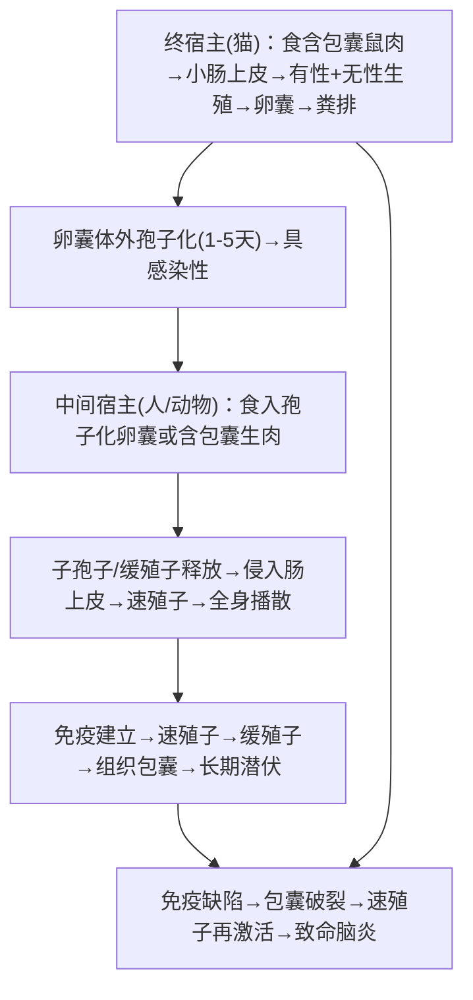
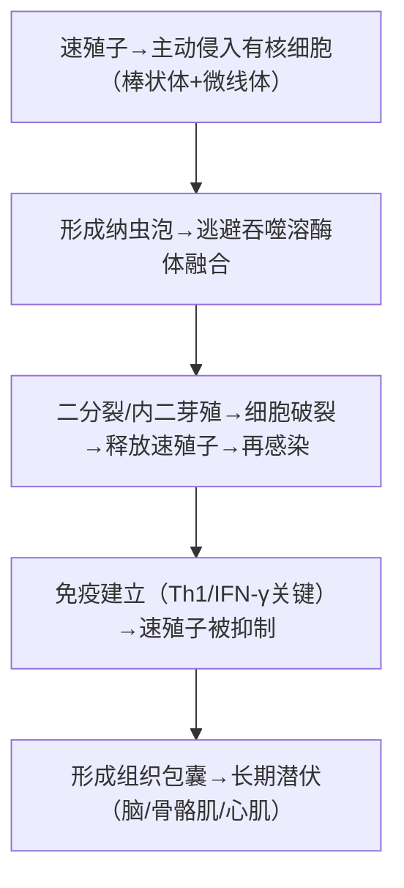

# 刚地弓形虫（*Toxoplasma gondii*）— 弓形虫病

## 📌 定义
- **刚地弓形虫**（*Toxoplasma gondii*）引起**弓形虫病**（toxoplasmosis）
- **机会性致病原虫**：免疫正常→隐性感染；免疫低下→严重播散
- **TORCH综合征**之一（To = Toxoplasma）
- **终宿主**：猫科动物（唯一）；**中间宿主**：人、哺乳动物、鸟类

---

## 🔬 三种形态

| 形态 | 大小 | 特征 | 寄生部位 |
|:----|:----|:------|:---------|
| **速殖子（tachyzoite）** | (4~7)×(2~4)μm | 半月形/香蕉形，一端尖一端钝；核居中偏后；**假包囊**（含数个速殖子） | 细胞内（急性期） |
| **缓殖子（bradyzoite）** | 约7μm | 形态同速殖子但增殖慢；**组织包囊**（含数十至数千缓殖子，直径5~100μm） | 脑、骨骼肌、心肌（慢性期） |
| **卵囊（oocyst）** | 10~12μm | 椭圆/圆形；随猫粪排出→体外孢子化→含2个孢子囊（各含4个子孢子） | 猫肠上皮 |

> 🖼️刚地弓形虫模式图
> ![[寄生虫_弓形虫_刚地弓形虫各形态.png]]

---

## 🔄 生活史

### 双宿主生活史

> 貓=唯一终宿主；包囊/卵囊=感染阶段；速殖子=急性致病阶段

### 传播途径

| 途径 | 说明 | 重要性 |
|:----|:-----|:-------|
| **食入含包囊的生肉 🥇** | 猪、羊、牛肉 | **最主要** |
| **食入卵囊** | 猫粪污染的食物/水/土壤 | ⚠️ 孕妇最关键 |
| **先天性** | 速殖子经胎盘→胎儿（**仅孕期原发感染**） | TORCH |
| 输血/器官移植 | 少见 | — |

- **感染阶段**：孢子化卵囊、组织包囊（含缓殖子）、假包囊（含速殖子）
- **致病阶段**：速殖子（急性期）、组织包囊（慢性潜伏）

---

## ⚙️ 致病机制

### 速殖子侵袭链

> Th1/IFN-γ=控制弓形虫最关键因子；免疫崩溃→包囊破裂→再激活

- **细胞免疫**：IFN-γ是控制弓形虫的最关键因子
- **潜伏再激活**：免疫低下时（AIDS、移植后）组织包囊破裂→速殖子播散

---

## 🩺 临床表现

### 先天性弓形虫病（母体原发感染→胎盘→胎儿）

> **感染越早，后果越重；孕晚期感染率高但症状轻**

| 表现 | 说明 |
|:----|:------|
| **流产/死胎** | 孕早期感染 |
| **脑积水** 🥇 | 典型三联征之一 |
| **脑钙化** 🥇 | CT/MRI可见颅内散在钙化灶 |
| **脉络膜视网膜炎** 🥇 | 眼部损害（可出生后数月~数年才出现） |
| 小脑畸形、小眼畸形 | — |
| 肝脾肿大、黄疸 | — |
| **精神运动障碍** | 智力低下、癫痫 |

> 先天性弓形虫病三联征：**脑积水 + 脑钙化 + 脉络膜视网膜炎**

### 获得性弓形虫病（免疫正常者）

| 表现 | 说明 |
|:----|:------|
| **淋巴结肿大 🥇** | **最常见**（颈后、锁骨上多见）、无痛性、可单/多发 |
| 发热、乏力、肌痛 | 类似传染性单核细胞增多症 |
| 轻度肝脾肿大 | — |
| **自限性** | 通常数周~数月自愈 |

### 免疫低下者弓形虫病（致命❗）

| 表现 | 说明 |
|:----|:------|
| **弓形虫脑炎 🥇** | AIDS患者最常见机会性感染之一；头痛、局灶神经征、癫痫、意识障碍 |
| **脑脓肿** | CT/MRI示环状增强病灶（好发基底节） |
| **心肌炎/肺炎** | 播散性感染 |
| **眼部：坏死性视网膜炎** | 视力下降 |

> 🚨 **AIDS患者弓形虫脑炎**：CD4<100 cells/μL时高发
> 🚨 **隐匿激活**：潜伏感染（包囊）→ 免疫崩溃 → 再激活 → 脑炎

---

## 🔬 检查

| 方法                     | 说明                 | 临床意义             |
| :--------------------- | :----------------- | :--------------- |
| **血清学 🥇**             | IgG + IgM          | **最常用诊断方法**      |
| ‣ **IgM(+) + 低亲和力IgG** | → 近期感染/原发感染        | 孕妇关键❗            |
| ‣ **IgG(+) IgM(-)**    | → 既往感染（有免疫力）       | —                |
| ‣ **IgM假阳性**           | 可持续数月~数年           | 需亲和力试验鉴别         |
| **PCR** 🥇             | 羊水/脑脊液/血液          | 产前诊断（羊水）、脑炎CSF诊断 |
| **直接镜检**               | 组织/体液 Giemsa染色→速殖子 | 有创               |
| **组织活检**               | 淋巴结、脑组织→见速殖子/包囊    | 确诊但创伤大           |
| **影像学**                | CT/MRI：脑内多发性环状增强病灶 | 弓形虫脑炎特征          |

---

## 💊 治疗

| 患者类型 | 方案 | 说明 |
|:---------|:----|:------|
| **免疫低下+急性感染 🥇** | **乙胺嘧啶 + 磺胺嘧啶 + 亚叶酸钙** | 首选治疗 |
| **先天性弓形虫病** | 同上 | 疗程6~12月 |
| **妊娠期（孕早期）** | **螺旋霉素** 🥇 | 减少垂直传播 |
| **妊娠期（中晚期+胎儿感染）** | 乙胺嘧啶 + 磺胺嘧啶（+亚叶酸钙） | 需权衡利弊 |
| **脉络膜视网膜炎** | 乙胺嘧啶 + 磺胺嘧啶 + 糖皮质激素 | — |
| **AIDS（CD4<100）** | 同上 → 待CD4>200可停药（HAART后） | 预防复发 |

> 🚨 **乙胺嘧啶致畸**（叶酸拮抗剂）— 孕早期禁用→改用螺旋霉素
> 🚨 **磺胺嘧啶 + 亚叶酸钙** 配合使用以减轻骨髓抑制

### 药物机制
- **乙胺嘧啶**：抑制二氢叶酸还原酶（DHFR）→ 干扰核酸合成
- **磺胺嘧啶**：抑制二氢叶酸合成酶（DHPS）→ 协同→双重阻断叶酸代谢
- **螺旋霉素**：大环内酯类，对胎盘渗透性好，可用于孕期

---

## 🛡️ 预防

| 措施 | 针对 |
|:----|:------|
| **不吃生肉/半生肉 🥇** | 组织包囊 |
| 接触猫粪后彻底洗手 | 卵囊 |
| **孕妇避免接触猫粪/土壤** | 卵囊 |
| 肉类-20℃冷冻24h以上可杀灭包囊 | 组织包囊 |
| 血清学筛查（孕前/孕期） | 先天性弓形虫病 |

> 💡 **孕妇处理方案**：血清学筛查 → 发现原发感染 → 螺旋霉素（孕早期）+ 羊水PCR → 胎儿感染 → 乙胺嘧啶+磺胺嘧啶（中晚期）→ 新生儿抗虫治疗

---

> 💡 **临床推理链**：**免疫正常**：淋巴结肿大 + 发热 + 接触猫/生肉史 → IgM(+)IgG(-)或IgM+低亲和力IgG → 急性弓形虫病 → 自限（通常不需治）→ 重症→乙胺嘧啶+磺胺嘧啶。**孕妇**：孕早期血清学筛查→IgM(+)→螺旋霉素。**AIDS**：CD4<100 + 头痛/局灶征 + MRI环状增强灶 → 疑诊弓形虫脑炎 → 经验性治疗 + PCR → 终身预防

---
## 📎 相关笔记
- 概论：[[医学原虫概论]]
- 鉴别：[[疟原虫]]（发热+肝脾大但周期热）、[[隐孢子虫]]（腹泻为主）
- 临床：[[TORCH综合征]]、[[弓形虫脑炎]]、[[脉络膜视网膜炎]]
- 药物：[[乙胺嘧啶]]、[[磺胺嘧啶]]、[[螺旋霉素]]
