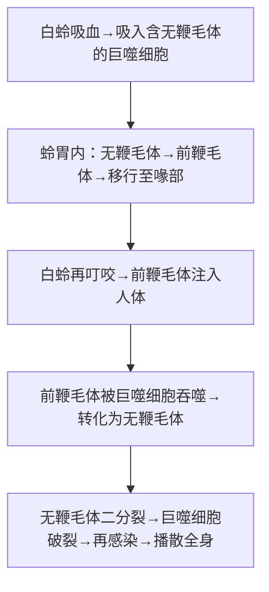

# 杜氏利什曼原虫（*Leishmania donovani*）

## 📌 定义
- 引起**内脏利什曼病**（黑热病）的病原体
- 无鞭毛体寄生于人及哺乳动物**巨噬细胞**内，前鞭毛体寄生于**白蛉**消化道内

## 🔬 形态

| 阶段 | 特点 |
|:----|:------|
| **无鞭毛体（利杜体）** | 卵圆形，(2.9~5.7)μm×(1.8~4.0)μm；胞质淡蓝/淡红色；核居中；**动基体**呈细杆状位于核旁 |
| **前鞭毛体** | 梭形，(14.3~20)μm×(1.5~1.8)μm；核居中，前端有动基体和基体→发出一根游离鞭毛 |

> 🖼️ **前鞭毛体宿主骨髓涂片**  
> ![[寄生虫_利什曼_杜氏利什曼原虫无鞭毛体.png|679]]![[寄生虫_利什曼_杜氏利什曼原虫前鞭毛体.png]]

## 🔄 生活史

> 前鞭毛体=感染阶段；无鞭毛体（利-杜小体）=诊断阶段

- **传染源**：病人、病犬（犬源型）、某些野生动物（野生动物源型）
- **传播媒介**：**雌性白蛉**（虫媒传播）
- **感染阶段**：前鞭毛体（白蛉唾液）
- **致病阶段**：无鞭毛体（巨噬细胞内）

## ⚙️ 致病机制

> **核心链**：无鞭毛体繁殖 → 巨噬细胞破裂 → 网状内皮系统增生 → 脾/肝/淋巴结肿大 → 脾功能亢进 → **全血细胞减少**

| 机制 | 表现 |
|:----|:------|
| **脾肿大** | 最突出，可达盆腔，质硬光滑 |
| **肝功能受损** | 肝细胞变性坏死，白蛋白↓ |
| **免疫复合物沉积** | 肾小球肾炎 |
| **细胞免疫抑制** | 皮肤迟发型超敏反应阴性 |

## 🩺 临床表现

### 内脏利什曼病（黑热病）

| 症状 | 特点 |
|:----|:------|
| **发热** | 长期不规则发热，可呈**双峰热** |
| **脾肿大** | **进行性**，甚至达盆腔 |
| **肝/淋巴结肿大** | 轻至中度 |
| **贫血** | 面色苍白、头晕（脾亢+骨髓受抑） |
| **出血倾向** | 鼻出血、牙龈出血（血小板↓） |
| **消瘦** | 病程长者明显 |

> 🖼️ **黑热病脾肿大体征** 
> ![[寄生虫_利什曼_黑热病脾肿大体征.png]]

### 其他类型
| 类型 | 特点 |
|:----|:------|
| **淋巴结型利什曼病** | 浅表淋巴结肿大为主，无/轻度脾肿大 |
| **PKDL（黑热病后皮肤利什曼病）** | 治愈后面/颈/四肢色素沉着或脱失斑；结节含大量无鞭毛体→**重要传染源** |
| **皮肤利什曼病** | 溃疡/结节（"东方疖"），自限性 |

## 🔬 检查

### 病原学检查（确诊依据）
| 方法 | 检出率 | 说明 |
|:----|:------|:------|
| **骨髓穿刺** 🥇 | 80%~90% | **最常用**，安全 |
| 淋巴结穿刺 | 46%~87% | 较低 |
| 脾穿刺 | 90%~99% | 检出率最高但有风险 |
| 肝穿刺 | 较高 | 有出血风险 |

- **涂片染色**：瑞氏/姬氏染液→镜检无鞭毛体
- **培养**：NNN培养基培养前鞭毛体
- **动物接种**：仓鼠等敏感动物

### 免疫学与分子生物学
- **ELISA/IHA/IFAT**：检测抗体
- **McAb-AST**：检测抗原→早期诊断
- **快速试纸法**：现场筛查
- **PCR**：检测DNA，敏感性/特异性极高

### 其他检查
- **血常规**：全血细胞减少（**白细胞↓最显著**）
- **肝功能**：白蛋白↓，球蛋白↑，A/G倒置
- **免疫球蛋白**：IgG显著↑

## 🆚 鉴别诊断
| 疾病 | 鉴别要点 |
|:----|:---------|
| **疟疾** | 周期性发热，血涂片查见疟原虫 |
| **伤寒** | 稽留热、相对缓脉、肥达反应(+) |
| **结核病** | 结核中毒症状、TST(+)、影像学特征 |
| **血液病** | 骨髓象特征性改变，无脾肿大或轻度 |
| **肝硬化** | 肝病史、肝功能损害、无原虫 |
| **恶性组织细胞病** | 骨髓异常组织细胞增生，无原虫 |

## 💊 治疗

| 药物 | 适应证 |
|:----|:--------|
| **葡萄糖酸锑钠（斯锑黑克）🥇** | **首选**，治愈率>90% |
| 喷他脒（戊烷脒） | 锑剂耐药/无效 |
| 两性霉素B | 难治性病例（毒性大） |
| 米替福新 | 口服新药，疗效好 |

**对症**：加强营养、纠正贫血、脾功能亢进严重者→脾切除

## 🛡️ 防治
1. **治疗病人**：早发现早治疗
2. **杀灭病犬**（犬源型流行区）
3. **消灭白蛉**：杀虫剂、改善居住环境
4. **个人防护**：流行区夜间驱蚊剂、蚊帐

> 💡 **临床推理链**：长期不规则发热 + 进行性脾肿大 + 消瘦 → 疑诊黑热病 → 骨髓穿刺查见无鞭毛体 → 确诊 → 葡萄糖酸锑钠治疗

---
## 📎 相关笔记
- 概论：[[医学原虫概论]]
- 传播媒介：[[白蛉]]
- 药物：[[葡萄糖酸锑钠]]、[[喷他脒]]
- 临床：[[黑热病]]、[[脾功能亢进]]
