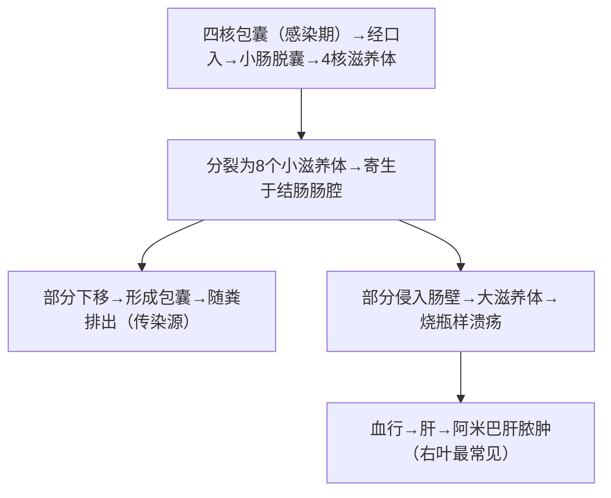

# 溶组织内阿米巴（*Entamoeba histolytica*）

## 📌 定义
- 寄生于人体肠道和其他组织的**致病性阿米巴**
- 引起**阿米巴痢疾**和**肠外阿米巴病**（肝脓肿最常见）

## 🔬 形态

> 🖼️ **滋养体镜下**：铁苏木素染色显示泡状核、核周染色质粒、吞噬的红细胞 
> 🖼️ **包囊镜下**：碘染色显示4核、棒状拟染色体  ![[寄生虫_阿米巴_溶组织内阿米巴滋养体铁苏木素染色.png|663]]![[寄生虫_阿米巴_溶组织内阿米巴包囊碘染色.png|252]]![[寄生虫_阿米巴_溶组织内阿米巴形态对比.png|332]]

### 1. 滋养体（Trophozoite）
| 特征      | 描述                                   |
| :------ | :----------------------------------- |
| **大小**  | 12～60μm，运动活跃                         |
| **运动**  | 伸出单一伪足，做**定向阿米巴运动**                  |
| **外质**  | 透明                                   |
| **内质**  | 颗粒状，含食物泡                             |
| **食物泡** | 含红细胞、细菌、组织碎片                         |
| **核**   | 泡状核，核膜内缘**排列整齐的核周染色质粒**，核仁细小居中，0.5μm |

**两种类型**：
- **肠腔内滋养体（小滋养体）** — 不吞噬红细胞，以细菌和肠内容物为食
- **组织内滋养体（大滋养体）** — ⚠️ **能吞噬红细胞** → 致病性阿米巴

### 2. 包囊（Cyst）
| 特征 | 描述 |
|:----|:------|
| **大小** | 10～20μm，圆球形 |
| **囊壁** | 厚，不着色（折光性强） |
| **核** | 1～4个，结构与滋养体相同 |
| **拟染色体** | 棒状，两端钝圆（成熟包囊常见） |
| **糖原泡** | 空泡状（碘染色呈棕色） |

> 🚨 **感染阶段**：**4核成熟包囊**
> 🚨 **致病阶段**：**组织内大滋养体**
> 🚨 误食滋养体**不会**感染（滋养体在上消化道被杀灭）→ 摄入包囊才感染
> 🚨 滋养体在肠腔外组织或外界**不能成囊**

## 🔄 生活史

> 四核包囊=感染阶段；吞噬红细胞的滋养体=确诊依据

- **宿主**：人（唯一宿主）
- **感染阶段**：4核成熟包囊
- **致病阶段**：组织内大滋养体
- **传播途径**：粪-口途径（污染的水、食物、手）
- **生活史类型**：**简单型**（无中间宿主）
- **繁殖方式**：二分裂增殖

## ⚙️ 致病机制

### 1. 致病因素
- **虫株毒力**：不同虫株毒力差异大
- **宿主免疫状态**：免疫功能低下→易感性↑
- **肠道菌群**：某些细菌协同作用

### 2. 毒力因子
| 因子 | 功能 | 口诀 |
|:----|:-----|:----|
| **凝集素（Gal/GalNAc lectin）** | 介导滋养体**吸附**于肠上皮细胞 | "粘" |
| **穿孔素（amoebapore）** | 在宿主细胞膜形成**离子通道**→细胞溶解 | "打孔" |
| **半胱氨酸蛋白酶** | 溶解组织、降解补体C3a/C5a及IgA→**逃避免疫** | "溶" |
| **脂磷酸聚糖分子（LPPG）** | 参与黏附和信号传导 | |

### 3. 病理变化

#### （1）肠阿米巴病
- **好发部位**：盲肠、升结肠（其次直肠、乙状结肠）
- **特征性病变**：**口小底大的烧瓶样溃疡**![[寄生虫_阿米巴_肠阿米巴烧瓶样溃疡.jpg|671]]
- 溃疡间黏膜正常
- 炎症反应轻（淋巴细胞/浆细胞为主，**中性粒细胞少**）

#### （2）肠外阿米巴病
- **阿米巴肝脓肿**（最常见，占90%以上）
  - 好发**肝右叶**（盲肠/升结肠血液回流至右叶）
  - 脓液：**巧克力色/果酱色**，黏稠，**无臭味**（无菌性）
  - 临床表现：发热、右上腹痛、肝肿大、压痛
  - 🖼️ **CT影像**：![[寄生虫_阿米巴_阿米巴肝脓肿大体.png]]
- **其他少见**：肺脓肿、脑脓肿、皮肤阿米巴病

## 🩺 临床表现

| 类型 | 特点 |
|:----|:------|
| **无症状带虫者** | 最常见（>90%），粪便中可检出包囊 |
| **阿米巴痢疾** | 果酱样便、腥臭、里急后重轻、全身症状轻 |
| **阿米巴肝脓肿** | 发热、肝区疼痛、肝肿大、巧克力色脓液 |

### 🆚 鉴别诊断

| 疾病 | 大便性状 | 全身症状 | 病原检查 | 治疗反应 |
|:----|:---------|:---------|:---------|:---------|
| **阿米巴痢疾** | 果酱样、腥臭 | 轻 | 滋养体/包囊 | 甲硝唑有效 |
| **细菌性痢疾** | 脓血便、黏液脓血 | 重（高热） | 痢疾杆菌 | 抗生素有效 |
| **肠结核** | 糊状/腹泻便秘交替 | 低热、盗汗 | 结核杆菌 | 抗结核有效 |
| **结肠癌** | 便血、变细 | 消瘦 | 活检 | 手术 |

## 🔬 检查

| 方法 | 适用 | 表现 |
|:----|:----|:------|
| **生理盐水涂片法**（确诊首选） | 急性期粪便 | **吞噬红细胞的滋养体** |
| **碘液染色** | 慢性期/带虫者粪便 | 查包囊 |
| **脓肿穿刺液** | 肝脓肿 | 查滋养体 |
| **血清学（IHA/ELISA/IFA）** | 肠外/慢性阿米巴病 | 特异性抗体 |
| **PCR** | 鉴别诊断 | 区分溶组织 vs 迪斯帕内阿米巴 |
| **影像学（超声/CT/MRI）** | 肝脓肿定位 | 单发/右叶/圆形/低密度灶 |

## 💊 治疗

### 治疗原则
- **杀灭组织内滋养体** + **清除肠腔包囊**

| 药物                        | 作用       | 适应症             |
| :------------------------ | :------- | :-------------- |
| **甲硝唑（metronidazole）** 🥇 | 杀灭组织内滋养体 | **首选**，肠/肠外阿米巴病 |
| 替硝唑/奥硝唑                   | 同甲硝唑     | 替代用药            |
| **巴龙霉素**                  | 杀灭肠腔内阿米巴 | 清除包囊（肠壁不易吸收）    |
| 二氯尼特                      | 杀灭包囊     | 带虫者治疗           |
| 氯喹                        | 杀灭组织内滋养体 | 阿米巴肝脓肿（辅助）      |

> 🚨 **易错**：甲硝唑主要杀灭**组织内滋养体**，清除肠腔包囊需配合巴龙霉素等肠壁不易吸收药物

### 肝脓肿治疗
- 药物：甲硝唑 + 氯喹
- 大脓肿→穿刺引流
- 药物无效/脓肿破裂→手术

## 🌍 流行与防治
- **全球分布**：热带、亚热带高发；我国农村高于城市
- **传播途径**：粪-口（污染水源/食物/手）；蝇/蟑螂机械性传播包囊
- **防治**：控制传染源（治疗患者/带虫者）+ 切断传播途径（粪便管理/饮水消毒）+ 注意饮食卫生

> 💡 包囊对干燥、高温抵抗力弱，但**耐受胃酸**（滋养体不耐胃酸）

---
## 📎 相关笔记
- 概论：[[医学原虫概论]]
- 对比：[[非致病性阿米巴]]（形态鉴别）、[[致病性自生生活阿米巴]]
- 临床：[[阿米巴痢疾]]、[[阿米巴肝脓肿]]
- 药物：[[甲硝唑]]、[[巴龙霉素]]
- 基础：[[01.4 病理索引]]（烧瓶样溃疡、炎症反应）
