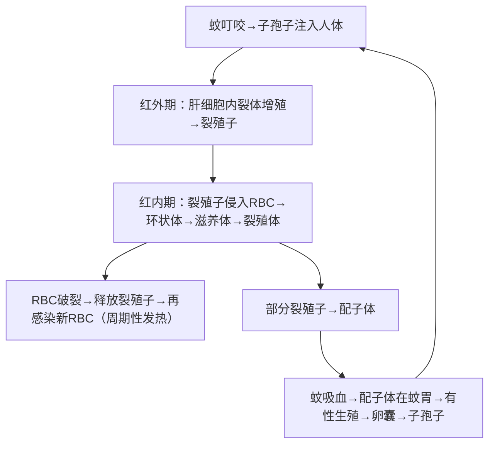

# 疟原虫（*Plasmodium* spp.）— 疟疾

## 📌 定义
- 疟原虫是疟疾的病原体，属**孢子虫纲**、**疟原虫科**
- 寄生于人及多种动物的**红细胞**和**肝细胞**
- 经**雌性按蚊**叮咬传播
- WHO估计全球约2.49亿病例/年（2022），非洲占绝大多数

### 人体四种主要疟原虫

| 虫种 | 疾病 | 周期 | 休眠子 | 严重度 |
|:----|:----|:----|:-------|:-------|
| **恶性疟原虫** (*P. falciparum*) | 恶性疟 | 36~48h | ❌ | ⚠️ **最危险** |
| **间日疟原虫** (*P. vivax*) | 间日疟 | **48h** | ✅ 有→复发 | 中等 |
| **三日疟原虫** (*P. malariae*) | 三日疟 | **72h** | ❌ | 较轻（可致肾病） |
| **卵形疟原虫** (*P. ovale*) | 卵形疟 | **48h** | ✅ 有→复发 | 较轻 |
| **诺氏疟原虫** (*P. knowlesi*) | 人兽共患疟疾 | **24h** | ❌ | 可重症（东南亚） |

---

## 🔬 形态（薄血膜吉氏染色）

### 环状体（早期滋养体）
| 虫种 | 特征 |
|:----|:------|
| **恶性疟原虫** | 细小，1个RBC可含**多个环状体**；常见**双环**（应用点） |
| **间日疟原虫** | 较大，1个RBC通常1个；环约为RBC直径1/3 |
| **三日疟原虫** | 较粗大，核1个，环较厚实 |
| **卵形疟原虫** | 类似间日疟，较致密 |

### 大滋养体
| 虫种        | 特征                                              |
| :-------- | :---------------------------------------------- |
| **恶性疟原虫** | **外周血不易见**（在内脏毛细血管发育）；大环状/不规则                   |
| **间日疟原虫** | **阿米巴样**，形态不规则；含**Schüffner点**（薛氏小点）；**疟色素**黄褐色 |
| **三日疟原虫** | 带状/圆形，致密；**Ziemann点**（齐氏小点）；疟色素深褐色              |
| **卵形疟原虫** | 较间日疟致密，不呈阿米巴样；RBC核形/卵圆形；**James点**              |

### 裂殖体
| 虫种 | 裂殖子数 | 特征 |
|:----|:---------|:------|
| **恶性疟原虫** | 18~36个 | 外周血不易见 |
| **间日疟原虫** | 12~24个 | 占满RBC；疟色素集中中央 |
| **三日疟原虫** | 6~12个 | 菊花状排列 |
| **卵形疟原虫** | 6~12个 | 较小 |

### 配子体
| 虫种 | 特征 |
|:----|:------|
| **恶性疟原虫** 🥇 | **半月形/香蕉形**（特征性形态）；雌性较大/雄性较小 |
| **间日疟原虫** | 圆形，占满RBC |
| **三日疟原虫** | 圆形，较小 |
| **卵形疟原虫** | 圆形，类似间日疟 |

> 🖼️四种疟原虫形态对比![[寄生虫_疟原虫_四种疟原虫形态对比.png|673]]![[寄生虫_疟原虫_疟原虫红细胞内期形态.png]]

---

## 🔄 生活史

### 三阶段



> 间日疟/卵形疟红外期有**休眠子**→可复发；恶性疟/三日疟无休眠子。红内期=临床致病阶段，红内期裂体增殖周期决定发热周期。

### 关键要点
- **感染阶段**：子孢子（蚊唾液腺）
- **致病阶段**：红内期裂体增殖（红细胞破裂）
- **传播阶段**：配子体（被蚊吸入）
- **复发机制**：P. vivax/P. ovale 的休眠子（hypnozoite）在肝内潜伏→激活→红内期复发
- **储存宿主**：P. knowlesi → 猴（人兽共患）

---

## ⚙️ 致病机制

### 红内期核心链

```
裂殖体破裂 → 裂殖子+代谢产物+红细胞碎片入血 → 释放内毒素样物质
    ↓
刺激巨噬细胞释放 TNF-α、IL-1、IL-6 → 体温调节中枢 → 寒战高热
    ↓
周期性发作（与红内期裂体增殖周期同步）
```

### 主要临床表现

#### 典型发作（红内期周期性）
| 分期 | 表现 |
|:----|:------|
| **寒战期** | 突然畏寒、寒战（约1h） |
| **高热期** | 体温升至39~41℃（2~6h） |
| **大汗期** | 大汗淋漓、体温骤降（1~2h） |
| **间歇期** | 无症状，等待下一周期 |

#### 各虫种发作周期
| 虫种 | 周期 | 发热规律 |
|:----|:----|:---------|
| 间日疟原虫 | 48h | **隔日**发作 |
| 恶性疟原虫 | 36~48h | 不规则/持续性 |
| 三日疟原虫 | 72h | **隔两日**发作 |
| 卵形疟原虫 | 48h | 隔日发作（较轻） |
| 诺氏疟原虫 | 24h | **每日**发作 |

### 贫血
| 机制 | 说明 |
|:----|:------|
| **直接破坏** | 裂体增殖直接溶解RBC |
| **脾功能亢进** | 脾吞噬正常RBC↑ |
| **免疫溶血** | 免疫复合物致RBC破坏 |
| **骨髓抑制** | 红细胞生成减少 |

### 脾肿大
- 急性期：轻度肿大，质软
- 慢性期（反复感染）：**巨脾症**，重量可达数千克
- 可伴脾功能亢进→全血细胞减少

### 凶险型疟疾（主要见于恶性疟原虫）

> **核心机制**：感染RBC表面表达 **PfEMP1** → 黏附于血管内皮 → **细胞性封堵**（cytoadherence）→ 微循环障碍

| 类型 | 表现 | 致死率 |
|:----|:----|:-------|
| **脑型疟 🥇** | 意识障碍、抽搐、昏迷（儿童+无免疫力成人多见） | 高 |
| **严重贫血** | Hb<5g/dL | 儿童多见 |
| **黑水热** | 大量溶血→血红蛋白尿（酱油色尿）→急性肾衰竭 | 需透析 |
| **急性肺水肿/ARDS** | 呼吸窘迫 | 高 |
| **低血糖** | 酸中毒、多器官功能衰竭 | — |

### 复发与再燃
| 概念 | 机制 | 虫种 |
|:----|:----|:------|
| **复发 (relapse)** | 红外期**休眠子**激活→重新进入红内期 | P. vivax、P. ovale |
| **再燃 (recrudescence)** | 红内期残存虫体抗原变异→免疫逃逸→重新增殖 | P. falciparum、P. malariae |

### 免疫
- **带虫免疫（premunition）**：虫体存在时维持免疫力，清除后消失
- **抗原变异**：恶性疟原虫 VsA（variant surface antigen）家族—免疫逃逸
- **疫苗**：RTS,S/AS01（Mosquirix）— 针对子孢子CSP蛋白，部分保护

---

## 🔬 检查

| 方法 | 说明 | 备注 |
|:----|:----|:------|
| **血涂片 🥇** | **薄血膜**（鉴定虫种）+ **厚血膜**（提高检出率） | 最常用，金标准 |
| **QBC法** | 荧光染色+离心浓集→毛细管法 | 快速，敏感度高 |
| **RDT（快速诊断试条）🥇** | 检测 HRP2（恶性疟）/pLDH（泛疟原虫） | 现场适用，无法鉴别种/定量 |
| **PCR** | 检测DNA | 敏感/特异性最高，科研与鉴别 |
| **血常规** | 贫血、血小板↓ | 辅助 |

> 💡 **采血时机**：发作期（寒战→高热）血中虫体最多

---

## 💊 治疗

### 抗疟药分类与作用环节

| 环节 | 药物 | 用法 |
|:----|:----|:------|
| **杀灭红内期 🥇** | **青蒿琥酯/青蒿素联合疗法（ACT）** | 恶性疟一线；重症青蒿琥酯iv |
| 杀灭红内期 | 氯喹（耐药普遍，少用） | 敏感地区仍可用 |
| **杀灭红外期（休眠子）** | **伯氨喹** | **根治间日疟/卵形疟** |
| 杀灭配子体 | 伯氨喹 | 阻断传播 |
| 杀灭红内期（重症） | 奎宁/奎尼丁（iv） | 二线/重症备选 |

### 用药方案

| 情况 | 方案 |
|:----|:------|
| **恶性疟（无并发症）** | ACT（青蒿琥酯+甲氟喹/本芴醇/咯萘啶/哌喹等） |
| **重症恶性疟** | 青蒿琥酯 iv/im 或 蒿甲醚 im |
| **间日疟/卵形疟** | ACT + **伯氨喹**（根治休眠子） |
| **孕妇（早期）** | 奎宁（避免青蒿琥酯早期） |
| **孕妇（中晚期）** | ACT可用 |
| **预防用药** | 多西环素/甲氟喹/伯氨喹（进入流行区前开始） |

> 🚨 **伯氨喹禁忌**：G6PD缺乏者 → **急性溶血危象**（须先筛查G6PD）
> 🚨 **耐药情况**：恶性疟原虫对氯喹全球性耐药；大湄公河次区域出现**青蒿素部分耐药**

---

## 🛡️ 预防
1. **按蚊控制**：杀虫剂、清除孳生地
2. **经杀虫剂处理的蚊帐（ITN）** 🥇
3. **室内滞留喷洒（IRS）**
4. **预防服药**：进入流行区
5. **疫苗**：RTS,S/AS01（非洲儿童试点接种）

---

## 🌍 流行

| 地区 | 主要虫种 | 情况 |
|:----|:---------|:------|
| **非洲撒哈拉以南** | 恶性疟原虫（为主）、间日疟原虫 | **90%以上病例+死亡** |
| **东南亚/西太平洋** | 间日疟原虫、诺氏疟原虫 | 间日疟多，耐药严重 |
| **中南美洲** | 间日疟原虫（为主）、恶性疟原虫 | 病例较少 |
| **中国** | 间日疟原虫、恶性疟原虫（输入性） | 2021年获WHO消除疟疾认证 |

---

> 💡 **临床推理链**：发热（周期性寒战高热大汗）+ 疫区旅居史 → 疑诊疟疾 → 厚/薄血涂片查见疟原虫 → 确诊虫种 + PCR确认 → ACT治疗（恶性疟）/ ACT+伯氨喹根治（间日疟/卵形疟）→ 重症→青蒿琥酯iv → 监测并发症

> 💡 **鉴别提醒**：发热需与**流感、伤寒、登革热、钩端螺旋体病**鉴别；脾大需与**黑热病、血吸虫病**鉴别

---
## 📎 相关笔记
- 概论：[[医学原虫概论]]
- 传播媒介：[[按蚊]]
- 鉴别：[[杜氏利什曼原虫]]（发热+脾大）、[[非洲锥虫]]（发热+淋巴结肿大）
- 对比：[[刚地弓形虫]]（TORCH）、[[隐孢子虫]]（水源性腹泻）
- 药物：[[青蒿素]]、[[伯氨喹]]、[[氯喹]]
- 临床：[[脑型疟]]、[[黑水热]]、[[脾功能亢进]]
