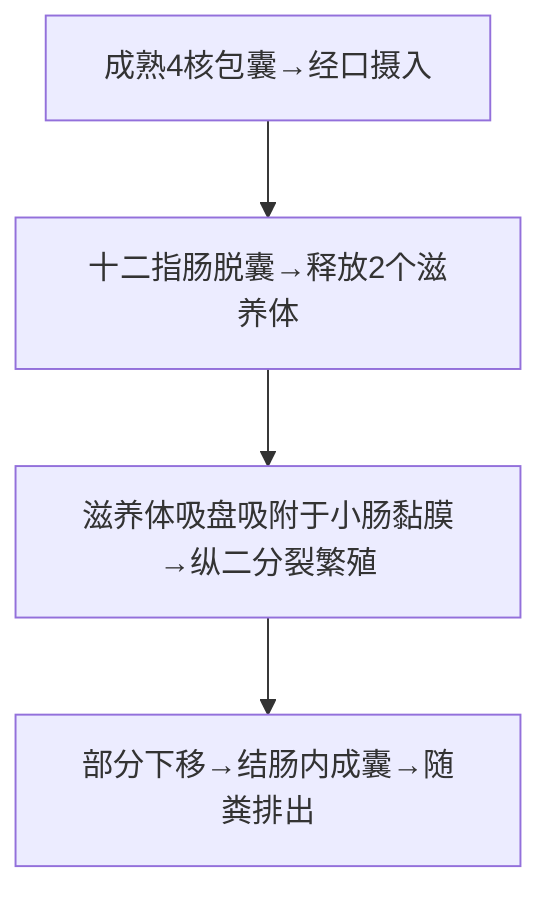

# 蓝氏贾第鞭毛虫（*Giardia lamblia*）

## 📌 定义
- 寄生于人体**小肠**（十二指肠、空肠）的鞭毛虫
- 引起**贾第虫病**（giardiasis）
- 重要的**水源性肠道原虫病**，旅行者腹泻常见原因

## 🔬 形态

| 阶段 | 特点 |
|:----|:------|
| **滋养体** | 纵切**半梨形**，(9~21)μm×(5~15)μm；腹面前半部有**吸盘**；4对鞭毛；1对卵圆形泡状核；轴柱1对 |
| **包囊** | 椭圆形，(8~19)μm×(7~10)μm；**成熟包囊含4核**，位于一端；有轴柱、副基体 |

> 🖼️ **滋养体（半梨形/吸盘/4对鞭毛与包囊（4核）模式图**![[寄生虫_贾第虫_蓝氏贾第鞭毛虫滋养体形态.png|679]]
> 🖼️**滋养体镜下观**
> ![[寄生虫_贾第虫_蓝氏贾第鞭毛虫包囊形态.png|679]]

## 🔄 生活史

> 4核包囊=感染阶段；吸盘吸附=致病机制

- **感染阶段**：成熟4核包囊
- **寄生部位**：十二指肠、空肠（吸附于黏膜表面）
- **传播途径**：粪-口（水源传播最常见）
- **易感人群**：免疫功能低下者、旅行者、儿童

## ⚙️ 致病机制

> **核心链**：滋养体吸附 → 机械损伤 + 分泌物 → 绒毛萎缩 + 二糖酶缺乏 → 吸收不良 → 腹泻/脂肪泻

| 机制 | 说明 |
|:----|:------|
| **机械性损伤** | 大量滋养体吸附覆盖→影响吸收 |
| **二糖酶缺乏** | 抑制酶活性→双糖吸收障碍 |
| **绒毛萎缩** | 慢性感染→绒毛变平→吸收面积↓ |
| **免疫因素** | 虫株致病力差异；丙种球蛋白缺乏者易感↑ |

## 🩺 临床表现

| 分期 | 表现 |
|:----|:------|
| **急性期** | 水样泻、恶臭、含脂肪滴（**脂肪泻**）；上腹绞痛；腹胀、低热；持续1~3周可自限 |
| **亚急性期** | 症状较轻，间歇性腹泻与便秘交替 |
| **慢性期** | 持续/间歇腹泻、脂肪泻（灰白色/恶臭）、体重↓、维生素缺乏、乳糖不耐受 |

> 🚨 **粪检采样原则**：**隔日1次，连续3次**（因排囊有间断性）
> 🚨 成形粪便→查**包囊**（碘液）；稀便/水样便→查**滋养体**（生理盐水涂片）

## 🔬 检查

| 方法 | 说明 |
|:----|:------|
| **生理盐水涂片法** | 稀便查滋养体 |
| **碘液染色** | 成形便查包囊 |
| **硫酸锌浮聚法** | 提高包囊检出率 |
| **十二指肠引流液** | 查滋养体 |
| **ELISA** | 检测粪便抗原或血清抗体 |
| **PCR/LAMP** | 检测DNA |

## 🆚 鉴别诊断
| 疾病 | 鉴别要点 |
|:----|:---------|
| **细菌性痢疾** | 脓血便，里急后重，粪培养(+) |
| **阿米巴痢疾** | 果酱样便，查见溶组织内阿米巴 |
| **轮状病毒肠炎** | 秋冬季，婴幼儿多见，病毒抗原(+) |
| **乳糖不耐受** | 进食乳制品后腹泻，无病原体 |
| **炎症性肠病** | 慢性病程，结肠镜+病理特征 |
| **乳糜泻** | 麦胶蛋白过敏，抗麦胶蛋白抗体(+) |

## 💊 治疗

| 药物 | 用法 | 备注 |
|:----|:----|:------|
| **甲硝唑🥇** | 成人250mg tid×7~10天 | 首选 |
| **替硝唑** | 单次2g或连用3天 | 疗效相似 |
| 呋喃唑酮 | 10mg/kg/d分4次×7天 | **儿童常用** |
| 巴龙霉素 | — | **孕妇可用**（甲硝唑有致畸风险） |
| 阿苯达唑 | 400mg/d×5天 | 替代 |

> 🚨 **孕妇首选巴龙霉素**（甲硝唑有致畸风险）

---
## 📎 相关笔记
- 概论：[[医学原虫概论]]
- 鉴别：[[溶组织内阿米巴]]、[[细菌性痢疾]]
- 临床：[[贾第虫病]]、[[旅行者腹泻]]
- 药物：[[甲硝唑]]、[[巴龙霉素]]
