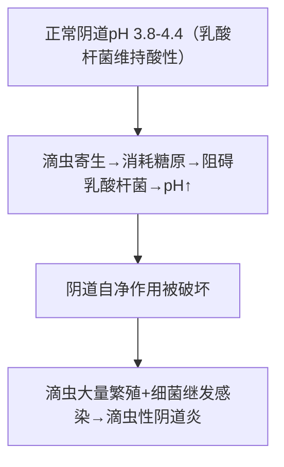

# 阴道毛滴虫（*Trichomonas vaginalis*）

## 📌 定义
- 寄生于女性阴道/尿道、男性尿道/前列腺的鞭毛虫
- 引起**滴虫病**（trichomoniasis）
- **性传播原虫病**，16~35岁女性感染率最高

## 🔬 形态
- **仅有滋养体期**，**无包囊期**
- 梨形/椭圆形，(7~32)μm×(5~12)μm
- 4根前鞭毛 + 1根后鞭毛（与波动膜外缘相连）
- 1根轴柱纵贯虫体并从尾部伸出
- 1个椭圆形核位于虫体前端
- **波动膜**：位于虫体前1/2外侧缘

> 🖼️ **滋养体（4前鞭毛+波动膜+轴柱）** 
> ![[寄生虫_毛滴虫_阴道毛滴虫滋养体形态.png]]

## 🔄 生活史
- **仅有滋养体期**，无包囊
- **女性**：阴道（后穹窿多见）、尿道、膀胱
- **男性**：尿道、前列腺
- **繁殖**：纵二分裂
- **外界抵抗力**：滋养体在外界有一定抵抗力

### 传播途径
| 途径 | 说明 |
|:----|:------|
| **性接触传播 🥇** | 主要途径 |
| 间接接触 | 共用浴盆/毛巾/泳衣/坐式马桶 |
| 母婴传播 | 经产道感染新生儿 |

## ⚙️ 致病机制

> 消耗糖原→pH↑→自净破坏=核心致病机制

- **接触依赖性细胞病变**：滋养体直接接触靶细胞→膜损伤→细胞凋亡

## 🩺 临床表现

### 女性
| 症状          | 特点                                                     |
| :---------- | :----------------------------------------------------- |
| **白带增多 🥇** | **灰黄色、泡状、臭味**（泡沫样白带）                                   |
| 外阴瘙痒/烧灼感    | —                                                      |
| 尿路刺激        | 尿频、尿急、尿痛                                               |
| **体征**      | 阴道黏膜充血水肿、**"草莓样"宫颈（即因感染引起的炎症，宫颈上出现小出血斑点）**、后穹窿大量泡沫状分泌物 |

### 男性
- 多数**无症状**或轻微（带虫者）
- 尿道炎、前列腺炎

### 并发症
- 女性：不孕（滴虫吞噬精子）
- 围产期：胎膜早破、早产、低体重儿
- ⚠️ **HIV传播风险增加2~3倍**

> 🖼️ **"草莓样"宫颈** 
> ![[寄生虫_毛滴虫_滴虫性阴道炎草莓样宫颈.png]]

## 🔬 检查

| 方法 | 说明 |
|:----|:------|
| **生理盐水涂片法🥇** | 阴道后穹窿分泌物→镜检活滋养体（**螺旋状运动**） |
| 尿液沉淀物 | 离心后查滋养体 |
| 培养法（Diamond培养基） | 阳性率高于涂片 |
| ELISA/DFA | 检测抗原 |
| PCR | 高敏感性/特异性 |

## 🆚 鉴别诊断
| 疾病 | 白带特征 | 关键鉴别 |
|:----|:---------|:---------|
| **滴虫病** | **灰黄色、泡状、臭味** | 镜检见活动滋养体 |
| **细菌性阴道病** | 匀质稀薄、鱼腥味 | **线索细胞**(+)，pH>4.5 |
| **外阴阴道假丝酵母菌病** | **豆渣样**，外阴奇痒 | 镜检见假丝酵母菌 |
| **淋球菌性宫颈炎** | 脓性 | 淋球菌培养/PCR(+) |
| **沙眼衣原体感染** | 黏液脓性 | 衣原体抗原/PCR(+) |

## 💊 治疗

| 药物 | 用法 | 备注 |
|:----|:----|:------|
| **甲硝唑（灭滴灵）🥇** | 口服2g单次 或 400~500mg bid×7天；+局部栓剂/凝胶 | **首选** |
| 替硝唑 | 2g单次口服 | 疗效相似 |

> 🚨 **性伴侣需同时治疗**（即使无症状）
> 🚨 治疗期间避免饮酒（**双硫仑样反应**）
> 🚨 孕妇：妊娠早期禁用，中晚期可局部用药

**局部治疗**：乙酰胂胺栓剂、1:5000高锰酸钾坐浴、乳酸/醋酸冲洗恢复酸性环境

## 🛡️ 预防
- 洁身自好，使用安全套
- 避免共用浴具
- 公共浴池注意防护

> 💡 **临床推理链**：灰黄色泡沫样白带 + 外阴瘙痒 + 性活跃期女性 → 疑诊滴虫病 → 分泌物涂片见活动滋养体 → 确诊 → 甲硝唑口服+局部用药，性伴侣同治

---
## 📎 相关笔记
- 鉴别：[[非致病性阿米巴]]（齿龈内阿米巴→口腔）
- 对比：[[其他毛滴虫]]
- 临床：[[滴虫病]]
- 药物：[[甲硝唑]]
